#+TITLE: Computer Architecture and Networks
#+DATE: [2025-06-25 Wed 15:02]
#+AUTHOR: Damian Chrzanowski
#+EMAIL: pjdamian.chrzanowski@gmail.com
#+OPTIONS: TOC:2 num:2
#+HTML_HEAD: <link href="https://fonts.googleapis.com/css?family=Source+Sans+Pro" rel="stylesheet">
#+HTML_HEAD: <link rel="stylesheet" type="text/css" href="../assets/org.css"/>
#+HTML_HEAD: <link rel="icon" href="../assets/favicon.ico">

* Definitions
* Number Bases

** Decimal

*** 1234
    = (1 * 10^3) + (2 * 10^2) + (3 * 10^1) + (4 * 10^0)
    = 1000 + 200 + 30 + 4 = 1234

*** 1024
    = (1 * 10^3) + (0 * 10^2) + (2 * 10^1) + (4 * 10^0)
    = 1000 + 0 + 20 + 4 = 1024

*** 20480
    = (2 * 10^4) + (0 * 10^3) + (4 * 10^2) + (8 * 10^1) + (0 * 10^0)
    = 20000 + 0 + 400 + 80 + 0 = 20480

*** 10
    = (1 * 10^1) + (0 * 10^0)
    = 10 + 0 = 10

** Binary To Decimal

*** Example: 00111111
    #+begin_verse
= (1 * 2^5) + (1 * 2^4) + (1 * 2^3) + (1 * 2^2) + (1 * 2^1) + (1 * 2^0)
= 32 + 16 + 8 + 4 + 2 + 1
= 63
    #+end_verse

*** Example: 11101
    #+begin_verse
= (1 * 2^4) + (1 * 2^3) + (1 * 2^2) + (0 * 2^1) + (1 * 2^0)
= 16 + 8 + 4 + 0 + 1
= 29
    #+end_verse

*** Example: 0000000001
    #+begin_verse
= (0 * 2^9) + (0 * 2^8) + (0 * 2^7) + (0 * 2^6) + (0 * 2^5) + (0 * 2^4) + (0 * 2^3) + (0 * 2^2) + (0 * 2^1) + (1 * 2^0)
= 0 + 0 + 0 + 0 + 0 + 0 + 0 + 0 + 0 + 1
= 1
    #+end_verse

*** Example: 1110000010
    #+begin_verse
= (1 * 2^9) + (1 * 2^8) + (1 * 2^7) + (0 * 2^6) + (0 * 2^5) + (0 * 2^4) + (0 * 2^3) + (0 * 2^2) + (1 * 2^1) + (0 * 2^0)
= 512 + 256 + 128 + 0 + 0 + 0 + 0 + 0 + 2 + 0
= 898
    #+end_verse

*** Example: 120000111
    #+begin_verse
= ERROR contains a value of 2
    #+end_verse

** Octal to Decimal

*** Example: 0o74
    #+begin_verse
= (7 * 8^1) + (4 * 8^0)
= 56 + 4 = 60
    #+end_verse

*** Example: 0o112
    #+begin_verse
= (1 * 8^2) + (1 * 8^1) + (2 * 8^0)
= 64 + 8 + 2 = 74
    #+end_verse

*** Example: 0o16
    #+begin_verse
= (1 * 8^1) + (6 * 8^0)
= 8 + 6 = 14
    #+end_verse

*** Example: 0o107
    #+begin_verse
= (1 * 8^2) + (0 * 8^1) + (7 * 8^0)
= 64 + 0 + 7 = 71
    #+end_verse

*** Example: 0o306
    #+begin_verse
= (3 * 8^2) + (0 * 8^1) + (6 * 8^0)
= 192 + 0 + 6 = 198
    #+end_verse

*** Example: 0o796
    #+begin_verse
ERROR contains the number 9
    #+end_verse

** Hex to Decimal

*** Example: 0xAB
    :PROPERTIES:
    :ID:       iwler7e0dmk0
    :END:
    #+begin_verse
= (10 * 16^1) + (11 * 16^0)
= 160 + 11 = 171
    #+end_verse

*** Example: 0x2AF3
    #+begin_verse
= (2 * 16^3) + (10 * 16^2) + (15 * 16^1) + (3 * 16^0)
= 2*4096 + 10*256 + 15*16 + 3 * 1
= 8192 + 2560 + 240 + 3 = 10995
    #+end_verse

*** Example:
    #+begin_verse
0x107
= (1 * 16^2) + (0 * 16^1) + (7 * 16^0)
= 256 + 0 + 7
= 263
    #+end_verse

*** Example:
    #+begin_verse
0x2BC3
= (2 * 16^3) + (11 * 16^2) + (12 * 16^1) + (3 * 16^0)
= (2 * 4096) + (11 * 256) + (12 * 16) + (3 * 1)
= 8192 + 2816 + 192 + 3 = 11203
    #+end_verse

*** Example:
    #+begin_verse
0x7F6
= (7 * 16^2) + (15 * 16^1) + (6 * 16^0)
= (7 * 256) + (15 * 16 ) + 6
= 1792 + 240 + 6 = 2038
    #+end_verse

** Decimal to Binary
   #+begin_verse
31 in dec to binary

2 | 31
------ left 1
2 | 15
------ left 1
2 |  7
------ left 1
2 |  3
------ left 1
2 |  1
------ left 1
     0
                      31 in dec = 11111 in binary
   #+end_verse

   #+begin_verse
16 in dec to binary

2 | 16
------ left 0
2 |  8
------ left 0
2 |  4
------ left 0
2 |  2
------ left 0
2 |  1
------ left 1
     0
                      31 in dec = 10000 in binary
   #+end_verse

** Octal to Binary
   #+begin_verse
Basically each octal value is represented by a 3bit number
217 in octal to binary

2 = 010
1 = 001
7 = 111
   => 0o217 = 010 001 111 (010001111)
   #+end_verse

** Hex to Binary
   #+begin_verse
Basically each hex value is represented by a 4bit number
0x10AB to binary
1 = 0001
0 = 0000
A = 1010
B = 1011
   => 0x10AB = 0001 0000 1010 1011 (0001000010101011)
   #+end_verse

** Binary Addition
   | A | B | A+B |
   |---+---+-----|
   | 0 | 0 |   0 |
   | 0 | 1 |   1 |
   | 1 | 0 |   1 |
   | 1 | 1 |  10 |

*** Example
    - We go from right to left like in standard addition
    #+begin_verse
     1

  10101
+ 11001
-------
 101110
    #+end_verse

*** Example
    #+begin_verse
    11

    111
    111
    101
--------
  10011
    #+end_verse

** Binary Multiplication
   | A | B | A*B |
   |---+---+-----|
   | 0 | 0 |   0 |
   | 0 | 1 |   0 |
   | 1 | 0 |   0 |
   | 1 | 1 |   1 |

*** Example
    #+begin_verse
   1110
x    11
--------
   1110
+ 1110
--------
 101010
    #+end_verse

** Binary Subtraction
   | A | B | A-B |
   |---+---+-----|
   | 0 | 0 |   0 |
   | 0 | 1 |  1* |
   | 1 | 0 |   1 |
   | 1 | 1 |   0 |

*** Example
    - In here in the second step we "borrow" the 1 from the third step
    #+begin_verse
     0

    1101
-   1011
--------
    0010
    #+end_verse

** Binary Division
   | A | B | A-B |
   |---+---+-----|
   | 0 | 1 |   0 |
   | 1 | 1 |   1 |

*** Good example here: [[https://www.youtube.com/watch?v=VKemv9u40gc][YouTube Video]]
    #+begin_verse

    01001
   ------
11| 11011
    11
   ------
    00011
       11
   ------
       00
    #+end_verse

** 2s Complement
   - The MSB (usually leftmost) signifies positive or negative number. 1 is negative, 0 is positive
   - If the number is negative we flip all the remaining bits and add a binary 1 to it
   #+begin_verse
n = 8

Example 1:
0 100 0001
Sign is 0 => positive
The value is then 100 0001 = 65 dec
So it is +65

Example 2:
1 000 0001
Sign is 1 => negative
The value needs to be flipped, so 111 1110 + 1bit = 111 1111 = 127
So it is -127
   #+end_verse

* Exam 1 Rundown

** Headings of the paper (20 marks each)
   - Computer Architecture
   - Distributed Computing, Virtualization, Cloud Computing
   - Programming (number representation e.g. 0x10AB, compiling, high/low level languages)
   - Number bases
   - Databases

** Computer system
   - A *system* is a collection of elements or components that are organized for a common purpose
   - A computer is an electronic device that manipulates data
   - Hardware and software together
   - The model is *input > process > output*
     - Retrieve input: disk file, mouse, keyboard, etc.
     - Process the input
     - Produce output: monitor, disk, terminal, printer, etc.
   - A computer has the ability to: Store data, retrieve data, process data
   - Elaborate on what the computer can be used if there are more marks required for it, as in: You can use a computer to: type docs, send emails, browse the internet...etc...etc
   - Manipulation of data: can be anything, as in audio/video/text
   - Interacting with a computer: mouse, touchpad, gamepad, keyboard, voice control, camera
   - Hardware vs Software
     - Hardware: Physical mechanisms to input and output data, manipulate data and control various input/output/storage and communication components. Monitors, Keyboards/Mice, Case, etc.
     - Software: Set of instruction to tell the hardware exactly what tasks to perform and in what order. Web browser, games, word processor.
   - Architecture vs Organization
     - Architecture: Attributes known to a programmer, such as CPU instruction set, bits used to address memory, etc.
     - Organization: Refers to the operational units and their interconnections that realize the architectural specifications, hardware details not transparent to the programmer, such as control signals between different units
     - Up to the Architecture whether a computer has a specific instruction, up to the Organization whether that specific instruction is done by some component (GPU/CPU/ALU) or many components.
   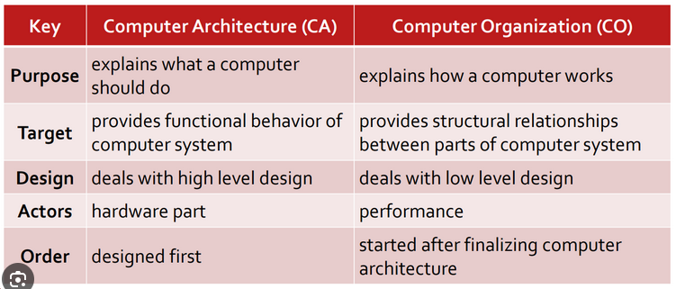

** Inside the Case
   - CPU: "Brain of the computer". Carry out commands from the interfaces.
     - Control Unit (CU) & Arithmetic logic unit (ALU)
     - Speed is expressed in hertz, instructions per second
     - Execute instructions fetched from the main memory
     - Millions of transistors
     - Transistors are building blocks of logic gates
   - RAM: short term memory
     - Static RAM - cache
     - Dynamic RAM
     - More RAM: more processing and the same time
     - Cleared when power goes down
     - FAST!
   - Hard Drive: HDD (Mechanical) or SSD (Solid State Drive, non mechanical)
     - Long term storage
     - Persists on power loss
   - Bus
     - Connects the Processor, Memory and IO
     - Electrical connection, a set of parallel wires
     - Carries and is split into: data, addresses, control signals
   - Video Card: used to display data to the screen
   - Sound Card: responsible for producing audio output
   - Network Card: allows to communicate over a network, such as the internet
   - PSU: provide various power lines for the computer, converts mains (AC) into DC

** Hardware Platform
   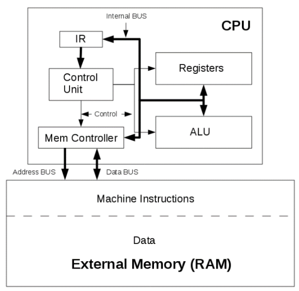

** Hardware Platforms: Instruction Cycle
   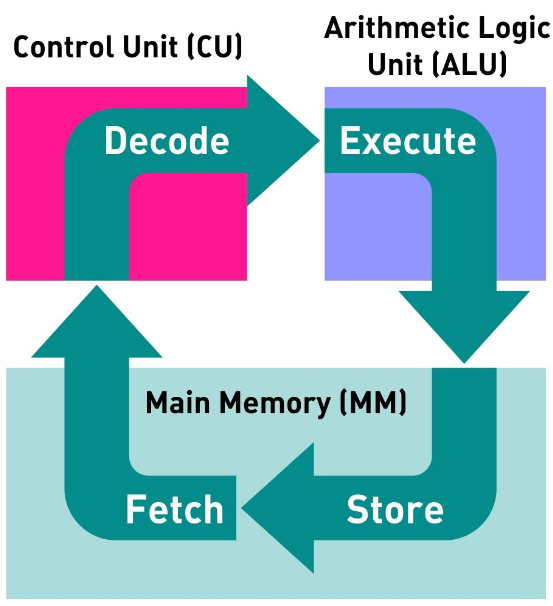

** Java Virtual Machine
   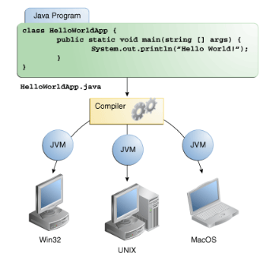

** Types of computers
   - Phone, tablet, console, PC, RPi

** Components of a PC
   - More RAM, more processing can be done at the same time: true
   - RAM, CPU, GPU, MOBO, HDD/SDD/FDD
   - CPU: Draw a diagram, preferably

** Server/Personal
   - Generally server serves multiple people and a PC just one, but it can be debated and should be expanded
   - Server serves the needs of other computers on the network

** OS
   - Is a Software Program
   - Software means to communicate with the hardware. It is basically a bridge between both.
   - Facilitates communication between a user and a computer and within a computer
   - Provides an abstraction over the hardware components
   - Key operations, manage:
     - Memory
     - Processes
     - Software
     - Hardware
   - Coordinates the communication between the running applications and their access to the CPU, memory and storage
   - Common OSs': Linux, Windows, macOS

** Computer Application
   - A piece of software that runs inside your OS and allows you to perform a specific task
   - Some types include: Mobile Apps, Desktop Apps, Web Apps

** Programming Languages
   - Artificial Language that sends instructions to the computer
   - Control behaviour or express algorithms precisely
   - There are thousands of languages
   - Each language tends to have its own pros and cons vs other languages

** Low Level/High level languages
   - Provide examples
   - Low compiles to machine code
     - Weak level of abstraction from the computer's hardware, sometimes barely any abstraction at all (e.g. Assembly)
   - High is interpreted and is generally ran by a VM
     - Strong level of abstraction from the computer's hardware
   - Web Languages: JS is the currently the only language that is supported by the Web Browsers to develop web apps
     - Although WebAssembly is gaining more and more traction every day
   - Levels of abstraction
     - High level: print("Hello")
     - Low level: MOV R1, 40000
     - Machine code: 01010100101010101010

** Hardware Platforms
   - Each has a unique machine language
   - Machine language is a set of instructions for the CPU
   - Examples of platforms
     - X86
     - AS 400
     - ARM
     - SPARC

** Machine Code
   - Machine code is the lowest level instruction set for a particular platform, e.g.: register data in memory, jump to a certain instruction
   - Is hardware dependent
   - These days low level machine code development is rare

** High Level Language
   - Transferred to machine code by a compiler

** Compiler
   - Is a program that translates a source program written in a high-level programming language into a sequence of machine instructions for a specific computer platform (architecture)

** Hardware Platforms: instruction cycle
   #+begin_verse
   +------------------+
   |    Application   |
   +------------------+
   |    OS            |
   +------------------+
   |Hardware Platform |
   +------------------+
   |CPU               |
   |RAM               |
   |STORAGE           |
   |Motherboard       |
   |I/O Devices       |
   +------------------+
   #+end_verse

** Key Developments in Networks

*** Distributed Systems
    - Distributed computing systems consist of multiple autonomous computers that communicate through a computer network
    - Involves hardware & software systems containing more than one processing/storage elements
    - The computers interact with each other to achieve a common goal
    - Computers coordinate actions through messaging systems over a network
    - *Clustering*:
      - Set of connected computers that appear as a single computer to an application and a user
      - Additional software runs to connect the nodes (individual computers in a cluster)
      - Usually nodes in a cluster are connected to each other via a fast local network
      - Types: compute clusters, storage clusters (data replication for robustness)
      - Clustering provides higher availability, reliability and scalability. E.g. when one computer fails the work is distributed to other, whereas a single computer would have to be restarted or replaced

*** Virtualization
    - Creation of virtual something, such as: hardware platform, OS, storage device, network resources
    - Hardware virtualization: creation of a VM that acts like a real computer with an OS. Software ran on these machines is completely separated from the underlying hardware.
    - Desktop virtualization: separation of the logical desktop from the physical machine
    - OS-level virtualization: hosting multiple environments within a single OS
    - Storage virtualization: completely abstracting logical storage from physical storage
    - Network virtualization: creation of a virtualized network addressing space within or across network sub-nets
    - VM: is one type of server virtualization
    - Hypervisor: software that enables one or more VMs to run on one physical machine
    - VMs can be ported/cloned to different physical machines that have the same Hypervisor - scalability and upgradability

*** VMs
    - Processes running in a VM are limited to the resources given to the VM (RAM, storage, etc.)

*** What is the name of the system running on a VM?
    - Host OS > Hypervisor > Guest OS

*** What are the types of Hypervisors
    - Type 1 vs Type 2
    - Include diagrams
    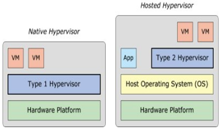

*** Cloud Computing
    - Key word is "SERVICE" where hardware and software is "SHARED"
    - It is a Buzzword, so there is no finite definition, many businesses make up what cloud is to them as they go
    - It is a business model
    - Usage and delivery of hardware and software on demand
    - Resources are scalable - you need more you get more, you need less you get less
    - Run applications and services over a network as opposed to a desktop (higher control for instance)
    - Benefits:
      - Location of infrastructure
      - New roles for IT staff
      - Trust? or not...
      - Separation of infrastructure from OS to Application (we don't care what someone else is running on the other side, for as long as they have a Web Browser)
      - Fast deployment
      - Pay per use
      - "Things" as a service:
        - Infrastructure
        - Platform
        - Software
        - Data
        - Storage
    - Challenges:
      - Continuous high availability
      - Consistency
      - Latency
      - Scalability
      - Security and data secrecy
      - Performance
      - Mindset
      - Data location - Legal impacts
      - Recovery

**** With regards to the separation of infrastructure from OS to Application in the Benefits
     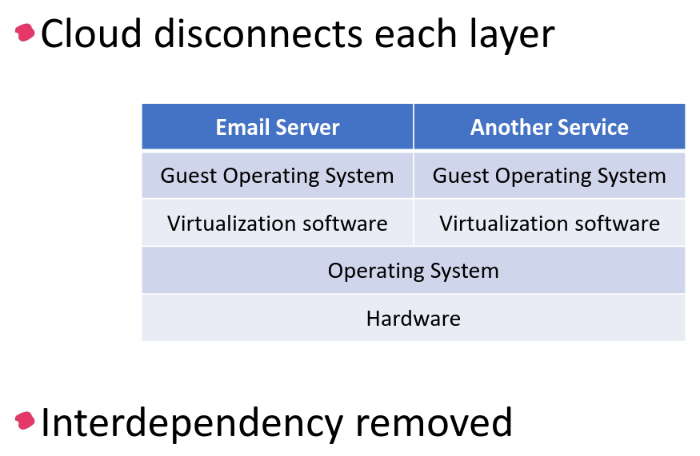

**** Private vs Public cloud
     - Private is concerned with security and is usually tied to a single entity. Dedicated customers. Sometimes dedicated servers. Confidential.
     - Whereas public cloud is accessible to the general public. Many customers. Internet connectivity.

**** Infrastructure
     - SaaS (use software, e.g.: Gmail)
       - No installation
       - Runs on cloud servers
       - Subscription based, usually
       - Example: Google docs, Zoom, Canva, M$ 365
     - PaaS (build software, e.g.: Heroku)
       - Devs don't manage hardware
       - Supports programming languages and frameworks
       - Speeds up app development
       - Example: Google App Engine, Heroku, M$ Azure App Serives
     - IaaS (rent server, build from scratch, e.g.: AWS)
       - Full control of the virtual machine
       - Scalable and flexible
       - Pay-as-you-go, usually
       - Example: AWS (EC2), M$ Azure, Google Cloud Compute Engine, DigitalOcean, Hetzner

**** Web Applications
     - Applications developed in "web" technologies: HTML, JS, PHP, etc.
     - Access is gained via a server that serves the application over HTTP/HTTPS and then we can view it in a browser
     - Google Docs is the perfect example

** Desktop Virtualization
   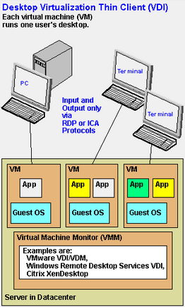

** True of false
   - A binary number representation in Java
   - An octal number representation in Java
   - A hex number representation in Java

** Base value conversion

** Binary addition/subtraction/multiplication/division

** Databases

*** DMBS (RDBMS)
    - (Relational) Database Management System
    - Software system designed to: store, manage and facilitate access to a (relational) database
    - A database is an organised collection of data: numbers, text, graphics, images, sounds, video, etc.

*** Why not use a file system?
    - Each application has their own way of accessing files and what information they read or write to them.
    - A database provides a unified abstraction on how to CRUD data.
    - Also: duplication of data, inconsistency, loss of metadata integrity, limited data sharing, development time, maintenance
    - Advantages of DB:
      - Minimal data redundancy (duplication)
      - Improved consistency
      - Data integration
      - Data independence
      - Improved data sharing
      - Application development productivity
      - Enforcement of Standards
      - Data accessibility/responsiveness
      - Security, backups/recovery, concurrency
    - Why Not always used?
      - Expensive/complex to setup and maintain
      - Cost/complexity must be offset by a need. Will a bunch of files actually do?
      - General-purpose, although there are special purpose DBs

*** Great need for DBMS these days
    - Corporate and Scientific

*** DBMS is a major part of the Software industry
    - Oracle, IBM, Microsoft, Sybase, Teradata and new ones continuously emerge
    - Open Source are very strong though: MySQL (MariaDB), PostgreSQL, BerkeleyDB

*** Related Industries
    - Data warehouses
    - Document management
    - Storage
    - Backup
    - Reporting
    - Business intelligence
    - App integration

*** Database and roles
    - DBMS vendors, programmers: Oracle, IBM, MS
    - End users in many fields: Business, education, science
    - DB application programmers: build enterprise apps on top of the DBMS, build web services etc.
    - Database admins
      - Design logical/physical schemas
      - Handle security and authorization
      - Data availability, crash recovery
      - Database tuning as needs evolve

*** DBMS isolation explanations
    - DBMS (Database Management System) is software that stores, manages and controls access to the database
    - Isolation means that the DBMS separates layers and operations, so that changes or activities on one layer don't affect another
    - There are three levels of isolation
      - Physical: physical storage changes don't affect users
      - Logical: logical structure changes don't confuse users
      - View: user's personalized view stays consistent

**** Level of Isolation defined by ANSI/ISO SQL standard
     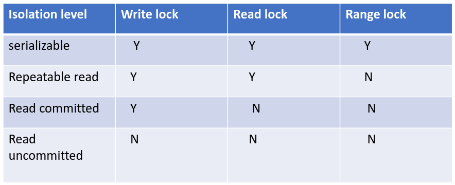

**** Isolation Levels are defined in terms of 3 phenomena that must be prevented between concurrent queries
     - Dirty reads: reading data that has not been committed
     - Non repeatable: a transaction rereads data it has previously read and finds that another committed transaction has modified or deleted the data
     - Phantom reads: a transaction re-runs a query and gets different results, another committed transaction has inserted additional rows that satisfy the search criteria
     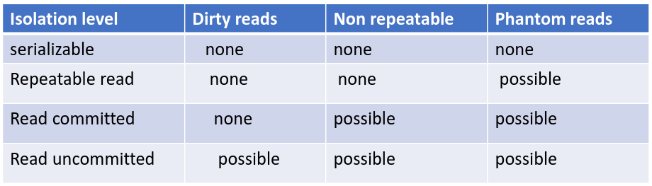

*** What is metadata
    - Data explaining data
    - Location, heart rate, etc, etc.
    - Helps organize and search data (improve data discovery)
    - Supports data management and security

*** What is a tuple
    - Single cell or a series of cells. Usually a row, according to google

*** Primary Key
    - Unique identify records
    - Prevent duplication of data
    - Data integrity
    - Enable relationships
    - Never can be null

*** Foreign Key
    - Is a field in a relational table that matches the primary key column in another table

*** Referential Integrity
    - Makes sure that the relationships created by the Foreign-Primary keys are not broken

*** Transaction
    - Key concept
    - Logical unit that is independently executed for data retrieval or manipulation
    - Data Transactions MUST be ACID

*** ACID acronym in Databases
    - Atomicity: Transaction is performed All-or-nothing
    - Consistence: No incorrect or corrupted data
    - Isolation: Transactions are independent and sequential
    - Durability: Changes are permanent, successful changes are not lost

*** Transaction rollback
    - Transaction log is used to perform a rollback
    - Uncommitted transactions are rolled back
    - Committed transactions are preserved

*** Data Model
    - Is a collection of concepts for describing data

*** Schema
    - Is a description of a particular collection of data, using a given data model. It describes the structure of a database.

*** DDL vs DML
    - Domain Definition Language (CREATE, ALTER, DROP, TRUNCATE)
      - Define of change database
    - Data Manipulation Language (SELECT, INSERT, UPDATE, DELETE)
      - Manipulate the data or work with the data

*** Database redesign the structure
    - Use a X normal form, to an extent

*** Six steps for designing data structure
    1. Identify data elements
    2. Subdivide each element into its smallest useful components
    3. Identify tables and assign columns
    4. Identify primary and foreign keys
    5. Review whether the data structure is normalised
    6. Identify the indexes

* Packet Tracer
  - The Question is twofold:
    - Must do the calculations yourself
  - Hook up a laptop with a serial cable to the Router if the router has no console
  - The default gateway is the IP address of the router, usually x.x.x.1

* Exam 2 Rundown

** Some Sample questions Networks Intro:
   - Internet vs Intranet, network-of-network (public) vs internal network (private)
   - Give 3 examples of scopes of classifications of networks: LAN, MAN, WAN (local, metropolitan, wide area network)
   - 3 examples of non-traditional network endpoints that we might see in the future: Fridge, car, microwave, IoT devices, coffee machine, TV, light bulb, washing machine, etc.
   - Give examples of 3 different resources that can be shared via a network: internet access, applications, files, databases, any digital media, any source of data (really) etc.
** Some Sample questions IP Addressing:
   - Purpose of IP address: unique identification of the end device on the network
   - Purpose of the Subnet Mask: divides the network from the host, defines the scope of the network, defines how many IP addresses are in the network
   - What is the purpose of NAT: so that the inner network can communicate with the outside network (private to public and vice versa), unregistered to registered, hide the private IP from the Public, make sure to mentioned ports that are used for the mapping inside of a NAT
   - Purpose of the 3way handshake: to validate that each of the sides are willing to communicate to each other and establish a reliable connection
** Some Sample questions Network Models and Layers:
   - Describe 3 differences between the token ring and the Ethernet
   - List 4 network topologies and describe their advantages/disadvantages
   - When would UDP be used over TCP
** Q1 Networks in general (nail this)
** Q2 IP Addressing (nail this, cos it helps with packet tracer)
** Q3 OSI Model (different network types are combined here)
** Q4 Packet Tracer
** Working out the bits for the Network address with a network 192.168.10.0, 4PCs and 1Router
   - Network ID: 192.168.10.0, we have 4 PCs and a router. So that's 5 devices + 2 IPs(network + broadcast): so we need 7 in total
   - * - meets requirements for amount of hosts (line drawn to the left of)
   - Everything to the left of the star in octets is: 1
     | Bit Values | 128 |  64 | 32 | 16 |  8 |     4 | 2 | 1 |
     | Hosts      | 256 | 128 | 64 | 32 | 16 | (*) 8 | 4 | 2 |
     | Octets     |   1 |   1 |  1 |  1 |  1 |     0 | 0 | 0 |

     Network ID: 192.168.10.0 (is the network address and is reserved)
     Octets: 128+64+32+16+8 = 248
     Subnet is then: 255.255.255.248
     We have three zeros in octets so CIDR = 32 - 3 = 29
     Broadcast is the last one: 192.168.10.7 (8 possible hosts, which is 8 - 1 to get the broadcast)
     Range is +1 from network to -1 from the broadcast: 192.168.10.1 - 192.168.10.6

** Working out the bits for the Network address with a network 192.168.200.0, 8PCs and 1Router
   - Network ID: 192.168.10.0, we have 8 PCs and a router. So that's 9 devices + 2 IPs(network + broadcast): so we need 11 in total
   - * - meets requirements for amount of hosts (line drawn to the left of)
   - Everything to the left of the star in octets is: 1
     | Bit Values | 128 |  64 | 32 | 16 |      8 | 4 | 2 | 1 |
     | Hosts      | 256 | 128 | 64 | 32 | (*) 16 | 8 | 4 | 2 |
     | Octets     |   1 |   1 |  1 |  1 |      0 | 0 | 0 | 0 |

     Network ID: 192.168.200.0 (is the network address and is reserved)
     Octets: 128+64+32+16 = 240
     Subnet is then: 255.255.255.240
     We have four zeros in octets so CIDR = 32 - 4 = 28
     Broadcast is the last one: 192.168.200.15 (16 possible hosts, which is 16 - 1 to get the broadcast)
     Range is +1 from network to -1 from the broadcast: 192.168.200.1 - 192.168.200.14

* Networks
  - Network: two or more devices connected together to share resources
  - Nodes on a network talk using agreed protocols
  - Networks are for communication
  - Sharing
  - Every Network Interface Card(or Controller) (NIC) has a unique 48Bit MAC address
  - Pros/Cons
    - Pros: Connectivity and Communication, data sharing, hardware sharing, internet access, etc.
    - Cons: Hardware/Setup cost, undesirable sharing, data security
  - Classes: Local(LAN), Metropolitan (MAN, much higher bandwidth), Wide (WAN, large distances)
  - Internet is a network of networks, uses a common set of protocols to define endpoint interaction/communication
  - Intranet still uses the same protocols as Internet, TCP/IP, HTTP and so on
  - Protocol: a set of rules and procedures for communication purposes
  - Topologies
    - Physical: the actual physical layout of the network components (devices) and how are they physically connected. E.g. Host1 > Switch > router 1 > router 2 > router 3 > switch > firewall > Server
    - Logical: describes how the messages travel, how information flows between the nodes. E.g Host1 > Server
    - Main topologies are:
      - Bus (10Base2): Basic topology, each devices has the same address path, so every message hits every device's NIC. One broken cable and the whole network is down. Expensive, but is easy to implement and extend. It is nearly obsolete.
      - Star(10BaseT and 100BaseT Ethernet): Common these days, uses a central hub or switch to connect many device. Easy to install, more expensive (due to the cable and switches),
      - Ring: Connected serially, messages flow clockwise or anticlockwise. Circle ring of computers. Growth is easy, but failure of one means the failure of the network
      - Mesh: Simplest in terms of logics, but most complex when it comes to physical design. High cost, every device is connected to every other device. High fault tolerance.
  - OSI Model: Physical, Data, Network, Transport, Session, Presentation, Application
  - TCP/IP Model: Network Interface, Internet, Transport, Application
  - Cabling: Coaxial, Twisted Pair, Fiber Optical
  - Subnet mask: its sole purpose is to determine whether an IP is inside of a local network or not, if it is not, then external routing begins

* IP Addressing
  - All quite easy stuff, really

* Networking Part 1
** Network architecture:
   - Ethernet: star topology (bus early), inexpensive, easy to install, fast, twisted pair
     - Ethernet frame:
   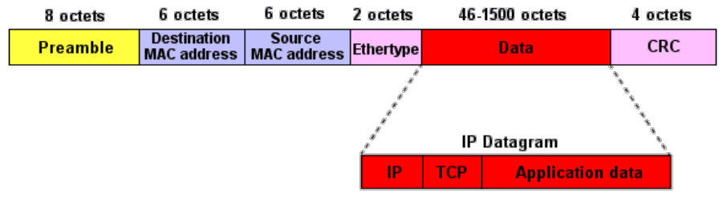
   - Token Ring: ring topology, expensive, stable, 4 or 16Mbps
   - Ethernet Vs Token: Ethernet is less expensive and easier to install, easy to add devices, but does not scale well; Token Ring is more secure and stable (not really used anymore), hard to add devices, scales well.
** Network Models
   - Client - Server
   - Peer to Peer
** ISO vs TCP/IP Model
   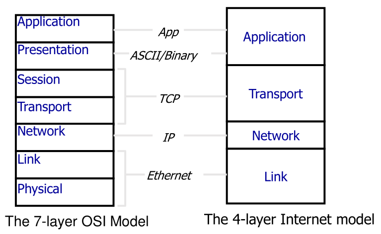

* ISO/OSI TCP-IP

** ISO/OSI
   - International Standards Organization (ISO) Open Systems Interconnect (OSI) - standard set of rules that describes the transfer of data between each layer in a network system
   - L7: *Application Layer*: Direct access to network services. Interface between the user and the network by providing services that directly support user applications.
   - L6: *Presentation Layer*: Formatting, Compression, Encryption, Encoding. ASCII, UTF-8, Binary. JPEG, GIF, JSON, etc. Interpret and convert data in various formats.
   - L5: *Session Layer*: Establish, Maintain and Terminate a "session". Session is an exchange of messages between computers. It is faster to have a session when there is a "dialog" as opposed to having a handshake whenever a communication takes place. Synchronization also takes place on this layer by utilising checkpoints (I received up to N bytes).
   - L4: *Transport Layer*: TCP or UDP. Packages are arranged by numbers for later assembly (use of a tracking number), also perform crc checks. Ensure proper sequence of data retrieval by performing error handling on the data sequence, on error: re-transmit data.
   - L3: *Network Layer*: Routers, IP addresses, packet routing, source-to-destination control, traffic control measures.
   - L2: *Data-Link Layer*: Handling of frames by utilising MAC addresses. Break down frames and place the electric signal onto the wire. Error detection and correction is also performed.
   - L1: *Physical Layer*: Physical characteristics of the network (type of cables, connectors, length of cable, etc.), electrical characteristics (how the actual voltages send the signal, low level stuff). Sends the binary data as electrical or optical signals.

** TCP/IP
   - Suite of communication protocols.
   - WAN uses TCP/IP as its protocol stack
   - 4 layers, unlike the OSI: Application, Transport, Internet (Network), Link
   - Describes how the data end-to-end has to be:
     - formatted
     - addressed
     - transmitted
     - routed
     - received
   - Layers
     - *Application Layer (DATA)*: Contains all the protocols and methods that fall into the process-to-process communication across the IP network. Uses the transport layer to establish host-to-host connection.
       - Telnet, FTP, HTTP, SIP
     - *Transport Layer (Segments/Datagrams)*: End-to-end communication services for the Application (Transmission Control Protocol (TCP) or User Datagram Protocol (UDP))
       - TCP: connection oriented (3 way handshake SYN > SYN ACK > ACK, establish sequence number in the SYN ACK), reliable/guaranteed, flow control (congestion control), full duplex between A and B.
         - Segmentation and Reassembly of data blocks. Multiplex/Demultiplex, assign ports to applications. Segments are re-ordered at destination.
         - Re-transmit if sequence is off. Sender starts at seq=1 and sends say 1500bytes, the receiver ACKs with Seq=1501. So the sender goes again. But if the data is broken then the receiver will send the last known ACK.
         - Establish with: SYN, SYN-ACK, SYN.
         - Close with: FIN > ACK + FIN > ACK
         - HTTP/FTP use TCP and not UDP
       - UDP: connectionless transmission, not guaranteed order or delivery.
         - Does not guarantee order of data, if order is needed it needs to be implemented by the application
         - Does error checking, but does not do anything about them (usually the damaged data is simply discarded).
         - DNS and DHCP happen via UDP
     - *Internet/Network Layer (IP/Packets)*: Set of protocols to transmit packets from source to destination. which is achieved by the IP address.
       - Three functions: Outgoing Packets (select next hop and transmit), Incoming packets (capture and pass payload to Transport Layer if appropriate), Error Checking
       - Example of protocols: IPv4, IPv6, ICMP (Ping)
     - *Link Layer (Frames)*: Physical and Logical network component, interconnects networks and devices

** Flow of webpage opening
   - SYN > SYN ACK > ACK (GET /html) > HTML response > close connection
   - Type in address, e.g.g http://www.ait.ie/engineering

*** HTTP 1.0
   - Flow non-persistent HTTP /1.0
   - HTTP client initiates a TCP connection to the server www.ait.ie on port 80
   - HTTP client sends a HTTP request via the established TCP connection to engineering/index.html
   - Server receives the request, encapsulates the response object in a HTTP Response Message and sends it back to the client. Requests to close the TCP connection.
   - HTTP client receives the Response message and agrees to terminate the TCP connection.
   - Connection is closed

*** HTTP 1.1
    - Added persistent connections, multiple object transfer over a single connection

* Remove at the End
  #+BEGIN_EXPORT html
  
  
  #+END_EXPORT
