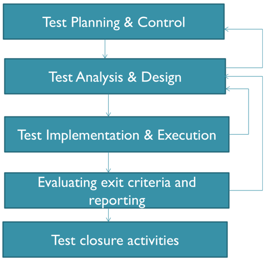
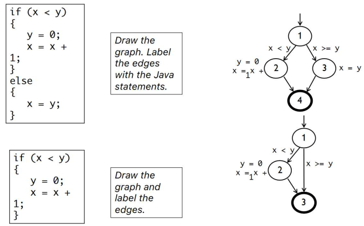
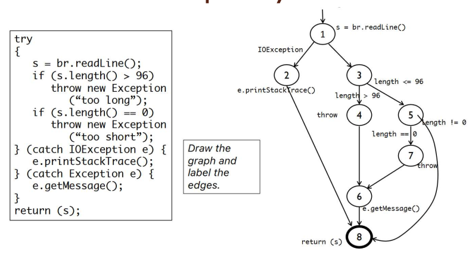
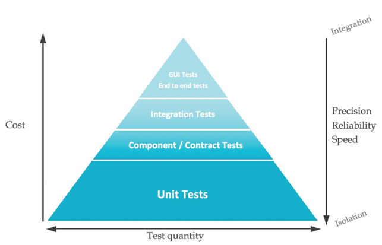
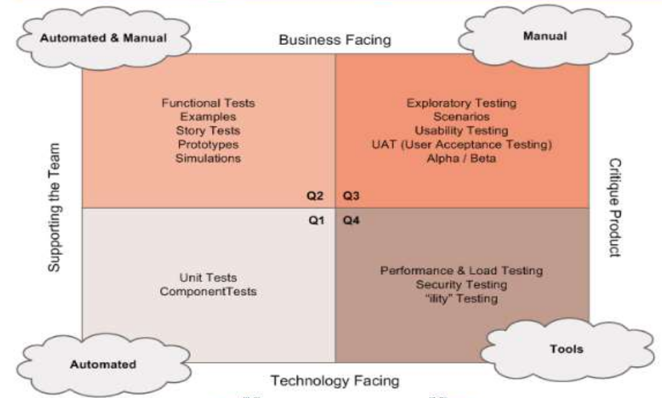
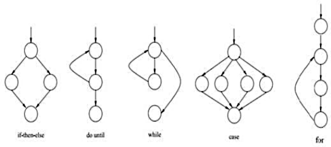

#+TITLE: Agile Design and Testing
#+DATE: [2025-10-16 Thu 09:32]
#+AUTHOR: Damian Chrzanowski
#+EMAIL: pjdamian.chrzanowski@gmail.com
#+OPTIONS: TOC:2 num:2
#+HTML_HEAD: <link href="https://fonts.googleapis.com/css?family=Source+Sans+Pro" rel="stylesheet">
#+HTML_HEAD: <link rel="stylesheet" type="text/css" href="../assets/org.css"/>
#+HTML_HEAD: <link rel="icon" href="../assets/favicon.ico">
[[file:index.org][Home Page]]
* Exam Questions Bank
  - (1x) Analyse a piece of code an point out why is it hard to test. CODE 1
  - (1x) Propose a refactoring plan for the same piece of code as in CODE 1
  - (1x) How would you use ~mockito~ to test CODE 1
  - (1x) With regards to ~mockito~: what is a ~dummy~, ~stub~ and a ~spy~? What is a ~test double~?
  - (1x) Why is a piece of given code challenging to test using ~mockito~?
  - (1x) From a list of test categorized them in terms of: ~Unit Test~, ~Integration Tests~, ~UI/E2E Tests~. Explain reasoning.
  - (1x) Purpose of the ~Test Pyramid~. Importance to structure the tests according to the Pyramid.
  - (1x) What is ~Cucumber~ and how does it fit with ~BDD~?
  - (1x) Write a ~Cucumber DataTable~ to achieve 100% ~code and branch coverage~
  - (1x) Using ~Selenium~ and potential problems with selecting elements and exceptions thrown with it
  - (2x) How many tests required to achieve ~100% branch coverage~ and ~100% code coverage~ in given code.
  - (1x) Write a ~parameterized test~ with ~CSVSource~ to achieve ~100% branch coverage~
  - (1x) Explain ~Command Query Separation~ (CQS)
  - (3x) Draw a ~control flow graph~ for a specific piece of code. Use ~E-N+2~ to calculate the ~cyclomatic complexity~.
    - ~Hybrid Flow Graph~ used on one exam
  - (1x) AI produced a user story, rewrite it using ~INVEST~ principles and add ~Acceptance Tests~.
  - (2x) What is ~McCabe's Cyclomatic~ number?
  - (2x) Calculate ~cyclomatic complexity~ for a given code
    - (1x) Three different methods for calculating it, explain them
  - (1x) Use ~agile testing quadrants~ to categorize a list of user stories
  - (2x) Use ~equivalence partitioning~ and ~BVA~
  - (1x) Explain ~parameterized testing~. How do you use them in jUnit5?
  - (1x) Using ~SOLID~ principles and evaluating code in terms of ~SOLID~.
  - (1x) Which ~design pattern~ is used in a given example? (here it is a singleton)
  - (1x) Returning an error as a String, what is the problem with that?
  - (1x) Break down ~Epics~ into ~User Stories~
  - (1x) ~Verification~ vs ~Validation~
  - (1x) ~Static analysis~: what is it? what benefits it provides?
  - (1x) Write user ~acceptance criteria~ for tests
  - (1x) Re-write user stories based on ~INVEST~
  - (1x) What is a ~Dependency Inversion Principle~? Does a piece of given code comply to it?
  - (1x) =!!!= Why testing can only detect the presence of errors and their absence?
  - (1x) What is ~Open-Close Principle~?
  - (1x) Write a ~state transition~ sequence
* Software Lifecycles and Fundamentals of Testing
** What is Software
   - Computer programs and associated documentation (requirements, design models, user manuals)
   - Bespoke or generic
** What is Software Engineering
   - Engineering discipline that is concerned with the aspect of software production
   - Should adopt systematic and organised approach to software creation
** Why Software Fails?
   - Error (leads to >) Defect (causes an observed) Failure
   - A person makes an error > that creates a fault (defect) > that causes a failure
   - To avoid failure we must either avoid errors and fault or find and fix them
** Reliability
   - Probability that software will not cause failures
   - Extensive testing to prevent failures as soon as errors occur (at the beginning or the end of software creation)
** Testing Triangle
   - Time - Money - Quality, balance between
   - Testing ensures functional and non-functional requirements are examined and defect reported
** Software process
   - Specification > Development > Validation > Evolution
** Testing process
*** Diagram
    
*** Planning
    - Determine what will be tested
*** Control
    - What to do when activities do not match up to plan
*** Analysis and Design
    - Review requirements, architecture, interface specs, etc
    - Analyse test conditions and input data
*** Implementation and Execution
    - Develop and prioritize test cases
    - Running tests
*** Evaluation and reporting
    - Checking if we succeeded, basically
    - Write up results
*** Closure
    - Docs in order
    - Close down env and infra
    - Handover to maintenance team
** What is testing
   - Testing is a systematic exploration of a component with the aim of finding defects
** Static vs Dynamic
   - Static testing is where code is not executed (e.g. specification document review)
   - Dynamic testing is where code is ran with some test data
** Seven Testing Principles
   1. Testing can only show the presence of bugs, not their absence
   2. Exhaustive testing is impossible
   3. Early Testing (late testing, especially under pressure is bad, also, the later the more expensive the fix)
   4. Defect Clustering (80% of problems found in 20% of modules)
   5. Pesticide Paradox (running the same test will not reveal new defects)
   6. Testing is context dependent (different tests for different needs)
   7. Absence of error fallacy (no errors does not means that they aren't there)
** Verification vs Validation
   - Verification: are we building the right product? (process infused)
     - Software inspection
   - Validation: are we building the product right? (requirements infused)
     - Software testing
** Test Coverage
*** Info
    - Provides a quantitative assessment of the extent and quality of testing
*** Black Box
    - The nitty gritty
    - Equivalence Partitioning
    - BVA
*** White Box
    - Structural testing: branches, components, etc.
    - Control Flow Graphs (CFG, uses number and circles to represent all "blocks"): models all execution of a method by describing control statements
      - Node: statement (sequenced). Use dummy nodes for things like while loops.
      - Edge: transfer of control (e.g. IF, write the condition on the edge, remember the for loops have condition inside of them)
      - Block: sequence of statements
**** Example if
     
**** Example try/catch
     
*** Fundamental Three structures of code
    - Sequence - statements one after another
    - Selection (branching) - choice
    - Iteration (looping)
*** Statement Coverage
    - Does not necessarily cover all paths, it merely executes all statements
    - When using a flowchart we only need to check which statements are executed, not which paths are taken
*** Branch Coverage
** General testing process
   - Requirements > Design > Code > Test
   - Incremental - add-on
   - Iterative - re-do
   - Problems with iterative: customer involvement, lack of docs, details may be lost if changes are not recorded
** Test Design
   - Identify test conditions: an item or event that could be verified with testing
   - Specify test cases: various inputs to test the event/component
   - Specify test procedures: actions to take (given/when/then)
** Test Levels
   - Unit: component
     - Arrange (setup), act (execute), assert (check)
   - Integrating: component interaction
   - System: E2E
   - Acceptance: End user confidence and satisfaction
** Test Types
   - Functional: specific functionality, e.g. search feature (aka specification based testing)
   - Non-functional: behavioural aspects (e.g. performance under load)
   - Testing after code changes: always re-test after fixes are applied (retesting, confirmation testing). Unchanged software also needs to be tested (regression testing, "just in case" scenario)
** Reviews
*** Types
    - Informal
    - Walk-through
    - Technical Review
    - Inspection
*** Objective
    - Finding defects
    - Gain understanding
    - Generate discussion
    - Decision making by consensus
*** Typically found during reviews
    - Deviation from standards
    - Requirements defects
    - Design defects
    - Insufficient maintainability
    - Incorrect interface specs
    - Proven an efficient and effective method for improving software
* User Stories
** Definition
   - A concise, written description of a piece of functionality that will be valuable to a use (or owner) of the software
   - 3Cs: Card, Conversation, Confirmation
   - As a ~role~, I want ~goal~, so that ~reason~ (aka Who/What/Why)
** INVEST
   - Independent
   - Negotiable
   - Valuable
   - Estimatable
   - Small
   - Testable
** Acceptance Criteria
   - Usually written in the Given > When > Then form
** Definition of Done
   - What counts as a user story being done?
** Defining the User or Personas
   - Clearly define who is a user and what are the competency levels
   - Personas are basically different users of the system, they describe who or what a specific user is
** Special User Stories
   - Non-functional Stories
   - Bug Stories
   - Spike Stories (research)
* Agile Testing
** The Test Pyramid
   
** Testing Quadrant
   
* Design Patterns
** Creational
   - Create objects for you
   - Builder: used to construct complex objects that often require their own deps, etc.
   - Factory: used to create instances, often with a specific setup in mind. Can be subtypes of an interface or a setup of a concrete class but with certain methods already called on it.
   - Singleton
** Structural
   - Compose groups of objects into larger structures
   - DAO: Hides the implementation details. Enables transparent access to the data structure.
** Behavioral
   - Help to facilitate communication between objects
** Anti-pattern
   - Reinventing the wheel in a bad way
* Agile Design
** Info
   - Build software in small increments
** Poor design (smells)
   - Rigidity
   - Fragility
   - Immobility
   - Viscosity
   - Needless complexity
   - Needless repetition
   - Opacity
** Open-Closed Principle
   - Modules/classes/functions should be open to extensions but closed for modifications. As in: it is ok to extend something, but don't modify the base (like Liskov).
** Liskov's Substitution Principles
   - Subtypes must be suitable for their base types
   - Basically the sub-type should not override the workings of the base to suite its own needs, you probably just have the wrong abstraction to begin with (or the whole system is not designed correctly)
** Single responsibility principle (SRP)
** Dependency Inversion Principle (DIP)
   - High level modules should not depend on low level modules.
   - Abstractions should not depend on details -> details should depend on abstractions.
** Interface Segregation Principle (ISP)
   - Make many small interfaces, rather than one large one.
   - Inherit from many interfaces rather than dependency inject only one or few. Especially when we're constructing a derived class.
* McCabe's Cyclomatic Complexity
** Definition
   - Design related metric
   - Uses control flow graphs to determine its complexity
   - =E - N + 2=, where E are edges and N are nodes. Basically it is ~Branches + 1~
** Example Control Flow Graphs
   
* Scaffold for Parameterized Testing
** pom for jupiter and jupiter with params
   #+begin_src xml
     <dependencies>
       <dependency>
         <groupId>org.junit.jupiter</groupId>
         <artifactId>junit-jupiter-api</artifactId>
         <version>5.4.2</version>
         <scope>test</scope>
       </dependency>
       <dependency>
         <groupId>org.junit.jupiter</groupId>
         <artifactId>junit-jupiter-engine</artifactId>
         <version>5.4.2</version>
         <scope>test</scope>
       </dependency>
       <dependency>
         <groupId>org.junit.jupiter</groupId>
         <artifactId>junit-jupiter-params</artifactId>
         <version>5.4.2</version>
         <scope>test</scope>
       </dependency>
     </dependencies>
   #+end_src
** Using the MethodSource with an expected Throw
   #+begin_src java
     @ParameterizedTest(name = "All input prices: {0}")
     @MethodSource("provideShoppingInvalidInputArray")
     @DisplayName("Shopping Invalid Input Array")
     void testShoppingInvalidInputArray(double[] prices) {

         IllegalArgumentException exception = assertThrows(IllegalArgumentException.class,
                                                           () -> Shopping.calculateFinalTotal(prices, false));

         assertEquals("Five items are expected as the input array.", exception.getMessage());
     }

     static Stream<Arguments> provideShoppingInvalidInputArray() {
         return Stream.of(
                          Arguments.of(new double[] {0, 0, 0, 0}),  // 4 items
                          Arguments.of(new double[] {2, 1, 0, 0, 0, 0}) // 5 items
                          );
     }

   #+end_src
** Using the MethodSource with an asssertEquals
   #+begin_src java
     @ParameterizedTest(name = "Input prices: {0}, should be = {1}")
     @MethodSource("provideShoppingNonPriority")
     @DisplayName("Shopping Valid non-Priority Input Prices")
     void testShoppingNonPriority(double[] prices, double shouldBe) {
         assertEquals(Shopping.calculateFinalTotal(prices, false), shouldBe, 0.01);
     }

     static Stream<Arguments> provideShoppingNonPriority() {
         return Stream.of(
                          Arguments.of(new double[] {0, 0, 0, 0, 0}, 0.0),
                          Arguments.of(new double[] {0.01, 0, 0, 0, 0}, 0.01), // 0.01

                          Arguments.of(new double[] {20, 20, 9.99, 0, 0}, 49.99), // 49.99
                          Arguments.of(new double[] {20, 20, 10, 0, 0}, 47.5), // 50 = 47.5
                          Arguments.of(new double[] {20, 20, 10.01, 0, 0}, 47.51), // 50.01 = 47.51

                          Arguments.of(new double[] {20, 20, 10, 40, 9.99}, 94.99), // 99.99 = 94.99
                          Arguments.of(new double[] {50, 50, 0, 0, 0}, 90.0), // 100 = 90
                          Arguments.of(new double[] {50, 50, 0.01, 0, 0}, 90.0), // 100.01 = 90

                          Arguments.of(new double[] {50, 50, 99.99, 0, 0}, 179.99), // 199.99 = 179.99
                          Arguments.of(new double[] {50, 50, 50, 50, 0}, 170.0), // 200 = 170
                          Arguments.of(new double[] {50, 50, 50, 50.01, 0}, 170.0) // 200.01 = 170.0
                          );
     }

   #+end_src
** Using the CsvSource
   #+begin_src java
     @ParameterizedTest
     @CsvSource(value= {"10:F","30:E","45:D","60:C","75:B","87:A"},delimiter=':')
     void testGrades(int gradeNum,char shouldBeGrade) {
         assertEquals(shouldBeGrade, studentGrade.getGrade(gradeNum));
     }

   #+end_src
** Using the CsvFileSource (put the CSVs in the main/resources directory)
   #+begin_src java
     @ParameterizedTest(name = "The year {0} should be {1}")
     @CsvFileSource(resources = "/leapyears.csv")
     void testLeapYears(int year, boolean shouldBe) {
         assertEquals(DateUtils.isLeapYear(year), shouldBe);
     }

   #+end_src
   The leapyears.csv file:
   #+begin_src csv
     1992,True
     1996,True
     1991,False
     1900,False
     2000,True
   #+end_src
** Using the ValueSource
   #+begin_src java
     @ParameterizedTest(name = "Investment of {0} should be illegal")
     @ValueSource(ints= {800, 999, 10001, 11000})
     void testExceptionThrowingInvestments(int investment) {
         IllegalArgumentException exception = assertThrows(IllegalArgumentException.class,
                                                           () -> InvestmentCalc.calculateInvestment(investment, 4));

         assertEquals("Investment has to be between 1000 and 10 000. Given value: " + investment, exception.getMessage());
     }

   #+end_src
* Mockito
** Info
   - Dummy: The mock, it is the actual test-double. ~mock(User.class)~
   - Stub: Just dummy data being passed in or returned, non-important to the outcome, also used to provide pre-defined responses to methods. ~when > thenReturn~
   - Spy: Used to verify if the real object does what it is supposed to do (a wrapper). It is exactly like a mock object, except it is wrapped around a real one. ~spy(realObject)~
** Sample
   #+begin_src java
     class PayoutSchedulerTestMG {

         TransactionDAO transactionDAO;
         MembershipDAO membershipDAO;
         StripeService stripeService;
         AuditLogger auditLogger; // Mock AuditLogger
         List<TransactionDto> transactions;
         PayoutScheduler payoutScheduler;

         // MG
         @BeforeEach
         void setup() {
             transactionDAO = mock(TransactionDAO.class);
             membershipDAO = mock(MembershipDAO.class);
             stripeService = mock(StripeService.class);
             auditLogger = mock(AuditLogger.class); // Mock AuditLogger
             transactions = new ArrayList<>();
             payoutScheduler = new PayoutScheduler(transactionDAO, membershipDAO, stripeService, auditLogger);
         }

         // MG
         @Test // 1
         void whenNoTransactionToProcessReturnsZero() throws EduStreamDAOException, EduStreamStripeException, SQLException {
             // Mock behavior: No transactions found
             when(transactionDAO.retrieveUnprocessedTransactions(anyInt())).thenReturn(new ArrayList<>());
             // Call reconcile method
             int result = payoutScheduler.reconcile(1);
             // Assert that 0 transactions were processed
             assertEquals(0, result);
             // Verify that transaction fetch was logged
             verify(auditLogger).logTransactionFetch(1, 0);
             // verify that no getMembershipDetails was called
             verify(membershipDAO, times(0)).getMembershipDetails(anyInt());
             // Verify no interaction with setPayoutDetails and sendPayout
             verify(membershipDAO, never()).setPayoutDetails(anyInt(), any());
             verify(stripeService, never()).sendPayout(any());
             // Verify no payout calculation or payout sent was logged
             verify(auditLogger, never()).logPayoutCalculation(anyInt(), anyDouble());
             verify(auditLogger, never()).logPayoutSent(anyInt(), anyDouble());
         }

         @Test // 2
         void testEduStreamDAOException() throws SQLException, EduStreamStripeException {
             // Mock behavior: SQLException thrown
             when(transactionDAO.retrieveUnprocessedTransactions(anyInt())).thenThrow(new SQLException());
             // Assert that the EduStreamDAOException is thrown with the correct message
             EduStreamDAOException exception = assertThrows(EduStreamDAOException.class, () -> {
                     payoutScheduler.reconcile(1);
                 });
             assertEquals("Error in connection to EduStream database", exception.getMessage());
             verify(auditLogger).logPayoutFailure(1, "Error in connection to EduStream database");
             // Verify no interaction with setPayoutDetails and sendPayout
             verify(membershipDAO, never()).setPayoutDetails(anyInt(), any());
             verify(stripeService, never()).sendPayout(any());
             // Verify no payout calculation or payout sent was logged
             verify(auditLogger, never()).logPayoutCalculation(anyInt(), anyDouble());
             verify(auditLogger, never()).logPayoutSent(anyInt(), anyDouble());
         }

         @Test // 3
         void whenOneTransactionToProcessReturnsOne() throws EduStreamDAOException, EduStreamStripeException, SQLException {
             // Create a single transaction
             transactions.add(new TransactionDto(1, 100.0));
             // Mock behavior: One transaction found
             when(transactionDAO.retrieveUnprocessedTransactions(anyInt())).thenReturn(transactions);
             // Mock membership details
             when(membershipDAO.getMembershipDetails(anyInt())).thenReturn(new MembershipDto(1, 0.1));
             // Call reconcile method
             int result = payoutScheduler.reconcile(1);
             // Assert that 1 transaction was processed
             assertEquals(1, result);
             // Verify logging of transaction fetch and payout calculation
             verify(auditLogger).logTransactionFetch(1, 1);
             verify(auditLogger).logPayoutCalculation(1, 90.0); // 100 - 10% commission
             verify(auditLogger).logPayoutSent(1, 90.0);
             // Verify interactions with setPayoutDetails and sendPayout
             verify(membershipDAO, times(1)).setPayoutDetails(anyInt(), any(PayoutDto.class));
             verify(stripeService, times(1)).sendPayout(any(PayoutDto.class));
         }

         @Test // 4
         void whenTwoTransactionsToProcessReturnsTwo() throws EduStreamDAOException, EduStreamStripeException, SQLException {
             // Create two transactions
             transactions.add(new TransactionDto(1, 100.0)); // First transaction of 100.0
             transactions.add(new TransactionDto(1, 200.0)); // Second transaction of 200.0
             // Mock behavior: Two transactions returned
             when(transactionDAO.retrieveUnprocessedTransactions(anyInt())).thenReturn(transactions);
             // Mock membership details (e.g., 10% commission rate)
             when(membershipDAO.getMembershipDetails(anyInt())).thenReturn(new MembershipDto(1, 0.1));
             // Call reconcile method for educator with ID 1
             int result = payoutScheduler.reconcile(1);
             // Assert that 2 transactions were processed
             assertEquals(2, result);
             // Verify logging of transaction fetch
             verify(auditLogger).logTransactionFetch(1, 2);
             // Verify that payout calculation is logged (total payout: 100 + 200, minus 10%
             // commission)
             verify(auditLogger).logPayoutCalculation(1, 270.0); // 300 - 10% commission = 270.0
             // Verify that payout was sent to Stripe
             verify(auditLogger).logPayoutSent(1, 270.0);
             // Verify that MembershipDAO setPayoutDetails is called with the correct payout
             verify(membershipDAO, times(1)).setPayoutDetails(anyInt(), any(PayoutDto.class));
             verify(stripeService, times(1)).sendPayout(any(PayoutDto.class));
         }

         @Test // 5
         void testEduStreamStripeException() throws SQLException, EduStreamStripeException {
             // Create a single transaction
             transactions.add(new TransactionDto(1, 100.0));
             // Mock behavior: One transaction found
             when(transactionDAO.retrieveUnprocessedTransactions(anyInt())).thenReturn(transactions);
             // Mock membership details
             when(membershipDAO.getMembershipDetails(anyInt())).thenReturn(new MembershipDto(1, 0.1));
             // Mock behavior: StripeService throws an exception
             doThrow(new EduStreamStripeException("Stripe Payment Error")).when(stripeService)
                 .sendPayout(any(PayoutDto.class));
             // Assert that EduStreamStripeException is thrown with the correct message
             EduStreamStripeException exception = assertThrows(EduStreamStripeException.class, () -> {
                     payoutScheduler.reconcile(1);
                 });
             assertEquals("Stripe Payment Error", exception.getMessage());
             // Verify logging of transaction fetch and payout calculation, but log failure
             // when Stripe error occurs
             verify(auditLogger).logTransactionFetch(1, 1);
             verify(auditLogger).logPayoutCalculation(1, 90.0); // 100 - 10% commission
             verify(auditLogger).logPayoutFailure(1, "Stripe Error: Stripe Payment Error");
             // Verify that setPayoutDetails is not called
             verify(membershipDAO, never()).setPayoutDetails(anyInt(), any(PayoutDto.class));
         }
     }
   #+end_src
** Concrete Class
   #+begin_src java
     public class PayoutScheduler {

         private TransactionDAO transactionDAO;
         private MembershipDAO membershipDAO;
         private StripeService stripeService;
         private AuditLogger auditLogger; // New addition

         public PayoutScheduler(TransactionDAO transactionDAO, MembershipDAO membershipDAO, StripeService stripeService, AuditLogger auditLogger) {
             this.transactionDAO = transactionDAO;
             this.membershipDAO = membershipDAO;
             this.stripeService = stripeService;
             this.auditLogger = auditLogger; // New addition
         }

         public int reconcile(int educatorId) throws EduStreamDAOException, EduStreamStripeException {
             try {
                 // Retrieve all transactions for the last 30 days
                 List<TransactionDto> transactions = transactionDAO.retrieveUnprocessedTransactions(educatorId);
                 auditLogger.logTransactionFetch(educatorId, transactions.size()); // Log transaction fetch

                 if (transactions.isEmpty()) {
                     return 0; // No transactions to process
                 }

                 // Retrieve membership info
                 MembershipDto membership = membershipDAO.getMembershipDetails(educatorId);
                 double commissionRate = membership.getCommissionRate();

                 // Calculate total payout (apply commission)
                 double totalAmount = 0;
                 for (TransactionDto transaction : transactions) {
                     totalAmount += transaction.getAmount() * (1 - commissionRate);
                 }

                 auditLogger.logPayoutCalculation(educatorId, totalAmount); // Log payout calculation

                 // Create payout details
                 PayoutDto payoutDto = new PayoutDto(educatorId, totalAmount);

                 // Send payout details to Stripe
                 stripeService.sendPayout(payoutDto);
                 auditLogger.logPayoutSent(educatorId, totalAmount); // Log payout sent

                 // Store payout information
                 membershipDAO.setPayoutDetails(educatorId, payoutDto);

                 return transactions.size();

             } catch (SQLException e) {
                 auditLogger.logPayoutFailure(educatorId, "Error in connection to EduStream database"); // Log failure due to SQLException
                 throw new EduStreamDAOException("Error in connection to EduStream database");
             } catch (EduStreamStripeException e) {
                 auditLogger.logPayoutFailure(educatorId, "Stripe Error: " + e.getMessage()); // Log failure due to Stripe exception
                 throw e;
             }
         }
     }
   #+end_src
* Remove at the End
  #+BEGIN_EXPORT html
  
  
  #+END_EXPORT
