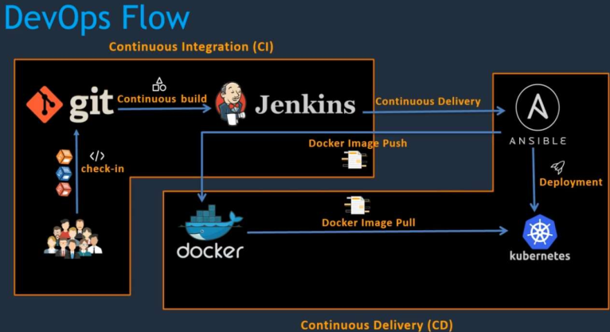
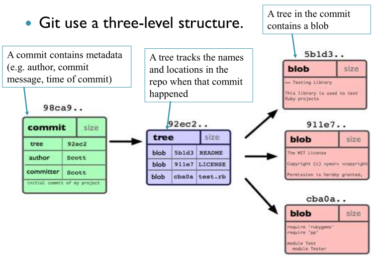
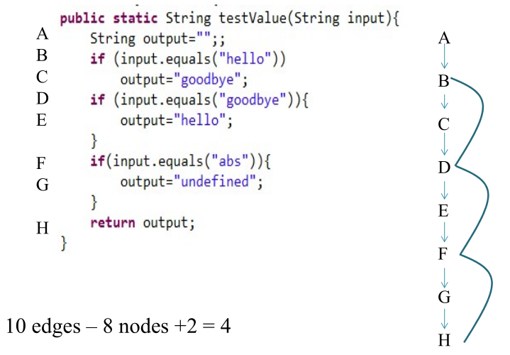
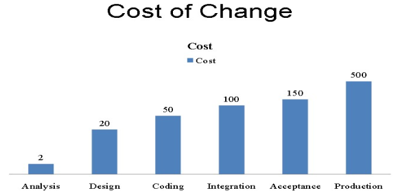

#+TITLE: CICD
#+DATE: [2026-04-07 Tue 15:56]
#+AUTHOR: Damian Chrzanowski
#+EMAIL: pjdamian.chrzanowski@gmail.com
#+OPTIONS: TOC:2 num:2
#+HTML_HEAD: <link href="https://fonts.googleapis.com/css?family=Source+Sans+Pro" rel="stylesheet">
#+HTML_HEAD: <link rel="stylesheet" type="text/css" href="../assets/org.css"/>
#+HTML_HEAD: <link rel="icon" href="../assets/favicon.ico">
#+latex_header: \hypersetup{colorlinks=true,linkcolor=black}
#+latex_header: \usepackage[margin=0.5in]{geometry}
#+latex_header: \usepackage[scaled]{helvet} \renewcommand\familydefault{\sfdefault}
* Exam Questions
** Propose a branching and merging model with diagrams in ~git~
** Challenges of ~CI/CD in rapid deployment~ in a cloud native env
   - Build stability (frequent changes are a challenging contributor)
   - Code quality (same as above)
   - Testing
   - Test coverage and design
   - Technical debt
   - Code complexity
   - CI/CD can be complex to setup
** System administration, deployment, ~DevOps in general~, Ansible for scaffolding, etc.
   #+begin_verse
   Use Terraform to create servers/networks/cloud resources (reliably and declaratively), use Ansible to configure the services/networks/servers/resources (reliably and declaratively, install software and configure it, deploy).

   Terraform builds the house, Ansible furnishes it.
   #+end_verse
   - Deployment pipeline
   - CI CD CD
   - Reduced downtime in deployment
   - Use build and CI tools (Maven and Jenkins)
** Describe what ~Jenkins~ does with regards to ~CI/CD~
   1. Automation of Build Process
   2. CI
   3. Automated Testing
   4. CD/D
   5. Integration with tools (Git/Maven/Sonar)
** 2x ~Testing pyramid~
   - Overview
   - Layers
   - Balance and proportions
** 2x ~Docker~, why was it made and what purposes does it serve?
   - Lightweight and efficient way to package and run applications consistently across environments
   - Perfect for microservices architecture
   - Reduced overhead compared to traditional virtualisation methods
** 2x ~Lifecycle of a Docker~ container from creation to termination.
   - ~docker create~: Created container
   - ~docker start~, ~docker run~: Run a container. Application inside is running
   - ~docker pause~, ~docker unpause~: Pause container (optional)
   - ~docker stop~: Stop execution of container and the application within
   - ~docker rm~: Permanently delete the container
** 3x Where does ~SonarQube~ fit into the CI/CD pipeline
   - After the build stage, in the ~static code analysis stage~
** 3x Mitigate a ~vulnerability~ detected by ~SonarQube~
** ~SonarQube~ maintainability ratings
*** Explanation
    - Is the value of the tech debt ratio. Compares the tech debt on a project to the cost it would take to rewrite it from scratch.
*** Reliability Ratings
    - <5% A rating (also mean 0 bugs)
    - 6% - 10 % B rating (also means 1 minor bug)
    - 11% - 20%  C rating (also means 1 major bug)
    - 21% - 50%  D rating (also means 1 critical bug)
    - >50%  E rating (also means 1 blocker bug)
*** Security Ratings
    - <5% A rating (also mean 0 vulnerabilities)
    - 6% - 10 % B rating (also means 1 minor vulnerability)
    - 11% - 20%  C rating (also means 1 major vulnerability)
    - 21% - 50%  D rating (also means 1 critical vulnerability)
    - >50%  E rating (also means 1 blocker vulnerability)
** 3x Diff between ~Cyclomatic and Cognitive Complexity~. Calculate both for a given code.
** Primary purpose of ~plugins~ in ~Maven~. What are the two main types?
   - ~Build plugins~: such as ~maven-compiler-plugin~, defined in the ~<build>~, used in the lifecycles (compile, test, package, etc.)
   - ~Reporting plugins~: such as ~maven-surefire-report-plugin~
** Issues with ~@Autowired~, use dep injection instead
   - Creates a ~tight coupling~
   - Use dependency injection (DI) via constructor injection
** How ~git~ stores and manages changes in a repo
*** General
    - Snapshots vs Differences: git stores snapshots, differences are evaluated in real time when needed. If a file has not changed, Git simply references the previous version instead of storing it again.
    - Objects in git db: ~commit~ (msg, author, parent, pointer to a tree), ~tree~ (file structure), ~blob~ (file data)
    - Role of SHA-1: unique identification of each object (commit)
*** What happens when
    - Branch: new pointer to an existing commit
    - Checkout: changes where the ~HEAD~ is pointing to
    - Merge: Combines histories, if they are diverged then a merge commit is created
** 2x Show steps with a ~diagram~ of a series of ~git~ commands
** ~RestTemplate~ vs ~Karate~ compare and contrast
   - Learning Curve:
     - Karate: simple, uses readable syntax via Cucumber
     - RestTemplate: Steeper learning curve, developer oriented
   - Support for BDD:
     - Karate: Strong BDD support via Cucumber/Gherkin
     - RestTemplate: uses standard java code, so not supported by BDD natively
   - Syntax and Test Writing:
     - Karate: Simple readable syntax, no boilerplate, easy to write and maintain, suitable for devs and QA engineers
     - RestTemplate: requires java knowledge, more verbose and technical, more control but less readable
** ~Cucumber~ in BDD with ~Example Mapping~
*** Benefits of ~Example Mapping~
    - Improves shared understanding of requirements
    - Helps define acceptance criteria early
    - Makes it easier to create test scenarios
    - Reduces ambiguity before development and testing
*** Mapping is carried out in a trivial way, just include invalid options as well
** Advantages of using ~mocks~ and mockito
** Maven's Project Object Model (~pom~)
   - POM: The Maven POM (pom.xml) is the central file used to define and manage a project. It identifies artifacts through coordinates, specifies packaging, supports modules, defines reusable properties, and manages dependencies with scopes such as test,provided and runtime. This makes Maven a powerful tool for building and managing Java projects.
   - Lifecycles:
     - ~validate~ (pom check and deps check)
     - ~compile~
     - ~test~
     - ~package~ (depending on the type, this phase could produce either a ~jar~ or a ~war~)
     - ~install~
   - Identification of artifacts
     - ~groupId~
     - ~artifactId~
     - ~version~
   - Packaging
     - ~jar/war~
   - Modules
     - Project split up into sub-modules with their own POM files
   - Properties
     - project version values
     - Java version values
     - plugin version values, plugin settings
   - Dep management, including scope. Three common scope types.
     - adding dependencies into the POM as ~<dependency>~
     - dependency scope: test, provided, runtime (only at runtime)
** ~TDD~ and steps involved
** TDD vs BDD
*** TDD
    - Focuses on writing unit tests before code
    - Uses a cycle: write tests > write code > refactor
    - Tests are written from a developer perspective
    - Focus is on verifying correctness of code
*** BDD
    - Focuses on describing behaviour from a user's perspective
    - Uses ~Give-When-Then~ format
    - Tests are written in a readable, natural language style
    - Emphasises collaboration between developers, testers and business stakeholders
*** Advantages of BDD
    - Requirements are expressed as clear scenarios
    - Both technical and non-technical team members can understand requirements
    - Reduces ambiguity and ensures the system behaves as expected
*** Summary
    - TDD focuses on testing code correctness, while BDD focuses on system behaviour. The key advantage of BDD is clearer communication and requirements understanding.
** Example Gherkin
   #+begin_src gherkin
     Feature: Calculator addition

     Scenario Outline: Add multiple numbers
       Given I have numbers <a> and <b>
       When I add them
       Then the result should be <result>

     Examples:
       | a | b | result |
       | 2 | 3 | 5      |
       | 4 | 6 | 10     |
       | 1 | 9 | 10     |
   #+end_src
* Common Questions
** What is a Deployment Pipeline?
   - Is an automated manifestation of your process for getting software from version control into the hands of your users.
   - DevOps diagrams with CI/CD
   
** CI vs CD
   - CI: practice of software development that helps the team to integrate their code multiple times a day seamlessly
     - Pros: detects problems as early as possible
   - CB (build): Process of automating the creation of a software build and running tests on it
   - CD: Practice of moving software changes into production efficiently, quickly and safely.
*** Graph
    - commit > build > unit test > deploy > test > prod deploy
    - CI: code > build > test
    - CD (delivery): code > build > test > release
    - CD (deploy): code > build > test > release > deploy
** Common SDLC steps
   - Requirements
   - System/Software design
   - Implementation + testing
   - Integration + system testing
   - Operation and Maintenance
** Git terminology
   - Snapshot: a commit object
   - Commit object:
     - Set of files
     - Reference to the parent commit object
     - Unique SHA-1
   - How git stores info:
   
** Branching strat:
   - Main branches: master(main), develop(dev)
   - Supporting branches:
     - feature branches: (branch and merge into/from dev)
     - release branches: from dev, prep release, any final fixes, etc.
     - hotfix branches: (branch from master merge into master)
** Docker
   - is a software tech that provides containers
   - OS level virtualisation that adds an additional layer of abstraction and automation
** Sonar Qube/Lint
   - CI: Continuous Inspection
   - Checks:
     - Code/block dupes
     - Coding standards
     - Code coverage
     - Code complexity
     - Comments
     - Bugs
     - Security vulnerabilities
   - SonarLint is ran as realtime analysis during coding inside of an IDE
   - SonarQube is ran after the tests are carried out so that quality and testing metrics can be extracted
** Bugs, vulnerabilities, code smells
   - Bugs: code that is demonstrably wrong and yields unexpected behaviour
   - Vulnerability: code that is potentially vulnerably to hacks or exploits
   - Code smells: Surface indications that there might be a deeper problem. Poor coding practices, that do not cause immediate issues.
** Quality metrics
   - Size metric: lines of code, classes, functions, files
   - Test metrics: unit tests, lines covered, branches covered
   - Complexity: cyclomatic, cognitive
   - Duplications: duplicated lines/blocks
   - Technical debt
** Seven Axis of Quality
   - Potential bugs
   - Coding rules
   - Tests
   - Duplications
   - Comments
   - Architecture and design
   - Complexity
** Complexities
   - Cyclomatic (branching)
   
   - Cognitive: increment when there is a *break* in the *linear flow* of the code.
** Unit Testing Phases
   1. Arrange (setup of vars, classes, etc.)
   2. Act (execute code)
   3. Assert (check correctness)
** Test Design Categories
   - Derived from the ~spec or model~ of system (black-box techniques).
     - Equivalence partitioning
     - Border value analysis (BVA)
     - Decision table testing (branch coverage, basically)
   - Derived from structure of the component or the system, aka structure-based or white-box testing.
   - Derived from the tester's experience or knowledge of systems, aka experience-based tests.
** Testing with Mocks
*** Components
    - Test class
    - System Under Test (SUT)
    - Depended on Components (DOCs)
*** Info
    - Dummy: The mock, it is the actual test-double. ~mock(User.class)~
    - Stub: Just dummy data being passed in or returned, non-important to the outcome, also used to provide pre-defined responses to methods. ~when > thenReturn~
    - Spy (~verify().someMethod(obj)~): Used to verify if the real object does what it is supposed to do (a wrapper). It is exactly like a mock object, except it is wrapped around a real one. ~spy(realObject)~
** Test Driven Development (TDD)
   - Is an approach to program development in which you inter-leave testing and code development.
   - Tests are written before code. Passing the tests is the critical aim.
   - Phases:
     - Identify requirements
     - Write tests for the requirements
     - Run the tests and see them fail
     - Implement functionality and re-run tests until completed
     - Move onto the next requirement
   - General cycle:
     1. Write failing tests (red)
     2. Write code, pass tests (green)
     3. Refactor (and repeat) (blue)
   - Benefits:
     - Code coverage
     - Regression testing
     - Simplified debugging
     - System documentation
   - Rules:
     1. Not allowed code, unless it is to pass a test (lolz)
     2. Not allowed to write any more of a unit test than is sufficient to fail
     3. Not allowed to write more code than there is to pass one test that we're working on
** Cost of changing code
   
** Build Systems
   - Generally: transform one form (input) into another (output)
   - Requirements of build tools:
     - Dependency Management
     - Versioning: dev, dev env, testing stage, prod stage
     - Compile code and build output
     - Execute tests, produce reports
     - Run quality checks
     - Build/deploy/release
     - Transfer files
     - Scripting capabalities
     - Cross-platform
     - IDE support
     - Docs
   - Maven project:
     - POM: contains all that is needed to build a project, as well as coordinates:
       - groupId: identification, such as com.tus
       - artifact: unique name of the project
     - Dependency manager: uses coordinates to manage deps, e.g.: groupId junit, artifactid junit, version 1.42, scope test
     - Project lifecycles
       - clean, prepare-resources, compile, package, test, verify, install, etc.
       - Typical:
         - ~validate~: check pom.xml
         - ~compile~: compile the source
         - ~test~: run unit tests
         - ~package~: create jar/war/...
         - ~verify~: verify package, run integration tests
         - ~install~: public package to local repo
         - ~deploy~: public package to remote repo
       - Phases and Goals: Phases are sequential (eg. ~install~ runs compile, test, package, verify and install). Goals are added via plugins and carry out additional work in the lifecycles.
     - Plugins
** User Stories
*** Definition
    - A concise, written description of a piece of functionality that will be valuable to a use (or owner) of the software
    - 3Cs: Card, Conversation, Confirmation
    - As a ~role~, I want ~goal~, so that ~reason~ (aka Who/What/Why)
*** INVEST
    - Independent
    - Negotiable
    - Valuable
    - Estimatable
    - Small
    - Testable
*** Acceptance Criteria
    - Usually written in the Given > When > Then form
*** Definition of Done
    - What counts as a user story being done?
*** Defining the User or Personas
    - Clearly define who is a user and what are the competency levels
    - Personas are basically different users of the system, they describe who or what a specific user is
*** Special User Stories
    - Non-functional Stories
    - Bug Stories
    - Spike Stories (research)
** SCRUM
*** Definition
    #+begin_verse
 Scrum is a lightweight framework that helps people, teams and organizations generate value through adaptive solutions for complex problems.
    #+end_verse
*** Scrum requires a Scrum Master to foster an environment where:
    - A Product Owner orders the work for a complex problem into a Product Backlog.
    - The Scrum Team runs a selection of the work into an Increment of value during a Sprint.
    - The Scrum Team and its stakeholders inspect the results and adjust for the next Sprint.
    - Repeat
*** Scrum is simple
    - Framework is purposefully incomplete
    - Is built upon the collective intelligence of the people using it
    - Rather than providing detailed instructions, the rules provide guidelines
    - Wraps around existing practices or renders them obsolete
    - Makes relative efficacy of current management, environment and work techniques; so that improvements can be made
*** Scrum Theory
    - Founded on empiricism and lean thinking
      - Empiricism asserts that knowledge comes from experience and decisions are made based on what is observed
      - Lean thinking reduces waste and focuses on essentials
    - Employs an iterative, incremental approach to optimize predictability and to control risk
    - Combines four formal events for inspection and adaptation within a containing event: The Sprint.
      - Sprint Planning
      - Daily Scrum
      - Sprint Review
      - Sprint Retrospective
    - Sprint events work because they implement empirical pillars of Scrum: transparency, inspection and adaptation
*** Pillars Of Scrum
**** Transparency
     - The process and the work must be visible to those performing the work as well as the ones receiving the work
     - Artifacts that have low transparency can lead to decisions that diminish value and increase risk
     - Enables Inspection
     - Inspection without transparency is misleading and wasteful
**** Inspection
     - Scrum artifacts and the progress towards agreed goals must be inspected frequently and diligently to detect potentially undesirable variance or problems.
     - To help with inspection, Scrum provides cadence in the form of its five events
     - Inspection enables Adaptation. Inspection without Adaptation is considered pointless.
     - Scrum events are designed to provoke change.
**** Adaptation
     - If any aspects of a process deviate outside acceptable limits or if the result is not acceptable, the process being applied or materials used must be adjusted.
     - Adjust as soon as possible to minimize further deviation
     - Adaptation is difficult if the people involved aren't empowered or self-managing.
     - Scrum team is supposed to adapt the moment it learns of anything via inspection
*** Scrum Values
    - *Commitment*, *Focus*, *Openness*, *Respect*, *Courage*
    - The team commits to achieve a goal and support each other
    - Focus on the work of the Sprint to make the best possible progress
    - Team and the stakeholders are open the work and the challenges
    - Respect each other to be capable and independent
    - Have the courage to work through tough problems and do the right thing
      #+begin_verse
      The above values are utilised by the team and people they work with. If applied well the pillars of transparency, inspection and adaptation come to life building trust.
      #+end_verse
*** Scrum Team
**** Consists of a small team, generally:
     - One Scrum Master
     - One Product Owner
     - Developers
     - No sub-teams and no hierarchies
     - Cohesive unit of professionals focused on the one objective: Product Goal
     - Typically 10 or fewer people
     - Usually smaller teams work better, communicate better and are more productive
     - Too large a team should perhaps split into own Scrum Teams with the same focus on the same product: share same Product Goal, Product Backlog and Product Owner.
**** Team is cross-functional
     - Each member has the skills necessary to create value during each Sprint
**** Self-managing
     - Internally decide who does what, when and how.
**** Responsible for all product-related activities
     - Stakeholder collaboration
     - Verification
     - Maintenance
     - Operation
     - Experimentation
     - Research and Development
     - Anything else that might be required
**** Accountability
     - Accountable for creating a value, useful Increment every Sprint
     - Three specific accountabilities within the Scrum Team
       - The Developers
       - The Product Owner
       - The Scrum Master
**** Developers
     - Are the people that are committed to creating any aspect of usable Increment each Sprint
     - The skills necessary may be broad and vary depending on the domain
     - But are always accountable for:
       - Creating a plan for the Sprint, the Sprint Backlog
       - Instilling quality by following the Definition of Done
       - Adapting their plan each day toward the Sprint Goal
       - Holding each other accountable as professionals
**** Product Owner
     - Accountable for maximising the value of the product resulting from the work of the Scrum Team
     - Accountable for effective Product Backlog management, which includes:
       - Developing and explicitly communicating the Product Goal
       - Creating and clearly communicating Product Backlog items
       - Ordering Product Backlog items
       - Ensuring Product Backlog is transparent, visible and understood
     - The Product Owner may delegate his tasks to others, but is held accountable nonetheless
     - The decisions of the Product Owner are transparent via the Product Backlog and through inspectable Increment at the Sprint Review
     - If anyone wants to change the Product Backlog they need to convince the Product Owner to do so
**** Scrum Master
     - Accountable for establishing Scrum as defined by the Guide
     - Help everyone understand Scrum and its practices and theories, both withing a team and the organisation
     - Is accountable for the team's effectiveness. This is achieved by improving the team's practices within the Scrum framework
     - Are true leaders who serve the Team and the organisation
     - Some ways how Scrum Masters serve the team:
       - Coaching in self-management and cross-functionality
       - Help the team in creating high-value Increments that meet DoD
       - Remove impediments to the team's progress
       - Ensure all Scrum events take place and are positive, productive and kept within a timebox
     - The Scrum Master serves the Product Owner:
       - Help with techniques for better Product Goal definitions and Product Backlog management
       - Help understand the need for clear and concise Product Backlog items
       - Help in establishing empirical product planning for a complex environment
       - Facilitate stakeholder collaboration as requested or when needed
     - The Scrum Master serves the organisation:
       - Lead, train and coach the org in Scrum adoption
       - Plan and advise Scrum implementations within the org
       - Help employees and stakeholder understand and enact an empirical approach for complex work
       - Remove barriers between stakeholders and the Scrum Team
*** Scrum Events
    - Events exist to create regularity and to minimize meetings not defined in Scrum
    - Failure to operate any events results in a lost opportunity to inspect and adapt
**** The Sprint
     - Is the heartbeat of Scrum
     - Fixed length, usually a month
     - New one starts immediately after the conclusion of the previous Sprint
     - All the work that is necessary to achieve the Product Goal (Sprint Planning, Daily Scrums, Sprint Review, Sprint Retrospective) happen within Sprints
     - During the Sprint:
       - No changes are made to endanger the Sprint Goal
       - Quality does not decrease
       - Product Backlog is refined as needed
       - Scope may be clarified and negotiated with the Product Owner as more is learned
     - Sprints enable predictability by ensuring inspection and adaptation of progress toward a Product Goal at least once a month
     - Shorter sprints can be employed to encourage faster learning, however, longer sprints can stray away from the over goal, the Sprint Goal
     - Each Sprint can be considered a mini-project (and now this whole thing makes much more sense)
     - Various practices exist to forecast progress: burn-downs, burn-ups, cumulative flow, etc.
       - However, remember that in complex environments what will happen is unknown. Only what has happened may be used for future decision making (empiricism).
     - Sprint may be cancelled if the Spring Goal becomes obsolete. Only the Product Owner has the authority to do so.
**** Sprint Planning
     - Initiates the Sprint by laying out the work to be performed for the Sprint
     - Is created by the entire Scrum Team
     - PO ensures attendees are prepared to discuss most important PB items and how they map to the Product Goal
     - The team may invite other people to provide advice
     - Sprint Planning addresses the following topics:
       - Why is this Sprint Valuable? - Sprint Goal must be finalized at the end of Sprint Planning, so the PO proposes how to increase value and utility in the Current Sprint, then the team collaborates to define a Sprint Goal. The Sprint Goal communicates why the Goal is valuable.
       - What can be Done this Sprint? - PO and the Devs discuss which items from the PB to include in the Sprint. The items may be refined during this process by the team (increases understanding and confidence of what is being done). Selecting items may be hard but empiricism helps as time goes by.
       - How will the chosen work get done? - Each item from PB is planned by the Devs to create an Increment that meets the DoD. Often this is accomplished by decomposing an item into tasks/sub-tasks. This is purely at the discretion of the Devs on how they approach this process. No one tells the Devs how to turn PB items into Increments of value.
     - The timebox for planning is usually 8 hours in a one-month Sprint. For shorter sprints it is less than that.
     - The Sprint Goal, PB's items selected for the Sprint and the Delivery Plan of said items are together referred to as the: Sprint Backlog
**** Daily Scrum
     - Goal is to inspect progress towards the Sprint Goal and adapt the Sprint Backlog if necessary (adjust the upcoming planned work)
     - Is a 15-minute event for the Developers of the Scrum Team
     - Is usually held at the same time and place every working day of the Sprint
     - If the PO or Scrum Master are actively working on items from the Sprint Backlog they participate as Devs
     - Devs select whatever structure and technique they want, for as long as their Daily Scrum focuses on progress towards the Sprint Goal and produces an actionable plan for the next day (create focus and improves self-management)
     - General goals:
       - Improve communication
       - Identify impediments
       - Promote quick decision making
       - Eliminate needs for other meetings (hopefully), however, if necessary other meetings happen throughout the day for more detailed discussions and plan adjustments
**** Sprint Review
     - Inspect the outcome of the Sprint, determine future adaptations
     - Present results to key stakeholders and progress towards the Product Goal (discuss progress as well)
     - Team and stakeholders discuss what was accomplished in the Sprint and what has changed
     - Based on all the information provided a discussion ensues on what to do next
     - Product Backlog may be adjusted to meet new opportunities
     - Is a working session and should not be a simple presentation
     - Is the second to last event, usually timeboxed to 4 hours for a one-month Sprint, less for shorter Sprints.
**** Sprint Retrospective
     - Purpose: Plan ways to increase quality and effectiveness
     - Scrum Team inspects how the last Sprint went with regards to: Individuals, Interactions, Processes, Tools and the Definition of Done.
     - Identify assumptions and explore their origins
     - Scrum Team discusses what went well during the Sprint, what problems were encountered and how the problems were solved (or not solved)
     - Scrum Team identifies most helpful changes to improve the way forward. Most impactful improvements are addressed as soon as possible.
     - Retrospective concludes the Sprint, timeboxed to three hours for a one-month Sprint, less for shorter sprints.
*** Scrum Artifacts
    - Represent work of value
    - Designed to maximise transparency of key information
    - Each artifact contains a commitment to ensure it provides information that enhances transparency and focus, this transparency and focus' progress can then be measured
**** Product Backlog
     - Emergent, ordered list of what is needed to create and improve the product.
     - Single source of work for the Scrum Team
     - Any item from the Backlog that can be done within a single Sprint is considered "ready" for Sprint Planning
     - Product Backlog refinement or grooming is the act of breaking down items into more precise items
     - It is an ongoing process that adds details, descriptions, order and size
     - Devs are responsible for the sizing
     - PO may influence the Devs by helping understand items and select trade-offs
***** Commitment: Product Goal
      - Describes a future state of the product which can serve as the target for the Scrum Team to plan against.
      - The Product Goal is in the Product Backlog
      - Is the long-term objective for the Scrum Team. Fulfil (or abandon) an objective before taking on the next
**** Sprint Backlog
     - Composed of the Sprint Goal (the: why)
     - The set of PB items selected for the Sprint (the: what)
     - Actionable plan for delivering an Increment (the: how)
     - The Sprint Backlog is a plan by and for the Developers
     - Is a high-visibility real-time picture of the work that the Devs plan to accomplish during the Sprint to achieve the Sprint Goal
     - Update the Backlog when more things are learned about the work
     - Should have enough detail that can be discussed during the Daily Scrum
***** Commitment: Sprint Goal
      - Single objective of the Sprint
      - Commitment by the Devs, but has flexibility in terms of the exact work needed to accomplish the goal
      - Creates coherence and focus. The whole team is on the same page and work together towards the same goal.
      - Is created during Sprint Planning and added to the Sprint Backlog
      - As Devs work they keep the Sprint Goal in mind
      - If the work turns out more difficult, they collaborate with the PO to negotiate the scope and hopefully achieve the Sprint Goal still
**** Increment
     - Is a concrete stepping stone towards the Product Goal
     - Each is additive with the previous one and thoroughly verified to ensure that all Increments work together
     - In order to provide value and Increment must be usable
     - Multiple Increments may be created within a Sprint
     - Increments may be presented to stakeholders sooner, Sprint Review does not need to be solely that moment
     - Work cannot be considered part of an Increment unless it meets the Definition of Done
***** Commitment: Definition of Done
      - Is a formal description of the state of an Increment when it meets the quality measures required for the product
      - When a Product Backlog item meets the Definition of Done, an Increment is made
      - DoD creates transparency. so that everyone understands what kind of work is necessary to complete a work item to create an Increment.
      - If a PB item does not meet the DoD it cannot be released or even presented at the Sprint Review. It goes back to the PB.
      - DoD may be an organizational standard, so then all Scrum Teams follow that standard. Otherwise the Scrum Team creates their own DoD appropriate for the product.
      - Devs are required to conform with DoD. If multiple teams work on a single product they all share the same DoD.
* Remove at the End
  #+BEGIN_EXPORT html
  
  
  #+END_EXPORT
