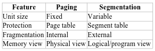

#+TITLE: Computer Architecture And Cloud Services
#+DATE: [2025-12-07 Sun 13:51]
#+AUTHOR: Damian Chrzanowski
#+EMAIL: pjdamian.chrzanowski@gmail.com
#+OPTIONS: TOC:2 num:2
#+HTML_HEAD: <link href="https://fonts.googleapis.com/css?family=Source+Sans+Pro" rel="stylesheet">
#+HTML_HEAD: <link rel="stylesheet" type="text/css" href="../assets/org.css"/>
#+HTML_HEAD: <link rel="icon" href="../assets/favicon.ico">
[[file:index.org][Home Page]]
* Exam Questions Bank
  - (1x) How admin can enable two users to copy files between each other, but restrict others from doing so?
  - (1x) ~GPUs~ and ~GPGPUs~ as an example of ~multicore~. What are GPUs good for?
  - (1x) CISC vs RISV. Experiencing ~Semantic Gap~
  - (1x) Fix a piece of code that has a potential ~race condition~
  - (1x) With regards to CPUs: What is ~paging~, ~page faults~, ~page thrashing~? CPU performance impacts.
  - (1x) What is ~Symmetric Multiprocessing~ (SMP) and ~Clustering~? With regards to ~high-performance~ ~multiprocessor~ configurations. Compare scalability and availability.
  - (1x) Is ~deadlock~ possible when ~two processes~ use ~three individual~ resources when ~one process~ requires a ~maximum of two resources~?
  - (1x) ~Load time~ of 64KB ~program~ when seek time is 10ms, rotation time of 10ms and tracks hold 32KB. When 2KB ~page size~ and when 4KB page size.
  - (1x) Two ~CPUs~ with ~two threads~ each load programs P0, P1 and P2, initialised at 5ms, 10ms and 20m. How long to ~complete execution~?
  - (1x) ~Disk access to a sector~ time with 15000 RPM, 8ms seek time and 500 sectors per track.
  - (1x) Define ~cloud computing~ and ~five key components~ associated with it.
  - (1x) Describe the ~CSA~ Open Certification Framework.
    - (1x) Also what can cloud provide do to ~prevent data loss~?
    - (1x) What can be done to prevent a ~security breach~?
  - (1x) Describe ~RAIDs~ 0 to 5 with regards to: ~read/write performance~ and ~reliability~
  - (1x) What is the { SPI Model }?. Compare traditional with ~IaaS~, ~PaaS~ and ~SaaS~
  - (1x) How to ensure that an ~authorized employee~ can ~access certain data~? Is it possible to provide ~absolute protection~?
  - (1x) What is and what are the problems with ~converging Cloud Computing and IoT~?
  - (1x) Using the CSA's ~STAR~, calculate ~trust proportion t~, ~certainty c~ and if needed ~trust value E~
* Answers to Questions
** How admin can enable two users to copy files between each other, but restrict others from doing so?
   - Create a shared group:
     - sudo groupadd designers
     - sudo usermod -aG designers user1
     - sudo usermod -aG designers user2
   - Change the group ownership of each user's home dir:
     - sudo chgrp designers /home/user1
     - sudo chgrp designers /home/user2
   - Set directory permissions
     - sudo chmod 770 /homs/user1 (full access for user and grou, 0 for outside)
     - sudo chmod 770 /homs/user2
** What is pipelining and performance effects
   - Starting to execute a second instruction before the first one is completed
   - So each of the stages below works on a different instruction at the same time
   - Stages of CPU execution:
     - Fetch
     - Decode
     - Execute
     - Memory
     - Write-back
   - So as an example the CPU can perform a fetch while the execute is still running and thus speeding up the processing drastically.
** In Computer Architecture, what do the terms ‘structure’ and ‘function’ refer to? In addition, list and describe 3 logical computer architecture structures?
   - Structure is the way in which components relate to each other
     - BIOS
     - CPU
     - Memory Volatile/Permanent
     - I/O
     - Communication channels (e.g. USB)
     - Bus
   - Function is the operation of individual components as part of the structure
     - Data processing
     - Data storage
     - Data movement
     - Control of each of the above
** Architecture vs Organization
   - Arch: is those attributes visible to the programmer: instruction set, I/O mechanisms, etc.
   - Org: is how features are implemented: control signals, interfaces, memory technology, etc.
** Briefly describe the purpose of the following registers: IR, PC, MAR, MBR, I/OAR and I/OBR.
   - IR: Instruction Register: holds the current instruction that the CPU is executing
   - PC: Program Counter: holds the address of next instruction to fetch
   - MAR: Memory Address Register: specify the address in memory for the next read or write
   - MBR: Memory Buffer Register: contains the data to be written into memory or data retrieved from memory
   - I/OAR: Input/Output address register: specify a particular IO device
   - I/OBR: Input/Output buffer register: exchange data with a particular IO device
** Calculate MIPS for a 2.5GHz CPU with 4 CPI vs Upgrade of the same CPU but with 5 pipelines and 2.0GHz
*** MIPS Calculation
    #+begin_verse
    ~MIPS = MHz/CPI~
    #+end_verse
*** Non-pipelined
    - 2500MHz/4 = 625 MIPS
*** Fully Pipeplined (does Fetch/Decode/Execute/Memory/Write) in 1 cycle
    - 2000MHz/1 = 2000 MIPS
** Ways to avoid race conditions
   1. Mutual Exclusion (Locks / Mutexes/ Semaphores): one thread at a time
   2. Critical Section: Protect a critical section of code with a lock
   3. Atomic operations: Usage of operations that cannot be interrupted mid-execution
   4. Avoid shared state: design programs to use ~local copies~ or message passing instead of sharing data directly
** Peterson's solution and preemptive vs non-preemptive.
   - It's easy to explain with the code bit, two processes can safely share a critical section
   - ~Preemptive scheduling~ allows a process to be interrupted at any time. It works with Peterson's because there is no timing, it depends on a shared variable, so even if interrupted it guarantees mutual exclusion.
   - ~Non-preemptive scheduling~, a process runs until it blocks or yields. The waiting loop ensures that even without forced switching, entering or leaving is respected.
** If students working at individual PCs in a computer laboratory send their files to be printed by a server which spools the files on its hard disk. Under what conditions may a deadlock occur if the disk space for the print spool is limited? How may the deadlock be avoided?
*** Problem
    #+begin_verse
Mutual exclusion
Disk blocks used for the print spool are exclusive resources.

Hold and wait
A print job may have already spooled some of its file to disk and is waiting for more disk space to finish spooling.

No preemption
The spooler cannot easily take back disk blocks already allocated to a partially spooled job.

Circular wait
Example scenario:
The spool disk has space for 10 MB.
Job A needs 6 MB, Job B needs 6 MB.
Job A spools 5 MB and waits for 1 MB more.
Job B spools the remaining 5 MB and waits for 1 MB more.
Disk is full; both jobs wait forever.
Neither job can finish and release space → deadlock.
    #+end_verse
*** Solution
    #+begin_verse
1. Request All Resources at Once
Require a job to have enough free disk space for the entire file before spooling begins.
If sufficient space is not available, the job waits without allocating any space.
Eliminates hold and wait.

2. Limit the Number of Concurrent Spooling Jobs
Allow only a fixed number of jobs to spool at once, based on disk capacity.
Prevents circular wait.

3. Disk Space Quotas or Reservation
Reserve disk space equal to the file size before spooling starts.
Commonly used in real print spoolers.

4. Use Streaming Instead of Full Spooling
Stream jobs directly to the printer when possible.
Reduces reliance on disk space.
    #+end_verse
** Paging vs Segmentation
*** Paging
    - Paging divides memory into fixed-sized blocks (physical & logical)
    - Each process has its own page table. OS checks whether a page belongs to a process before allowing access.
*** Segmentation
    - Divides memory into variable-sized logical units such as code, stack, heap, functions or arrays.
    - Each segment has a base address and a limit
    - Protection is achieved using ~segment descriptors~, which define access rights to each segment.
*** Info Table
    
** How is a page fault managed
   1. Process attempts memory access. The OS checks memory and it is not in the RAM.
   2. Interrup to OS
   3. OS locates the required page in the SWAP or on disk
   4. Frame selection
   5. Load the page into the frame
   6. Restart instruction
** ~GPUs~ and ~GPGPUs~ as an example of ~multicore~. What are GPUs good for?
   - GPU is a core designed to perform parallel operations of graphics data
   - GPUs perform parallel operations on multiple sets of data, especially good for vectors
   - They are an example of multicore because GPUs themselves contain many computational units
   - GPGPU - using GPUs for general purpose (GP)
   - GPUs are good for: graphics processing, video processing, vector-style computations (image, video, simulations, large data sets)
** CISC vs RISV. Experiencing ~Semantic Gap~
*** CISC (Complex Instruction Set Computer)
    - CISC: large complex instruction sets, intended to close the "semantic gap" to resemble a high-level language
    - Perform significant work per instruction, higher cycles per instruction, higher period per instruction
*** RISC (Reduced Instruction Set Computer)
    - RISC: simple instructions, low cycles per instructions and uniform instruction formats
    - Requires more instructions per program, but instructions are faster
    - Focuses on:
      - Many registers
      - Simple addressing modes
      - Pipeline-friendly design
*** Semantic Gap
    - CISC addresses the problem, bridging the gap between between high-level languages and instructions sets, but that increased compiler complexity
    - Bridging the gap was achieved by creating larger instruction sets.
    - Also adding microcode to implement complex sequences "in hardware" to ease compiler work
    - Other solutions bring compiler complexity, so addressing this problem via hardware (instruction + microcode) allows for smaller complexity and faster execution
** Fix a piece of code that has a potential ~race condition~
*** Problem
    - The problem is race condition
    - Two threads will run concurrently and you cannot fully predict the order of execution
    - Causes lost updates, non-atomic operation
    - Solution, add: synchronized to the method signature (easiest solution)
*** Implementing a Runner
    #+begin_src java
      public class BankRunner {
          public static void main(String [] args) {
              BankAccount acc = new BankAccount();

              // thread 1 deposist
              Runnable depositTask = () -> {
                  for (int i = 0; i < 5; i++) {
                      acc.deposit(20);
                  }
              }

              Runnable withdrawTask = () -> {
                  for (int i = 0; i < 5; i++) {
                      acc.withdraw(20);
                  }
              }

              Thread t1 = new Thread(depositTask);
              Thread t2 = new Thread(withdrawTask);

              t1.start();
              t2.start();

              try {
                  t1.join();
                  t2.join();
              } catch (Exception e) {

              }

              System.out.println("Final balance = " + acc.getBalance());
          }
      }
    #+end_src
** With regards to CPUs: What is ~paging~, ~page faults~, ~page thrashing~? CPU performance impacts.
   - ~Paging~ is an OS mechanism that maps physical memory to virtual memory
   - ~Page Fault~ occurs when a program accesses virtual memory, but it points to an empty area of RAM (might have to be recovered from disk) or it is simply not loaded
     - Accessing I/O (disk) to recover a page fault is a very slow operation
   - ~Page Thrashing~ occurs when the system swaps pages around due to a small memory size. This generally takes place when too many programs compete for too little RAM (can lead to using the SWAP)
** What is ~Symmetric Multiprocessing~ (SMP) and ~Clustering~? With regards to ~high-performance~ ~multiprocessor~ configurations. Compare scalability and availability.
   - SMP: System has ~multiple processors~ and share ~one main memory~ and run one OS. The OS schedules threads across all processors.
     - Great performance if work can be done in parallel
     - If 1 cpu fails the work can continue (availability)
     - Supports incremental growth (add more processors)
   - Clustering: Whole computers (nodes) working together as one system.
     - Each node has its own CPU, Memory, OS, etc.
     - Great scalability (just keep on adding more computers)
     - Very high availability (one PC failure is no problem at all)
** Is ~deadlock~ possible when ~two processes~ use ~three individual~ resources when ~one process~ requires a ~maximum of two resources~?
*** Deadlock concepts
    - Deadlock is possible when all four of these are present, however preventing at least one of these prevents deadlock.
    - Mutual exclusion: Some resources can be used by only one process at a time.
    - Hold and wait: A process holds at least one resource while waiting to acquire additional resources.
    - No preemption: Resources cannot be forcibly taken from a process; they must be released voluntarily.
    - Circular wait: A set of processes exists where each process is waiting for a resource held by the next process in a cycle.
*** Answer to the question
    - Each process needs at most 2 resources, and there are 3 identical resources total. In the worst case, both processes each hold 1 resource (using 2 total), leaving 1 free resource. One of the processes can then acquire this remaining resource, reach its maximum of 2, complete, and release its resources. This prevents circular wait, so deadlock cannot occur.
** ~Load time~ of 64KB ~program~ when seek time is 10ms, rotation time of 10ms and tracks hold 32KB. When 2KB ~page size~ and when 4KB page size.
   - To load one track it takes 10ms + 5ms (avg rotational latency) to find it = 15ms "per sweep"
   - Load speed is 32KB in 10ms (one full track is 32KB and a full rotation is 10ms). So we can load 3.2KB/ms
   - We have a 64KB program
     - 2KB page it is 32 sweeps:
       - Transfer = 2KB / 3.2KB/ms = 0.625ms + 10 + 5 = 15.625ms = 32 * 15.625ms = 500ms
     - 4KB page is is 16 sweeps:
       - Transfer = 4KB / 3.2KB/ms = 1.25ms + 10 + 5 = 16.25ms = 16 * 16.25ms = 260ms
** Two ~CPUs~ with ~two threads~ each load programs P0, P1 and P2, initialised at 5ms, 10ms and 20m. How long to ~complete execution~?
   - This is trivial
** ~Disk access to a sector~ time with 15000 RPM, 8ms seek time and 500 sectors per track.
   - Average Access Time = SeekTime + Average Rotational Delay + Transfer Time
   - 15 000 RPM = 60 000ms / 15 000 = 4ms per rotation
   - Avg Rotational Delay (half a rotation) = 4 / 2 = 2ms
   - Transfer time = 4ms / 500 = 0.008ms (the amount of time it takes for one sector to pass under the head)
   - Avg Access Time = 8ms + 2ms + 0.008ms = 10.008 ms
** Define ~cloud computing~ and ~five key components~ associated with it.
*** Definition
    - ~Cloud computing~: is a model that provides on-demand, scalable, virtualized services (SPIs) delivered over the Internet with elastic resource allocation and a pay-as-you-use pricing.
*** Five Key Components
    - Virtualization: virtual servers, hypervisors ,virtual memory
    - Elasticity/Scalability: automatically scale to handle variable workloads
    - Service Models (SaaS, PaaS, IaaS)(SPI): SPI model is central to cloud architecture
    - Storage Virtualization: Storage is abstracted, is scalable and is distributed.
    - Network Virtualization: Virtual routers and switches manage cloud networking
*** Cloud Solution
    - Hybrid: part of the data in a private cloud and the streaming solution in a public cloud (for better scalability)
** Describe the ~CSA~ Open Certification Framework.
*** Description
    - An industry initiative to allow global, accredited, trusted certification of cloud providers
*** Four Initiatives Are
    - Cloud Controls Matrix (CCM): Detailed set of security controls
    - Consensus Assessments Initiative (CAI/CAIQ): Providers answer questions about their security with a via a questionnaire (STAR)
    - Cloud Audit: Standardized methods for auditing cloud services
    - CoudTrust Protocol (CTP): Mechanism for customers to obtain transparency about security and privacy practices
*** Also what can cloud provide do to ~prevent data loss~?
    - Security Controls
    - Backup & Contingency Systems
    - Migration & Redundancy
    - Data Isolation
    - Understanding Sensitive Data
*** What can be done to prevent a ~security breach~?
    - Backup Systems
    - Contingency Plans
    - Professional Staff
    - Audit logs, monitoring tools
    - Risk Management practices
** Describe ~RAIDs~ 0 to 5 with regards to: ~read/write performance~ and ~reliability~
   - 0: Striping
   - 1: Mirroring
   - 2: ECC Striping
   - 3: Striping + Single Parity Disk
   - 4: Block Striping + Single Parity Disk
   - 5: Block Striping + Distributed Parity
     | RAID                   | Read      | Write                | Reliability |
     |------------------------+-----------+----------------------+-------------|
     | 0 (Striping)           | Fast      | Fast                 | None        |
     | 1 (Mirroring)          | Very good | Slow (dupe writes)   | Excellent   |
     | 2 (ECC Striping)       | High      | High                 | Good (ECC)  |
     | 3 (Striping SPD)       | Very high | Moderate             | Good        |
     | 4 (Block Striping SPD) | Good      | Poor (parity bottle) | Good        |
     | 5 (Block Striping DP)  | Very good | Good                 | Good        |
** What is the { SPI Model }?. Compare traditional with ~IaaS~, ~PaaS~ and ~SaaS~
** How to ensure that an ~authorized employee~ can ~access certain data~? Is it possible to provide ~absolute protection~?
** What is and what are the problems with ~converging Cloud Computing and IoT~?
** Using the CSA's ~STAR~, calculate ~trust proportion t~, ~certainty c~ and if needed ~trust value E~
*** Definition: Security, Trust & Assurance Registry (STAR)
* Intro
* Remove at the End
  #+BEGIN_EXPORT html
  
  
  #+END_EXPORT
