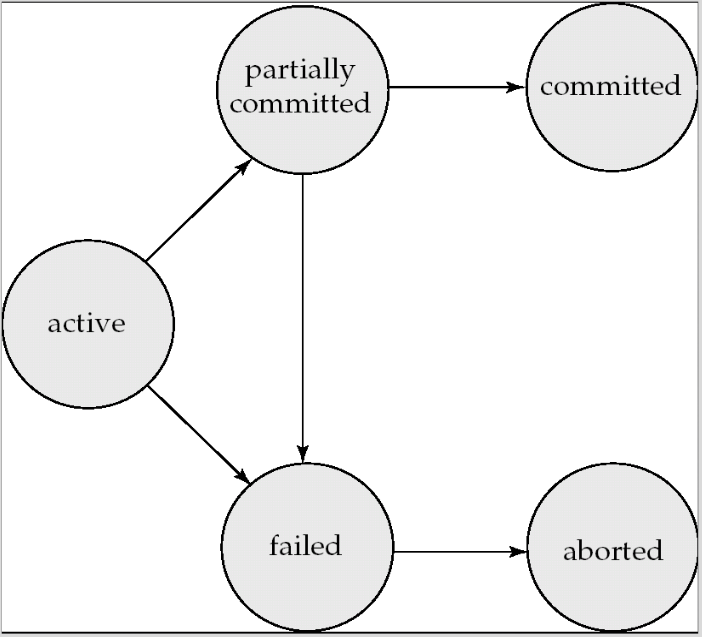
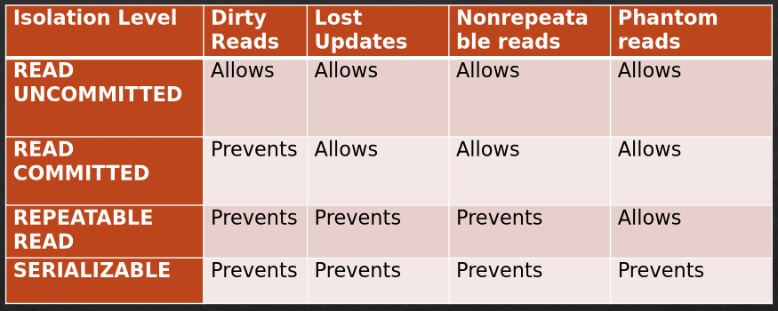

#+TITLE: Databases
#+DATE: [2025-12-05 Fri 12:00]
#+AUTHOR: Damian Chrzanowski
#+EMAIL: pjdamian.chrzanowski@gmail.com
#+OPTIONS: TOC:1 num:2
#+latex_header: \hypersetup{colorlinks=true,linkcolor=black}
#+latex_header: \usepackage[margin=1in]{geometry}
#+latex_header: \usepackage[scaled]{helvet} \renewcommand\familydefault{\sfdefault}

[[file:index.org][Home Page]]

* Exam Question Bank
** Questions
*** ERD
   - (4x) Draw an ERD
   - Phases of DB design
   - DB Modelling
*** SQL
   - (2x) Create SQL Tables
   - (3x) Construct SQL Queries based on Tables in an Appendix
   - (2) Construct an SQL Join Query
   - Construct an SQL Join Query with Group By
   - Diff between Functions and Procedures
   - (2x) Write a Function
   - (3x) Write a Procedure
     - (2x) with transaction (~declare continue handler for sqlexception~ is necessary here)
   - Write a Trigger
   - Write an Event
   - Write an Index
   - (2x) Subqueries vs Joins
   - (3x) SQL Injection, what is it?
     - (2x) 3 ways to protext
     - (2x) Explain two different types
   - (1x) Dynamic SQL
*** JDBC/JPA
   - (3x) Analyse a bit of JPA code, draw out tables and columns
   - (4x) Explain Object Relational Paradigm Mismatch.
     - (1x) Focus on 5 problems
     - (3x) Focus on Associations (how JPA resolves this?)
   - (2x) Compare JPA and JDBC
   - Create a JPA EntityManager
     - Save Entity
     - Update Entity
     - Delete Entity
*** Concurrency
   - Preventing Deadlock. Four levels of isolation.
   - (2x) Four common concurrency problems
     - Data integrity
     - Locking behaviour
     - Concurrency elimination vs Performance
*** NoSQL
   - (2x) ACID vs BASE. Trade-offs with regards to the CAP Theorem.
   - (3x) What is NoSQL and provide 4 types that exist with examples on where they are used and what are the names of these technologies
   - (1x) Denormalization
   - (1x) What is Big Data
     - Explain 4Vs of Big Data
* DML/DDL
** Data Manipulation Language
   - ~select/insert/delete/update~ into tables, basically
** Data Definition Language
   - ~create/alter/drop~ tables/attributes
* DB Functions
** Scalar
   - UCASE()
   - LCASE()
   - LEN(): length of a text field
   - ROUND(): rounds to a specified number of decimal places, e.g.: ~select round(wage, 2)~ two decimal places
   - NOW()
** Aggregate
   - AVG()
   - COUNT()
   - SUM()
* Types
  - CHAR(size)
  - VARCHAR(size)
  - TEXT
  - INT(max_digits_or_omit)
  - TINYINT
  - DECIMAL(size, decimal_places)
  - DATE: YYYY-MM-DD
  - DATETIME: YYYY-MM-DD HH:MI:SS
  - TIMESTAMP: YYYY-MM-DD HH:MI:SS
  - NULL: use with IS NULL or IS NOT NULL rather than ~=~
* SQL
** Insert
   #+begin_src sql
     insert into table_name
     values ('02/25/08', 'pizza', 70);

     insert into table_name (date, name, qty)
     values ('02/25/08', 'pizza', 70);
   #+end_src
** Delete
   #+begin_src sql
     delete from table_name
     where condition;
   #+end_src
** Update
   #+begin_src sql
     update table_name
     set attr = some_val
     where condition;
   #+end_src
** Joins
   - ~join~ (aka ~inner join~)
   - ~left join~
   - ~right join~
   - ~full join~
   - One table join
   #+begin_src sql
     select column_names
     from table_1 as t1
     join table2 as t2
     on t1.id = t2.t1_id;
   #+end_src
   - Two table join
   #+begin_src sql
     select column_names
     from table_1 as t1
     join table2 as t2
     on t1.id = t2.t1_id
     join table3 as t3
     on t2.id = t3.t2_id;
   #+end_src
** Like
   | Like Operator | Description                                       |
   |---------------+---------------------------------------------------|
   | LIKE 'a%'     | Starts with a                                     |
   | LIKE '%a'     | Ends with a                                       |
   | LIKE '%or%'   | Has or at any position                            |
   | LIKE '_r%'    | Has an 'r' at the second position                 |
   | LIKE 'a_%'    | Starts with a, and has at least 2 chars in length |
   | LIKE 'a__%'   | Starts with a, and has at least 3 chars in length |
   | LIKE 'a%o'    | Starts with a and ends with o                     |
   #+begin_src sql
     select col_name
     from table_name
     where col LIKE pattern;
   #+end_src
** Between
   #+begin_src sql
     SELECT column_name(s)
     FROM table_name
     WHERE column_name BETWEEN value1 AND value2;
   #+end_src
   #+begin_src sql
     SELECT column_name(s)
     FROM table_name
     WHERE column_name NOT BETWEEN value1 AND value2;
   #+end_src
** Group by and Having
   - Group by determines how the data is grouped and having determines which groups to include
     #+begin_src sql
       select department, gender, count(*) as "Number of Emp"
       from details
       group by department, gender
       having count(*) > 2;
     #+end_src
** Group by and rollup
   - Includes an additional row after every group with a summary
     #+begin_src sql
       select department, gender, count(*) as "Number of Emp"
       from details
       group by department, gender with rollup;
     #+end_src
** Unions
   - Each side must have the same amount of columns
   - Columns must have similar data types
     #+begin_src sql
       select column1, column2 from table1
       union
       select column1, column2 from table2;
     #+end_src
** Index
   - Speeds up a data retrieval for a specific column
   - Avoid on columns that are updated frequently as that will likely slow the whole database down, rather than speed up
     #+begin_src sql
       create index lastname_index
       on table_name(last_name);

       show index from table_name;

       drop index lastname_index on table_name;
     #+end_src
** Subqueries in ~where~
   #+begin_src sql
     select distinct customer_name
     from details
     where customer_name in (select customer_name from depositor);
   #+end_src
   #+begin_src sql
     select distinct customer_name
     from details
     where customer_name not in (select customer_name from depositor);
   #+end_src
** Joins vs Subqueries
   - A join can included columns from both tables, a subquery cannot
   - A join tends to be more intuitive when there are relationships
   - A subquery can pass aggregate functions to the main query
   - A subquery is more intuitive on ad hoc relationships
   - Long complex queries tend to be easier to debug and to code
   - Performance impact of many subqueries can be substantial when compared to joins
* Procedures vs Functions
  | Procedure                  | Function                      |
  |----------------------------+-------------------------------|
  | Can return a value via OUT | Has to return a value         |
  | Operations (CRUD)          | Calculation                   |
  | Must be called with CALL   | Can be used inside of queries |
  | Can change data            | Should not change data        |
** Function
   - Calculates the order total by getting the qty from OrderDetails table and price from the Products table
   #+begin_src sql
     DROP FUNCTION IF EXISTS calculate_order_total;
     DELIMITER //

     CREATE FUNCTION calculate_order_total (
     order_id_param INT
     )
     RETURNS DECIMAL(10,2)
     DETERMINISTIC -- means that the output does not change when the same input is provided (alternative is NOT DETERMINISTIC)
     BEGIN
     DECLARE total_var DECIMAL(10,2);

     -- Calculate total value for the given order_id
     SELECT SUM(od.quantity * p.unit_price)
     INTO total_var
     FROM Order_Details od
     JOIN Products p
     ON od.product_id = p.product_id
     WHERE od.order_id = order_id_param;

     return total_var;
     END//
     DELIMITER ;
   #+end_src
   - Use like this:
   #+begin_src sql
     SELECT calculate_order_total(5001);
   #+end_src
** Procedure
   - Updates the total_amount field in the Orders table using the total calculated by the calculate_order_total function
   #+begin_src sql
     DROP PROCEDURE IF EXISTS update_order_total;
     DELIMITER //

     CREATE PROCEDURE update_order_total (
     in order_id_param INT
     )
     BEGIN
     DECLARE total_calc DECIMAL(10,2);

     -- Call the stored function to get the total
     SET total_calc = calculate_order_total(order_id_param);

     -- Update the Orders table with the calculated total
     UPDATE Orders
     SET total_amount = total_calc
     WHERE order_id = order_id_param;
     END//
     DELIMITER ;
   #+end_src
   - Use like this:
   #+begin_src sql
     CALL upate_order_total(5001);
   #+end_src
   - Procedure with error handling
   #+begin_src sql
     DELIMITER //

     CREATE PROCEDURE update_invoice_credit_total
     (
     invoice_id_param INT,
     credit_total_param DECIMAL(9, 2)
     )
     BEGIN
     DECLARE sql_error TINYINT DEFAULT FALSE;

     DECLARE CONTINUE HANDLER for SQLEXCEPTION
     SET sql_error = TRUE; -- declaration to set sql_error to TRUE when an exception occurs

     START TRANSACTION;

     UPDATE invoices
     SET credit_total = credit_total_param
     WHERE invoice_id = invoice_id_param;

     IF sql_error = FALSE THEN
     COMMIT;
     ELSE
     ROLLBACK;
     END IF;
     END //
   #+end_src
   - Same as above but with INput and OUTput
   #+begin_src sql
     DELIMITER //

     CREATE PROCEDURE update_invoice_credit_total
     (
     in invoice_id_param INT,
     in credit_total_param DECIMAL(9, 2)
     OUT update_count int
     )
     BEGIN
     DECLARE sql_error TINYINT DEFAULT FALSE;

     DECLARE CONTINUE HANDLER for SQLEXCEPTION
     SET sql_error = TRUE; -- declaration to set sql_error to TRUE when an exception occurs

     START TRANSACTION;

     UPDATE invoices
     SET credit_total = credit_total_param
     WHERE invoice_id = invoice_id_param;

     IF sql_error = FALSE THEN
     SET update_count = 1;
     COMMIT;
     ELSE
     SET update_count = 0;
     ROLLBACK;
     END IF;
     END //

     delimiter ;

     CALL update_invoice_credit_total(5001, @update_count);  -- call the procedure
     select @update_count; -- check output
   #+end_src
* Views
** Benefits
   - Design Independence: limit exposure of tables' data, also if the underlying table changes, all we have to do is update the View and the end-user is unaware of any changes
   - Data Security: restrict access to data
   - Simplified queries: hide complexity
   - Updatability: while restricted, Views can be used to update/insert/delete data
** Usage
   - Declaration
   #+begin_src sql
     CREATE VIEW my_details AS
     SELECT firstName, lastName FROM details;

     CREATE VIEW my_details AS
     SELECT firstName, lastName, rate * hours as wage
     FROM details;
     -- output columns: firstName, lastName, wage (named column)
   #+end_src
   - Usage
   #+begin_src sql
     SELECT * from view_name;
   #+end_src
* Triggers
** Info
   - Named block that fires when insert, update or delete statement is executed
   - Triggers can be fired before or after the statement
   - You must specify a FOR EACH ROW clause. Creates a row-level trigger that fires once for each row that is modified.
   - Only row-level triggers in MySQL are supported
   - Show existing triggers with ~SHOW TRIGGERS;~ or ~SHOW TRIGGERS IN database_name;~
   - You cannot alter triggers, you have to delete(drop) the previous one if you want to override it.
   - Triggers are a bit dangerous as some inner workings might not be visible if the developer is not aware of the existing triggers.
   - Can slow down processing if there are a lot of triggers
   - Can make maintenance difficult
   - Hard to debug
   - Can cause non-obvious deadlocks
   - Note that ~update~ and ~insert~ use ~NEW~ and ~delete~ uses ~OLD~
** Before Update Trigger
   - Declaration
   #+begin_src sql
     DELIMITER //

     CREATE TRIGGER details_before_update
     BEFORE UPDATE ON details
     for EACH ROW
     BEGIN
     SET NEW.department = UPPER(NEW.department)
     END //
   #+end_src
   - Will fire when:
   #+begin_src sql
     update details
     set department = "any dept"
     where id = 5;
   #+end_src
** After Insert Trigger
   - Declaration
   - In this example we first create an audit table that stores information about each insert on a different table
   #+begin_src sql
     drop table if exists orders_audit;

     create table orders_audit
     (
     order_id int not null,
     customer_id int not null,
     action_type varchar(50),
     action_date datetime not null
     )

     delimiter //

     drop trigger if exists orders_after_insert;

     create trigger orders_after_insert
     after insert on orders
     for each row
     begin
     insert into orders_audit values
     (NEW.order_id, NEW.customer_id, "INSERTED", NOW());
     end //
   #+end_src
   - Will fire when:
   #+begin_src sql
     insert into orders values (1215, 11, '2009-11-23', '2009-11-28');

     -- check with
     select * from orders_audit;
   #+end_src
** After Delete Trigger
   - Declaration
   #+begin_src sql
     drop trigger if exists orders_after_delete;

     delimiter //

     create trigger orders_after_delete
     after delete on orders
     for each row
     begin
     insert into orders_audit values
     (OLD.order_id, OLD.customer_id, "DELETED", NOW());
     end //
   #+end_src
   - Will fire when:
   #+begin_src sql
     delete from orders where order_id = 1216;
   #+end_src
* Events
  - Fires an event according to the event scheduler
  - The event scheduler is switched off by default. Check with ~show variables~, set with ~set global event_scheduler = on~
  - Can be one-off or be recurring
  - Can use ~interval~ such as: ~minute, hour, day, week, month, year~
** One-Off
   - Declaration
   #+begin_src sql
     drop event if exists one_time_delete_audit_rows;

     delimiter //

     create event one_time_delete_audit_rows
     ON SCHEDULE AT now() + interval 10 minute
     do begin
     delete from orders_audit where action_date < now() - interval 10 minute;
     end //
   #+end_src
** Recurring
   - Declaration
   #+begin_src sql
     drop event if exists monthly_delete_audit_rows;

     delimiter //

     create event monthly_delete_audit_rows
     on schedule every 1 month
     do begin
     delete from orders_audit where action_date < now() - interval 1 month;
     end //
   #+end_src
** Altering (enable/disable only)
   #+begin_src sql
     alter event monthly_delete_audit_rows disable;
     alter event monthly_delete_audit_rows enable;
   #+end_src
* JDBC
** Using JDBC
   1. Load the driver
   2. Define the connection URL
   3. Establish connection
   4. Create a Statement object
   5. Execute a query using the statement
   6. Process the result
   7. Close the connection
** Important objects
   #+begin_src java
     Connection con = DriverManager.getConnection(url + dbName, userName, password);
     Statement stmt = con.createStatement();
     ResultSet rs = stmt.executeQuery("select * from movies;"); // read
     stmt.executeUpdate("insert...."); // insert data
     stmt.executeUpdate("delete from...."); // delete data

     PreparedStatement ps = con.prepareStatement("select * from pm.perf where cell_id = ?"); // prepared statement
     ps.setString(1, "1"); // set the value safely
     ps.setInt(1, 1); // set the value safely
     ps.setFloat(1, 1.0f); // set the value safely
     ps.execute();

     rs.getString(columnIndex)
         rs.getString(columnName)
   #+end_src
** The ResultSet
   - Is a table of data generated by the SQL query. Allows you to iterate over the rows that have been retrieved.
   - Retrieves data row by row, maps the results to the closest Java data types.
* SQL Injection Attacks
** Protection
   - User prepared statements
   - Use ORMs
   - Sanitisation of input data
   - Database permissions
** Improperly handled escape characters
   #+begin_src java
     stmt = "select * from users where name = '" + userName + "';";

     // we can set userName to ' OR '1' = '1
     // and thus always return all users and retrieve all data
   #+end_src
** Incorrect data type management
   #+begin_src java
     stmt = "select * from userinfo where id = " + id_var + ";";

     // we can set id_var to something like this "1; DROP TABLE users"

   #+end_src
** Blind SQL injection
   - Relies on server responses to deduce the inner workings.
** Second-Order SQL injection
   - A user may insert an SQL as some sort of a field. That field gets then inserted into a database completely unsanitised.
   - Later on, this bit of SQL code may get executed during the retrieval (say looking at a profile page, but the address is the actual SQL).
* Stored Procedures vs Java
** Performance
   - SP: faster for batch operations, complex SQL, large datasets
   - Java: faster in-memory processing & computational tasks
** Maintainability
   - SP: harder to test and maintain
   - Java: easier to version, debug and extend
** Portability
   - SP: db specific, vendor lock-in
   - Java: db agnostic
** Security
   - SP: encapsulates sql logic, restrict access, reduce injection risk
   - Java: secure with prepared statements & ORM frameworks
** Complexity of Logic
   - SP: Best form DB-centric logic, aggregations and triggers
   - Java: Complex operations are done best via code
** Transactions & Scalability
   - SP: strong db-level transaction control, vertical scaling (potential bottleneck)
   - Java: distributed transactions, horizontal scaling
** Summary
   - SP: efficient for heavy db work, security and encapsulation
   - Java: flexible, portable, scalable, suited for complex logic
   - Hybrid: often best approach
* Normalisation
  - Is the process where a database is designed in a way that removes redundancies, and increases the clarity in organizing data in a database.
  - Usually involves dividing large tables into smaller ones.
  - Objective is to isolate data so that CRUDs are more specific and less broad.
* ERDs
** Benefits
   1. Visual clarity
   2. Improved communication
   3. Reduces errors
   4. Efficient database design
   5. Simplifies maintenance
** Poor modelling
   - Data redundancy
   - Inconsistent data
   - Difficult maintenance
** ER Modelling Phases
   1. Specify the Entities
   2. Specify Relationships
   3. Specify Connectivity and Optionality
   4. Add the Attributes
** Database Modelling
*** CDM (Conceptual Data Modelling)
    - Capture the satellite view of the business requirements
    - Raw entities and their relationships only (cardinality)
    - What problems does the business solve?
    - What do the ideas or concepts mean? (concept may be basic or critical, depending on the requirements of the business)
*** LDM (Logical Data Modelling)
    - Designing the actual database schema
    - CDM may reveal that a Customer places Orders, but LDM will reveal that a customer has a name, address, can place many orders, etc.
    - Apply normalisation here
*** PDM (Physical Data Modelling)
    - Is the actual implementation in some sort of software, e.g.: MySQL, Postgres, MongoDB, etc.
    - Here we actually write the code for creating the tables/documents
    - Develop constraints specific to a DB: PKs, FKs, Unique, etc.
    - Views, procedures, or any other additional functionality
    - Most of databases if even of the relational type differ slightly, so the implementation can differ from one type of software to another (as in one DB to another DB)
* ORMs (JPA)
  - Use language's Objects to save/retrieve data instead of using SQL
  - Map between an object and a row in a database table
** ORM Mismatch
   - DBs store data in rows and tables
   - We can simulate object associations using relations between rows in tables
   - But there are some conceptual differences
   - ORM Mismatch basically means that objects models and relational models do not work together very well
     - RDBMS: Represent data in a tabular format. Mathematical concepts
     - Object Oriented langs: represents data as an interconnected graph. Software engineering concepts.
*** The 5 Problems
    1. Granularity: Objects are more granular. E.g. User Class may have an Address class and other subclasses. SQL only has tables and columns do deal with this, while possible it is just not as easy to translate.
    2. Subtypes: OOP has inheritance and polymorphism, new subclasses can extend previous ones. No such thing in SQL.
    3. Identity: Sameness in OOP ~object1 == object2~ same object at the same memory location, othwerise we use the ~equals~ method to compare objects. In SQL the Identity is expressed by the primary key.
    4. Associations: Java has associations via object references and supports any type. SQL has only one-to-one and one-to-many. Many-to-many is simulated by creating an associative table.
    5. Data navigation: In OOP we generally use getters to navigate to nested or associated objects, it is relatively easy to accomplish. In SQL we have to use JOINs.
** Java Annotations
   #+begin_src java
     class User {
         @Id
         @GeneratedValue
         private int id;

         private String name;

         @OneToMany(targetEntity = Invoice.class)
         @JoinColumn(name = "FKColumnName")
         List<Invoice> invoices;

         @ManyToMany(targetEntity = Book.class)
         @JoinTable(name = "book_mapping") // is optional, otherwise JPA will create the table itself
         List<Invoice> invoices;
     }
   #+end_src
** Java JPA Snippets
   #+begin_src java
     // in attributes create entity man factory and entity man
     EntityManagerFactory emf = Persistence.createEntityManagerFactory("db_name");
     EntityManager em = emf.createEntityManager();

     // create: employee method, get a transaction, begin, persist, commit
     Employee e = new Employee(name, lastname);
     EntityTransaction trans = em.getTransaction();
     trans.begin();
     em.persist(e);
     trans.commit();

     // update: find employee, trans, begin, set on entity, commit
     Employee e = em.find(Employee.class, aID);
     EntityTransaction trans = em.getTransaction();
     trans.begin();
     e.setLastName(newLastName);
     trans.commit();

     // delete: find employee, trans, begin, remove on em, commit
     Employee e = em.find(Employee.class, aID);
     EntityTransaction trans = em.getTransaction();
     trans.begin();
     em.remove(e);
     trans.commit();
   #+end_src

* Transaction Management
** Concurrency Control
   - Ensure that the database integrity is intact when accessed and manipulated by multiple users simultaneously
** Consistency
   - A DB is in a consistent state when there are no contradictions between items stored in the database
   - DBMS must take measures to ensure consistency, albeit occasionally a DB enters inconsistency, so it is the DBMS' role to make sure that the inconsistency is only temporary. If another user accesses data during an inconsistency, then that is a major problem.
** Autocommit
   - Normally MySQL is in ~autocommit~ mode, as in: all CRUDs are committed immediately upon execution
** Transactions
   - We start a transaction, execute a series of CRUDS, then we end the transaction. So we basically go from consistent -> not consistent -> consistent. If there are any errors during execution the DBMS will "rollback" any changes and we go back to a consistent state. During a transaction any other user cannot "touch" the same data, they basically have to wait for their turn.
   - A transaction must satisfy the four requirements of ACID:
     - Atomicity: each bit of the transaction either completes successfully or none of it does.
     - Consistency: If there is no concurrency, then a transaction must start and end at a consistent state.
     - Isolation: Outcome of all transactions should be the same, whether done in series or concurrently.
     - Durability: When the transaction completes the effect have to be permanent, even if the system crashes.
*** States of a Transaction
    
    - Active: start transaction
    - Partially committed: last statement executed, changes not yet permanent
    - Committed: changes made permanent
    - Failed: logical error or user interrupt. rollback has already been placed. commit may cause a rollback as well.
    - Aborted: all effects of the transaction have been removed
** Declaration
   #+begin_src sql
     start transaction;

     -- do work here

     commit; -- success
     rollback; -- when failed, but done automatically when not in a Stored Procedure
   #+end_src
** Concurrency
*** Four types of problems
**** Dirty Reads
     - Accessing data that hasn't been committed yet.
**** Lost Updates
     - Occurs when two transactions select the same row and update it independently based on the original value. The later update will overwrite the earlier update.
**** Nonrepeatable Reads
     - Occurs when two select statements read data while a transaction is taking place (which could happen during a single SP). The first select may have a different value than the next one if the transaction took place in-between.
**** Phantom Reads
     - A transaction re-runs a query and gets different results, another committed transaction has inserted additional rows that satisfy the search criteria.
*** Solution
    - Use ~SET TRANSACTION ISOLATION LEVEL~
    
    - SERIALIZABLE: prevents all problems but comes at a large performance cost due to the usage of heavy locking. It basically removes concurrency when operating on the same data.
    - READ UNCOMMITTED: sets no locks and therefore all concurrency problems exist. Best performance though.
    - READ COMMITTED: Works with other transactions well, as it prevents seeing what has not been committed yet. But it does allow for other concurrency problems.
    - REPEATABLE READS (default in MySQL): Locks placed on all the data within a transaction, so it prevents others from updating it. Good middle ground, but phantom reads can occur.
** Deadlock
   - Neither of transactions can be committed because each has a lock on a resource needed by another transaction.
   - Example of a possible deadlock:
     #+begin_src sql
       -- transaction 1
       START TRANSACTION;
       UPDATE savings SET balance = balance - transfer_amount;
       UPDATE checking SET balance = balance + transfer_amount;
       COMMIT;

       -- transaction 2
       START TRANSACTION;
       UPDATE checking SET balance = balance - transfer_amount;
       UPDATE savings SET balance = balance + transfer_amount;
       COMMIT;
     #+end_src
   - Now, suppose that the first statement in transaction 1 locks the savings account, and the first statement in transaction 2 locks the checking account.  At that point, a deadlock occurs because transaction 1 needs the savings account and transaction 2 has to be rolled back so the other can proceed, and the loser is known as a *Deadlock Victim*.
** Preventing Deadlock
   1. Don't allow transactions to remain open very long
   2. Don't use a transaction level higher than necessary
   3. Make large changes when you can be assured of near exclusive access
   4. Take locks into consideration when coding transactions
* NoSQL
** Advantages
   - Elastic scaling
   - Big data
   - Reduced personnel costs
   - Reduced equipment costs
   - Flexible data models
** BigData
   - Massive amounts of rapidly growing data
   - Diverse
   - Not formally modelled
   - Unstructured
   - Heterogeneous
   - Data is valuable
   - The 4Vs:
     - Volume: sheer amount
     - Variety: sheer variety, different forms etc.
     - Veracity: biases, noise, abnormality
     - Velocity: high generation amount
** NoSQL Characteristics
   - Other means than tabular
   - Horizontal scaling rather than vertical
   - Relax on one or more ACID properties
   - Does not use SQL
   - Manage large volumes of data
   - Data is partitioned among different machines
   - Distributed fault-tolerant architecture
** Types
   | NoSQL Category       | Use Case                                            | Best-know Tech      | Size | Complexity |
   |----------------------+-----------------------------------------------------+---------------------+------+------------|
   | key-value stores     | Caches, Simple domains with fast access             | Redis, Memcached    | XL   | S          |
   | column-family stores | Write-heavy applications, logging, data analytics   | Cassandra, HBase    | L    | M          |
   | document-oriented db | Content management, real-time analytics, E-commerce | MongoDB, CouchDB    | M    | L          |
   | graph database       | Social networks, Fraud detection, Access control    | Neo4j, AllegroGraph | S    | XL         |
** Denormalization
   - Denormalization: we generally don't worry here about redundant or even duplicated data (e.g. copy over an employee's job description). Consider the purpose of the DB.
   - No joins, because the data is in a denormalization state
   - Denormalization can improve performance by: removing joins, pre-compute aggregate data, "storing" the count of the "many" elements in a one-to-many relationship as an attribute of the "one" relation
   - When to denormalize:
     - When a column from a join is repeatedly used
     - If a table updates infrequently (data remains relatively constant)
     - Include columns with derived values when those values are used frequently
** CAP Theorem
   #+begin_verse
   It is stated that a distributed computer system cannot simultaneously provide all three of the following guarantees:
   #+end_verse
   1. Consistency: Write a value and get the same value back. There are windows of inconsistency.
   2. Availability: May not be able to write or read. System may say that you can't write because it wants to keep the system consistent.
   3. Partition Tolerance: The system continues to operate despite arbitrary partitioning due to network failure.
   #+begin_verse
   You can have at most two of the above.
   To scale you need partitioning, so you have to sacrifice either availability or consistency.
   In almost all cases you would choose availability over consistency.
   But it may depend on the service you are providing.
   #+end_verse
*** Consistency Model
    - When something is written in node A, can I read it from node B? The answer is *maybe*.
    - EVENTUAL CONSISTENCY is the general answer
    - When no updates occur for a long period of time, eventually all updates will propagate through the system and all the nodes will be consistent
*** BASE
    - (B)asically (A)vailable, (S)oft state, (E)ventual consistency
      - Basically Available: system seems to work all the time
      - Soft State: it doesn't have to be consistent all the time
      - Eventual Consistency: becomes consistent at some later time
    - CAP systems aren't ACID, they are BASE

    #+BEGIN_EXPORT html
    
    
    #+END_EXPORT
