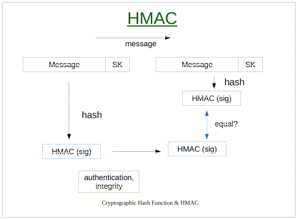
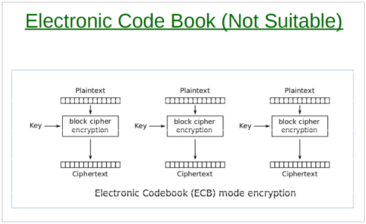
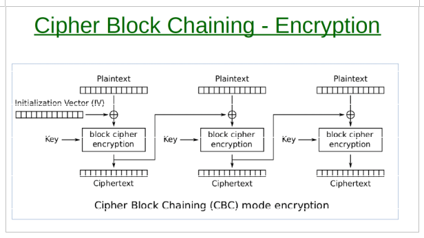
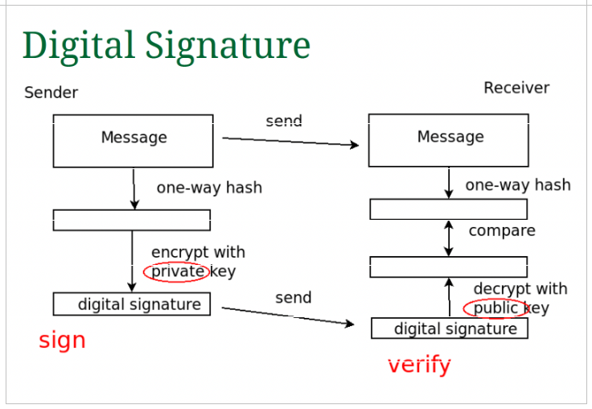
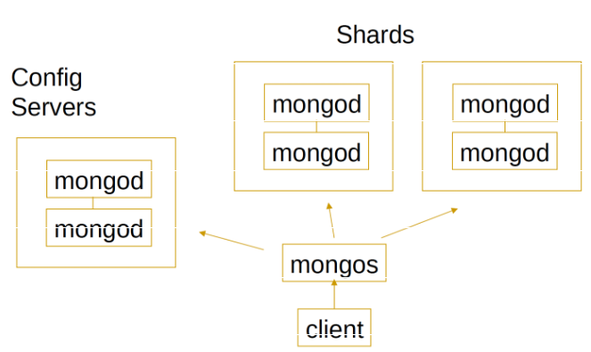

#+TITLE: Distributed Systems And Security
#+DATE: [2026-01-12 Mon 14:14]
#+AUTHOR: Damian Chrzanowski
#+EMAIL: pjdamian.chrzanowski@gmail.com
#+OPTIONS: TOC:2 num:2
#+HTML_HEAD: <link href="https://fonts.googleapis.com/css?family=Source+Sans+Pro" rel="stylesheet">
#+HTML_HEAD: <link rel="stylesheet" type="text/css" href="../assets/org.css"/>
#+HTML_HEAD: <link rel="icon" href="../assets/favicon.ico">
#+latex_header: \hypersetup{colorlinks=true,linkcolor=black}
#+latex_header: \usepackage[margin=0.5in]{geometry}
#+latex_header: \usepackage[scaled]{helvet} \renewcommand\familydefault{\sfdefault}
[[file:index.org][Home Page]]
* Exam Questions
** What is a ~Cryptographic Function~? Four properties of it
   - Takes an input data of arbitrary size and produces a fixed-size output called a hash (or digest). One single change in the input completely changes the output.
   - Properties:
     - Efficient to compute: Easy to compute hash
     - Pre-image resistance: Cannot find the input msg from the hash
     - Second pre-image resistance: Any change to input changes the hash
     - Collision resistance: Cannot find two different input msgs with the same hash
** Diff between ~pseudo~ random and ~truly random~ RNG. Outline ~SHA1PRNG~ algo. How to ~seed~ pseudo rng?
   - ~Truly random~ comes from physical processes
   - ~Pseudo random~ come from an algorithm that generates numbers and for a given seed the same sequence of numbers is generated.
   - ~SHA1PRNG~:
     - Gets a true random using entropy source
     - Repeatedly hashes the seed to get a stream of random-looking bytes. With every request the seed is hashed again and a new internal state emerges.
     - Concatenates with a 64bit increment
     - Applies SHA-1 hash to produce output
   - Correct way to ~seed~:
     - Should be seeded from a true random value (entropy source, like user interaction with pc)
     - A cryptographically secure PRNG must be seeded from a source of true randomness.
   - ~CSPRNG~:
     - Cryptographically secure PRNG, however, do not compromise the seed!
   - Linux Sources:
     - /dev/random: true random generator
     - /dev/urandom: cryptographically secure pseudo-random generator
** Diffie-Hellman
   - The main public values:
     - a prime number ~p~
     - a base ~g~
   - Step 1: Choose secret values
     - Each side chooses a random number: first side ~a~ and second side ~b~
   - Step 2: Calculate public values
     - First side: ~A = g^a mod p~
     - Second side: ~B = g^b mod p~
   - Step 3: Exchange values
     - Send A and B over the network
   - Step 4: Calculate shared secret
     - First side: ~S = B^a mod p~
     - Second side: ~S = A^b mod p~
** What is a ~one-time pad~? How does a ~stream cipher~ work?
   - One-time pad:
     - The key is the same length as the message
     - Encryption is done via XOR
     - ~c = k XOR m~, ~m = k XOR c~
     - Why not practical: the key must be the same length as the message, the key can only be used once, impractical for real systems.
   - Stream cipher:
     - Replaces the key with a ~pseudo-random key~ stream
     - Uses a ~PRNG~ (pseudo RNG)
     - Injects a secret key seed into a long key stream generator
     - The message is XORed with this key stream = ~c = k XOR m~
     - A stream cipher does not have perfect secrecy
     - It is reversible
** What is a block cipher? What are "modes of operation" and why are they important? Outline CBC.
   - Cipher Block Chaining [[id:lwt2r7e1rwk0][(CBC)]] explained in another question
   - Block cipher takes a given block (say 128 bits) and with a given key it produces ciphertext (the output)
     - It is deterministic, because the same key and the same input will always produce the same output (AES is one of the examples here)
   - Modes of operation, e.g.: ECB, CBC
** What is a ~Hashed Message Authentication Code~ (~HMAC~) for a message? What does it enable the receiver to do? What is the typical use case?
   - A HMAC is generated by concatenating a message (input) with a secret to produce a hash (the HMAC).
   - The sender computes a HMAC of the message along with the shared secret key. The receiver the receives the message and the HMAC and also computes its own HMAC and compares them. When the HMACs are the same then:
     - ~The integrity~ is sound: the message was not tampered with
     - ~The authentication~ is sound: the receiver knows that only someone with a shared key could produce a valid HMAC.
** Procedure of ~calculating a HMAC~. Inner and outer ~padded keys~. Draw diagram.
   - Diagram
   
   #+begin_src
        K (key)
          |
   -----------------
   |               |
pad/XOR         pad/XOR
with ipad       with opad
   |               |
K ⊕ ipad        K ⊕ opad
   |               |
   |        ----------------
   |        |              |
   |     concatenate       |
   |        |              |
   |    inner hash         |
   |   H(K⊕ipad || m)      |
   |        |              |
   -------->|--------------|
            |
     concatenate
            |
     H(K⊕opad || inner)
            |
          HMAC
   #+end_src
   - Procedure:
     - Prepare a key: if key is longer than the hash block size -> hash it, otherwise pad it with zeroes (prevent length extension attacks)
     - Create padded keys
     - Compute inner hash
     - Compute final HMAC
** Salted hash passwords. Adaptive one-way function.
   - ~Salt~ is added to the hash so that two same passwords don't have the same hash and thus be reversible.
   - ~Adaptiven one-way function~, works one way, so the password cannot be reversed. Also it's computing power can be adjusted so that the time taken is intentionally small (stops brute forcing quickly).
*** Key stretching
    - Hashing the passwords many times in a loop, often used to apply the salt many times.
** Naively applying a ~block cipher to each block~ of a message in turn? What is the solution? Explain the procedure.
   :PROPERTIES:
   :ID:       lwt2r7e1rwk0
   :END:
   - The problem is that a pattern can be discovered if the produced cipher repeats.
   - Solutions:
     - Electronic Code Book (ECB) is the standard and is not suitable (applies the same cipher on each block)
     - Cipher Block Chaining (~CBC~), each block depends on the previous one, removes the repetition problem.
   - ~ECB~:
     
   - ~CBC~:
     - Uses XOR to combine with the previous block to produce a new cipher
     - On the first block it uses Initialisation Vector (~IV~)
     - Encrypt: start with a random IV value, mix first block with IV, then lock (produce first block), next block -> mix with previous block, then lock
     - Decrypt: first unmix the IV on the first block, then unlock, on the next block unmix using the data from the first block, then unlock
     
** ~Digital Signatures~
   - Diagram
   
   - Creation: take the messsage and compute with a one-way hash. The hash is then encrypted using the sender's private key (that is the digital signature). Sender sends the message and the digital signature.
   - Verification: receiver computes the hash of the received msg. Decrypt the digital signature using the public key. Compare the hash values of the message.
   - Setup: each user must have a pub/pri key pair.
   - Guarantees: Authentication and Integrity
   - Client side steps:
     - In short: Verify digital cert (sig check), extract pub key, verify digital sig
     - Cert Signature Verification
     - Cert Chain Validation
     - Validity period check
     - Domain name check
     - Revocation check
     - Key usage & extensions check
     - Public key validation
     - Sign verification in handshake
   - ~Confidentiality~ is achieved via diffie-hellman so that all data can be encrypted in-between. Alternatively, use session key exchange.
** What is a ~Digital Cert~
   - A ~digital cert~ is a structure that binds a name to a public key. Is issued by the cert authority (~CA~), which is trusted.
   - The cert contains:
     - Name of the owner
     - Public Key
     - Name of the CA
     - Other details such as validity and digital signature of the CA
   - Usage in HTTPS:
     - Server sends a digital cert
     - Client verifies the cert against CA, client uses the PUB key to verify that the server indeed has the private key (otherwise it would not work)
     - Client gets the PUB key from the cert
     - Client uses the PUB key for secure communication with the server.
** Keystore vs Truststore
   - Keystore: stores private keys and certificates, used by servers
   - Truststore: stores certificates of CAs, used by clients
** 2008 Rogue CA Cert attack. Hash collision attack, describe it.
   - Was based on the MD5 collision
   - Attackers created two different certs that had the same hash
     - One was ~end-user cert~
     - The other was ~intermediate CA cert~
   - Attackers used the end-user cert to get it signed legitimately, then copied it onto the intermediate CA cert which made the new cert valid. This allowed the attackers to issue invalid certs that appeared as valid and trusted by the CA.
** ~Messaging services~. Give four advantages of messaging services compared to distributed objects.
   - A messaging service is a ~Message Oriented Middleware (MOM)~ where communication is done by sending *asynchronous messages*.
   - Pros of messaging:
     - Decoupling: processes communicate via a separate service, not directly
     - Redundancy: no loss of data, it stays until it is received (unless configured otherwise)
     - Scalability: easy to add/remove services
     - Elasticity & Spikability: increase in traffic is just done via holding onto messages
     - Resilience: If a component fails, the messages stay until the service comes back up (so that it can receive messages for it)
     - Delivery Guarantees: msgs will be processed eventually.
     - Ordering guarantees: processed in order, generally FIFO
     - Buffering: queues act as buffers
     - Understanding data flow: Message queues can be used as metrics to identify inefficient parts of the system
     - Async communication: msgs can be processed later, it adds flexibility
** ~Sharding~ in mongodb
   - Diagram
     
     - Sharding: is used to split very large data, then each server (a shard) stores data for its own defined shard (date range? id range? shards are defined based on data)
     - Architecture:
       - client -> mongos (router) -> mongod (shards) | mongod (config servers, stores metadata about the distribution of the data)
** ~User sessions~ in a ~distributed systems~, what are the issues?
   - Use something like memcached or redis to store user sessions, so that information is distributed across the server instances.
** SSH 1.0
   - Operation:
     - Client connects to server
     - Server sends: public key + temp pub key
     - Client:
       - Generates a symmetric session key
       - Encrypts the key with pub key + temp pub key from server
       - Sends the encrypted symm key back
     - Server
       - Decrypts the key using pub + temp key
     - From now communication is symmetrically encrypted
** Perfect forward secrecy
   - Future compromise of keys does not allow the decryption of past data.
   - For SSH 1.0 this is achieved by the usage of the temporary key, which is destroyed after a session.
** Difference between a Queue and a Topic in JMS
   - Queue: uses a queue system in which each message is received once by one of the receivers only
     - Suitable for: task distribution
   - Topic: publishes a message to a topic and all subscribers to said topic receive it
     - Suitable for: broadcasting messages to multiple clients, notifications, updates, etc.
** Twitter auth
   - Client requests auth: gets back ~ID~ and ~Secret Key~
   - When the client needs to auth via API it sends the ID, the message and HMAC calced with the secret key.
     - The server then looks up the secret key via the ID, calculates the HMAC and compares.
** Types of firewalls
   - ~Packet Filtering Firewall~:
     - Checks packets at a basic level
     - IP address, port numbers, protocol
   - ~Application (Proxy) Firewall~
     - Works at a higher level
     - Looks at http requests and works between the client and the server, usually software level
** Messaging system advantages
   - Sudden spike: uses buffering to solve it
   - Sustained spike: can easily add more services to deal with the queues, the queue itself can be scaled (increased) to accommodate the increased traffic
   - Reliability: Messages remain in the system if a process fails, messages may need ACKs for certain systems
   - Ease of development: decoupling, provides independence and the many advantages of it.
** Java
*** Server to client TCP/IP
    #+begin_src java
      ServerSocket ss = new ServerSocket(2000);
      // Create a server socket listening on port 2000

      while (true) {
          // Loop forever to handle multiple clients

          Socket s = ss.accept();
          // Wait (block) until a client connects

          InputStream in = s.getInputStream();
          // Get input stream from client

          Scanner r = new Scanner(in);
          // Wrap input stream to read text (String)

          OutputStream o = s.getOutputStream();
          // Get output stream to send data to client

          PrintWriter p = new PrintWriter(o);
          // Wrap output stream to send text

          String inputLine = r.nextLine();
          // Read request (String) from client

          p.println("Hello " + inputLine + " from Server");
          // Send response back to client

          p.close();
          // Close connection (also flushes data)
      }
    #+end_src
*** Client to server TCP/IP
    #+begin_src java
      InetAddress inet = InetAddress.getByName("localhost");
      // Get IP address of server (localhost)

      Socket s = new Socket(inet, 2000);
      // Connect to server on port 2000

      OutputStream o = s.getOutputStream();
      // Get output stream to send data

      PrintWriter p = new PrintWriter(o);
      // Wrap output stream to send text

      InputStream in = s.getInputStream();
      // Get input stream to receive data

      Scanner r = new Scanner(in);
      // Wrap input stream to read text

      p.println("John");
      // Send request (String) to server

      p.flush();
      // Force data to be sent (important in TCP)

      String response = r.nextLine();
      // Read response from server

      System.out.println(response);
      // Print server reply
    #+end_src
*** Server to client UDP
    #+begin_src java
      // create socket on port 2000
      DatagramSocket socket = new DatagramSocket(2000);

      // buffer for incoming data
      byte[] buf = new byte[1024];

      DatagramPacket receivePacket = new DatagramPacket(buf, buf.length);

      // blocking call to receive datagram
      socket.receive(receivePacket);

      // get client address
      InetAddress inetAddress = receivePacket.getAddress();

      // get client port
      int port = receivePacket.getPort();

      // extract message
      String message = new String(receivePacket.getData(), 0, receivePacket.getLength());

      // server replies with:
      String reply = "Hello " + message;
      buf = reply.getBytes();

      DatagramPacket sendPacket = new DatagramPacket(buf, buf.length, inetAddress, port);
      // use client address and port

      socket.send(sendPacket);
      // send reply back
    #+end_src
*** Client to server UDP
    #+begin_src java
      // create socket on a port
      DatagramSocket socket = new DatagramSocket(2012);

      String name = "paul";
      // convert message to bytes
      byte[] buf = name.getBytes();

      // get server address
      InetAddress inetAddress = InetAddress.getByName("localhost");

      // create packet with data, address and port
      DatagramPacket packet = new DatagramPacket(buf, buf.length, inetAddress, 2000);

      // send datagram to server
      socket.send(packet);
    #+end_src
* Security
** What is Security
** Authorisation vs Authentication
** Accountability vs Availability
** Uses of Random Passwords
*** Also: Cryptographically safe random numbers
*** Random number generation
    - Big'ish topic
** LCG - Linear Congruential Generator
** LFSR - Linear Feedback Shift Register

* Remove at the End
  #+BEGIN_EXPORT html
  
  
  #+END_EXPORT
