#+TITLE: Networks
#+DATE: [2025-11-13 Thu 15:26]
#+AUTHOR: Damian Chrzanowski
#+EMAIL: pjdamian.chrzanowski@gmail.com
#+OPTIONS: TOC:2 num:2
#+HTML_HEAD: <link href="https://fonts.googleapis.com/css?family=Source+Sans+Pro" rel="stylesheet">
#+HTML_HEAD: <link rel="stylesheet" type="text/css" href="../assets/org.css"/>
#+HTML_HEAD: <link rel="icon" href="../assets/favicon.ico">
[[file:index.org][Home Page]]
* Solutions to Questions
** Use Dijkstra to calculate the shortest path
   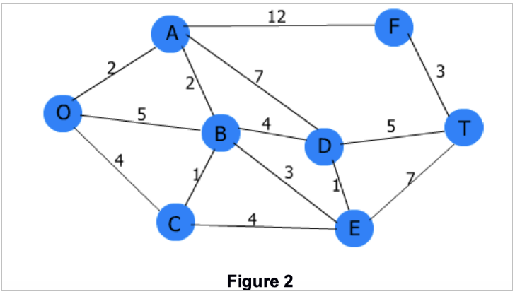
*** Current best !means visited
    - a!: o > a (2)
    - b!: o > a > b (4)
    - c!: o > c (4)
    - d!: o > a > b > d (8)
    - e!: o > a > b > e (7)
    - f!: o > a > f (14)
    - t!: o > a > b > d > t (13)
*** Step 1
    - Start node o
    - o = 0
    - a = 2
    - b = 5
    - c = 4
    - visited = {}
*** Step 2
    - Start node a (next shortest, cost 2)
    - a = 2 (stays the same)
    - b = 4 (shorter than before)
    - f = 2 + 12 = 14
    - d = 2 + 7 = 9
    - c = 4
    - e = inf
    - t = inf
    - visited = {a}
*** Step 3
    - Start node c (next shortest, cost 4)
    - update:
    - b = 4 (discard 5, no change)
    - e = 4 + 4 = 8
    - visited = {a, c}
*** Step 4
    - Start node b (cost 4)
    - update
    - d = 8 (better 9)
    - e = 7 (better than 8)
    - visited = {a,c,b}
*** Step 5
    - Start node e (cost 7)
    - d = 8 (no change)
    - t = 14
    - visited = {a,c,b,e}
*** Step 6
    - Start node d (cost 8)
    - t = 13 (better, update path)
    - visited = {a,c,b,e,d}
*** Step 7
    - Start node t (cost 13)
    - f = 16 (worse)
    - visited = {a,c,b,e,d,t}
*** Step 8
    - Start node f (cost 13)
    - worse to all neighbours
    - visited = {a,c,b,e,d,t,f}
** Host A sends 5 data segments to Host B. How many packets are sent altogether if packet 2 is lost, but eventually all arrive? Show behaviour, segments sent and sequence breakdown for GBN, SR, TCP
*** GBN
    - Sender sends: 1, 2, 3, 4, 5
    - Segment 2 is lost
    - ACK cumulative:
      - Sends ACK1 for packet 1, and more ACK1s for packets 3, 4 and 5 (seg 1 is missing)
    - Sender times out on Seg 2
    - Sender re-transmits seg 2 3 4 5
    - Receiver sends ack2-3-4-5
    - Sequence is: 1, 2, 3, 4, 5, 2, 3, 4, 5
    - Total packets from sender 5 + 4 = 9, total packets from receiver 4 + 4 = 8.
*** SR
    - Sender sends: 1, 2, 3, 4, 5
    - Sender sends individual ACKs for each of received segments = 1, 3, 4, 5
    - Receiver receives: ACK1 3 4 5, ACK 2 times out
    - Receiver re-sends Seg 2
    - Sequence is: 1, 2, 3, 4, 5, 2
    - Total sent packets = 6
*** TCP (no delayed ACK, cumulative ACK)
    - Sender sends: 1, 2, 3, 4, 5
    - Receiver ACKs instantly for each segment
      - ACK1 for seg 1
      - Segment 2 is lost
      - For segments 3 4 5 the receiver send ACK2 3 times and thus triggers a Fast Retransmit
      - Receiver, however, stores 3 4 5
    - Sender, triggered by 3 duplicate ACKs re-sends seg 2
    - Receiver then responds with ACK6
    - Sequence is: 1, 2, 3, 4, 5
    - Fast-retransmit: 2
    - Total sent packets = 6
** List 3 types of multimedia synchronizations
*** Intra-media Synchronization (internal synchronization)
    - Ensuring video frames are shown at the correct frame rate
    - Ensuring audio samples are played sequentially without gaps or overlaps
    - Goal: maintain correct timing so that playback is smooth and continuous
*** Inter-media Synchronization (lip-sync)
    - Matching audio with video
    - Synchronizing background audio with animation
    - Goal: maintain alignment between multiple streams (audio + video, video + text, etc)
*** Group synchronization
    - Ensuring all participants of a multimedia playback receive the data at the same time, so that all experience it simultaneously
    - Synchronizing slides or media during a live video conference
    - Goal: Ensure consistent playback across different users
** Describe sending an Email with details across the stack
*** Message from alice@tus.edu to bob@gmit.edu
*** Alice (layer 7)
    - Uses a UA to compose an email: From: xxx, To: xxx, subject: xxx
    - Alice clicks send and the UA creates a message in SMTP format (header + body)
*** Alice (layer 6)
    - Character encoding, mime structure
    - TLS handshake
    - Encrypts the data before sending
*** Alice (layer 5)
    - Establish, manage and terminate the SMTP session
    - STARTTLS (if needed)
*** Alice (layer 4)
    - Message split up into TCP segments
    - TCP three-way-handshake with the mail server: syn, syn-ack, ack
    - Flow control, sequencing, re-transmission and error checking
    - When done, TCP connection close
*** Alice (layer 3)
    - IP packets
    - Source IP (alice's IP, could be NATed)
    - Destination IP -> mailserver
    - Alice's device passes TCP segments to IP
    - Each segment is encapsulated in an IP packet: IP header: src IP, dest IP, TTL, protocol (TCP), etc
    - Routing:
      - Packet is sent through the default gateway (first hop, i.e. the first router)
      - Router checks the destination IP, consults the routing table and forwards the packet to mailserver
*** Alice (layer 2)
    - Ethernet, WiFi
    - MAC addresses
    - Alice's host knows default gateway IP
    - It uses ARP to find the gateway's MAC if not in ARP cache:
      - ARP request (broadcast): "Who has gateway IP? Tells on broadcast"
      - ARP reply (unicast): "Gateway's MAC is AA:BB:CC:DD:EE:FF"
    - Alice's NIC encapsulates each IP packet in a Layer 2 frame:
      - Ethernet header: dest MAC = router MAC, src = Alice's MAC.
      - Frame type indicates IPv4.
    - Frame is sent across the LAN to the router
    - At each hop the frame is stripped and re-encapsulated with new source/dest MAC for that link.
*** Alice (layer 1)
    - Frames are turned into bits and sent over a medium (copper, optical, radio, etc.)
*** SMTP server @ tus.edu (Alice's mail server)
    - Re-assemble the data
      - L1: signals > bits
      - L2: bits > frames > strip L2 header
      - L3: frames > IP packets > IP header check
      - L4: IP packets > TCP segments
      - L5-L7: SMTP server processes the session and email
    - App layer at the server
      - Receive the SMTP conversation from Alice's UA
      - Store/queue the message
      - Now needs to deliver the message onward to gmit.edu mail server
*** SMTP server @ tus.edu (Alice's mail server)
    - The mail transfer agent (MTA) queries the DNS for MX gmit.edu
    - MTA opens an SMTP session with mail.gmit.edu
    - Sends message MAIL FROM: alice, RCPT TO: bob, DATA: ....
    - Same layer logic as before with regards to TCP -> IP -> Frames
*** SMTP server @ gmit.edu (Bob's server)
    - L1 to L7 as before, Bob's server receives the message
    - The server places the new message in Bob's inbox
*** Bob receives mail
    - Bob uses a UA
    - Using either POP3 or IMAP bob checks his email with his username/password combination
    - UA requests a list of messages
    - UA sees a new message and downloads it
** Diff between quality of experience and quality of service
*** QoS
    - Refers to *network-level performance guarantee* such as delay, loss, jitter, throughput, scheduling, priority handling, congestion control and resource allocation
*** QoE
    - Refers to *what the end user actually perceives*, which depends not only on the network metrics but also on the video compression, playout buffering, error concealment and human tolerance patterns
*** In terms of Video codecs
**** QoS
     - The coded determines the bitrate required
     - Higher bitrate require more bandwidth, if bandwidth is not sufficient then we get: packet loss, packet queue, delay increase.
     - Coded bitrate affects network load and thus the network's ability to deliver QoS metric
**** QoE
     - Codec determines the video quality seen by the viewer: sharpness, smoothness, aftifacts
     - The higher the compression the higher the distortions
     - Adaptive streaming adjusts the bitrate to the current transfer rate to maintain a good experience for the end user
*** In terms of Transmission Effects: Delay, Loss, Jitter
**** QoS
     - Objective and Measurable metrics
     - E2E delay: time it takes for packets to travel, the longer the worse
     - Jitter: variation in packet arrival times, buffering partially fixes that
     - Packet loss: packets dropped due to congestion
     - Throughput: amount of data successfully delivered
     - Scheduling and priority: mechanisms like FIFO and priority queuing and weighted fair queuing impact multimedia flows
**** QoE
     - User's perception depends on how the application handles imparements
     - Delay: Large delays cause late audio/video frames, lip-sync problems or complete interruptions
     - Jitter: Causes uneven playback unless smoothed with a buffer
     - Loss: Visible artifacts or missing frames, applications use *error concealment* or *interpolation* to hide these effects
     - Buffering: Users may see freezing or stalling during video streaming
*** Evaluation
**** QoS (Network centered)
     - Measuring packet delay
     - Loss rates
     - Jitter statistics
     - Throughput measurements
     - Router queue behaviour
     - Any of the above are objective and can be measured
**** QoE (User centric)
     - Depends on the application behaviour and human perception
       - Video quality
       - Smoothness (no freezing)
       - Audio-video synchronization
       - Subjective viewing satisfaction
     - Not directly measured on the network, but depends on the techniques applied by the application
       - Playout buffering
       - Adaptive Bitrate (ABR) control
       - Error concealment
       - Codec choice
       - Compression level
       - Pre-recorded vs live-stream characteristics
       - Human tolerance to impairments
*** Summary
    - QoE involves human perception and QoS involves measurable network-level parameters.
** What is FCAPS? and NETCONF
*** NETCONF
    - Network Configuration Protocol is used to install, modify and delete configuration of network devices
    - Client-server model
    - RPC based
    - Usually runs over SSH
    - XML based communication
    - NETCONF sits within the (C) of FCAPS as in: configuration
      - Albeit NETCONF can indirectly support: Fault Management (diagnostics retrieval), Performance Management (reading counters or operational state), Security Management (updating configs to more secure ones, controlling access)
*** What is FCAPS?
    - It is a standard framework use to describe five core areas of network management
*** (F) Fault Management
    - Detect, isolate and correct fault in the network.
    - Alarm detection, event logging, error detection, rapid fault recovery
    - Minimise downtime
*** (C) Configuration Management
    - Device setup, configuration backups, change tracking, inventory of hardware, ensuring correct device configuration (setup)
*** (A) Accounting Management
    - Measure and record usage of network resources for: billing, auditing or cost allocation. Tracks per-user bandwidth consumption.
*** (P) Performance Management
    - Ensure the network is delivering expected performance levels.
    - Monitor: throughput, delay, jitter, packet loss and utilisation bottlenecks
*** (S) Security Management
    - Protect network from unauthorised access and threats
    - Authentication, access control, encryption, intrusion detection and enforcement of policies.
** Calculate distance tables after a link cost has changed
   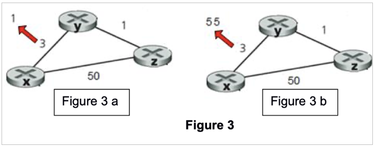
*** 3a
**** Original
     - x <> y = 3
     - x <> z = 50
     - z <> x = 1
     - x table:
       - to x = 0
       - to y = 3
       - to z = 4 (50 or (3+1)=4 with 2 hop)
     - y table:
       - to y = 0
       - to x = 3
       - to z = 1
     - z table:
       - to z = 0
       - to y = 1
       - to x = 4 (better than 50)
**** After
     - x <> y = 1 (changed, decreased, cost reduction)
     - x <> z = 2 (better than 50)
     - z <> x = 1
     - x table (recomputes distance):
       - to x = 0
       - to y = 1
       - to z = 2
         | dest | cost | next hop |
         |------+------+----------|
         | x    |    0 | x        |
         | y    |    1 | y        |
         | z    |    2 | y        |
     - y table (recompute distance):
       - to y = 0
       - to x = 1
       - to z = 1
         | dest | cost | next hop |
         |------+------+----------|
         | y    |    0 | y        |
         | x    |    1 | x        |
         | z    |    1 | z        |
     - z table (recompute distance):
       - to z = 0
       - to y = 1
       - to x = 2 (better than 50)
         | dest | cost | next hop |
         |------+------+----------|
         | z    |    0 | z        |
         | x    |    2 | y        |
         | y    |    1 | z        |
*** 3b
**** Original
     - x <> y = 3
     - y <> z = 1
     - z <> z = 50
     - x table:
       - to x = 0
       - to y = 3
       - to z = 4 (50 or 4 with 2 hop)
     - y table:
       - to y = 0
       - to x = 3
       - to z = 1
     - z table:
       - to z = 0
       - to x = 4 (or 50 with)
       - to y = 1
**** After
     - x <> y = 55
     - x table (recomputes distance):
       - to x = 0
       - to y = 55
       - to z = 50 (55 + 1 is worse)
         | dest | cost | next hop |
         |------+------+----------|
         | x    |    0 | x        |
         | y    |   55 | y        |
         | z    |   50 | z        |
     - y table (recompute distance):
       - to y = 0
       - to x = 51 (better than 55)
       - to z = 1
         | dest | cost | next hop |
         |------+------+----------|
         | y    |    0 | y        |
         | x    |   51 | x        |
         | z    |    1 | z        |
     - z table (recompute distance):
       - to z = 0
       - to y = 1
       - to x = 50
         | dest | cost | next hop |
         |------+------+----------|
         | z    |    0 | z        |
         | y    |    1 | y        |
         | x    |   50 | x        |
** NAT traversal problem
   - In certain circumstance the outside world needs to know your IP to communicate with you. NAT prevents that from happening.
   - Solution: use static open ports or UPnP (automatically requests a port to be open from the router to the outside world)
** DHCP discovery
   - Client has no IP and no broadcast
   - Fires a DHCPDISCOVERY
   - DHCP server replies with DHCPOFFER
     - Offer IP address
     - Subnet mask
     - Default gateway
     - Lease duration
     - DNS server
   - Client replies with DHCPREQUEST
   - Server replies with DHCPACK
** Difference between forwarding and routing
   - ~Forwarding~ is the local function inside of a router. When a packet arrives the router consults the forwarding table and moves the packet to the correct output link. Very fast nano seconds.
   - ~Routing~ is a network-wide process used to decide the path that a packet takes from source to destination. Routing algorithms are used here and the information is exchanged between routers, routers then update their forwarding tables so that a packet can reach its destination.
** How are routing decisions made in an MPLS-enabled network? Compare to others.
*** Multiprocess Label Switching (MPLS)
    - Ingress router (router at the edge) first MPLS router receives an IP packet
      - Consults routing and label forwarding tables
      - Adds an MPLS label to the packet, now the packet is routed based on its label
    - Core routers forward using labels only
      - Core routers do not examine the IP anymore
    - Egress router at the other edge removes the label once the packet exits the MPLS "area".
*** Characteristics of MPLS
    - Forwarding uses fixed-size labels instead of IP
    - Decisions are made per Label Switch Path (LSP)
    - Paths can be traffic-engineered
*** Compared to IP routing
    - MPLS is faster and supports many services like VPNs, QoS and other services
** Contents of different containers
*** TCP Packet
    - Source/Destination Port: identify apps.
    - Sequence Number: byte number of first data byte.
    - Acknowledgment Number: next expected byte.
    - Data Offset: size of TCP header.
    - Flags: SYN, ACK, FIN, RST, PSH, URG, etc.
    - Window Size: flow control.
    - Checksum: error-checking for header+data.
    - Options: e.g., MSS, window scale, timestamps.
    - Data: upper-layer data (e.g., HTTP).
    #+begin_src markdown
      0                   15                  31
      +-------------------+-------------------+
      |    Source Port    |  Destination Port |
      +-------------------+-------------------+
      |               Sequence Number         |
      +---------------------------------------+
      |           Acknowledgment Number       |
      +-------+---+-------+-------------------+
      | Data  |   |       |                   |
      |Offset | R |Flags  |   Window Size     |
      |(4bit) |svd(9bits) |                   |
      +-------+---+-------+-------------------+
      |     Checksum       |  Urgent Pointer  |
      +--------------------+------------------+
      |    Options (if any, variable length)  |
      +---------------------------------------+
      |                 Data                  |
      |              (Payload)                |
      +---------------------------------------+
    #+end_src
*** UDP Datagram
    - Length: header + data length in bytes.
    - Checksum: covers header+data (optional in IPv4, mandatory in IPv6).
    - Data: upper-layer data (e.g., DNS, VoIP).
      #+begin_src markdown
        0                   15                  31
        +-------------------+-------------------+
        |    Source Port    |  Destination Port |
        +-------------------+-------------------+
        |         Length    |      Checksum     |
        +-------------------+-------------------+
        |                 Data                  |
        |              (Payload)                |
        +---------------------------------------+
      #+end_src
*** IPv4 Packet
    - Version: 4 for IPv4.
    - IHL: Internet Header Length (size of IP header).
    - DSCP/ECN: QoS and congestion info.
    - Total Length: entire packet length.
    - Identification/Flags/Fragment Offset: fragmentation.
    - TTL: hop limit.
    - Protocol: next layer (e.g., 6 = TCP, 17 = UDP).
    - Header Checksum: for IPv4 header.
    - Source/Destination IP: addresses.
    - Options: rarely used.
    - Data: typically a TCP/UDP segment (or ICMP, etc.).
      #+begin_src markdown
        0                   7                   15                  23                  31
        +-------+-------+-------+---------------+-------------------+-------------------+
        |Version|  IHL  | DSCP  |     ECN       |      Total Length                     |
        +-------+-------+-------+---------------+-------------------+-------------------+
        |         Identification                |Flags|   Fragment Offset               |
        +---------------------------------------+-----+---------------------------------+
        |   Time To Live   |    Protocol        |          Header Checksum              |
        +------------------+--------------------+---------------------------------------+
        |                        Source IP Address                                      |
        +-------------------------------------------------------------------------------+
        |                     Destination IP Address                                    |
        +-------------------------------------------------------------------------------+
        |                    Options (if any, variable)                                 |
        +-------------------------------------------------------------------------------+
        |                                   Data                                        |
        |                               (Payload)                                       |
        +-------------------------------------------------------------------------------+
      #+end_src
*** Ethernet Frame
    - Destination MAC (6B)
    - Source MAC (6B)
    - EtherType (2B): e.g., 0x0800 = IPv4, 0x86DD = IPv6, 0x0806 = ARP.
    - Payload: usually 46–1500 bytes (may include padding).
    - FCS: Frame Check Sequence (CRC-32, 4B) for error detection.
      #+begin_src markdown
        (Preamble + SFD)   [not usually shown in logical diagrams]
        +---------+-------------------+-------------------+---------+---------------+---------+
        |Preamble | Destination MAC   |   Source MAC      | EtherType / Length      |   ...   |
        |7 bytes  |   (6 bytes)       |    (6 bytes)      |        (2 bytes)        |         |
        +---------+-------------------+-------------------+-------------------------+---------+
        |
        v
        +------------------------------------------+
        |            Payload (Data)                |
        |   (e.g., an IPv4 packet, IPv6, ARP)      |
        +-------------------+----------------------+
        |       FCS (CRC)      |
        |        4 bytes       |
        +----------------------+
      #+end_src
** End-to-End delay calculation between switch R1 and host R2
   - Assuming there is no propagation delay, no process delay and no queuing delay it is TOTAL DELAY = L/R1 + L/R2
** Sequence of frame transmission in a IEEE 802.11 wireless lan while channel is busy
   - We have 4 devices A B C D
   - Backoff values are B(40) C(10) and D(20)
   - When device A transmits, the other devices detect a busy channel and wait.
   - After A finishes the other devices start a countdown of their Backoff values
   - C reaches zero first and transmits first
     - Now B is 30
     - D is 10
   - D reaches zero and transmits next
     - Now B is 20
   - B reaches zero and transmits last
** For a certain amount of hops (4) at a certain bps (9600) and propagation delay (0.001s), a message of 3200 bits
   - Calc end-to-end data transfer delay for message switching, assuming additional 16bit header required
   - Calc end-to-end data transfer delay for datagram packet switching, assuming fixed packet size 1024bit + 16bit header
   - Two reasons why packet switching is preferred to circuit switching
*** Message switching delay
**** Given
     - Number of hops = 4
     - Link rate = 9600 bps
     - Propagation delay = 0.001s
     - Message length = 3200 bits
     - Header = 16 bit
     - Processing delay = 0
     - No ACKs
**** Step 1, message size
     - Total message size = 3216 bits
**** Step 2, transmission delay per hop
     - T_x = L/R = 3216/9600 = 0.335 sec
**** Step 3, propagation delay per hop
     - T_p = 0.001 sec
**** Step 4, total delay per hop
     - T_hop = Tx + Tp = 0.335 + 0.001 = 0.336 sec
**** Step 5, total across 4 hops
     - T_total = 4 * 0.336 = 1.344 sec
*** Datagram packet switching delay
**** Given
     - Message size = 3200 bits
     - Header per packet = 16 bits
     - Packet size = 1024 bits
     - Link rate = 9600 bps
     - Propagation per hop = 0.001 s
     - Number of hops = 4
**** Determine how many packets are needed
     - Useful payload per packet = 1024 - 16 = 1008 bits
     - Number of packets = 3200 / 1008 = 3.18 -> 4 packets needed
**** Transmission delay per packet
     - T_x = L/R = 1024 / 9600 = 0.10667 sec
     - T_p = 0.001s
     - T_hop = 0.10667 + 0.001s = 0.10767 sec
**** Total
     - In a datagram packages are streamed, so the delay is the 4 hops of the first packet + the delay for one hop of the remaining packets, so
     - 4 * 0.10767 = 0.43068 sec
     - Remaining packets = 3 * 0.10767s = 0.32001 sec
     - So the total is: 0.43068s + 0.32001s = 0.75069 sec
** Routing Algorithms global vs decentralized, static vs dynamic
*** Global
    - Every router has information about neighbouring nodes and links
    - Link costs are known and advertised to each other
    - Routers have a view of the network
    - Link-State (LS) routing, each router broadcasts link-state information to all others and runs Dijkstra to compute the shortest path.
*** Decentralized
    - Router only know about their neighbours
    - No router has a complete view of the network
    - Routes emerge from repeated sharing and updating
    - Distance Vector (DV) algorithm, e.g. RIP
*** Static
    - Manual configuration of routes
    - No automatic adaptation
*** Dynamic
    - Routers adapt automatically to link failures, congestion or topology changes
** Streaming solutions
*** Progressive Download
    - Linear download
    - Slow pc/network will have to buffer
    - No bitrate adaptation
*** Server-based streaming (RTSP)
    - Low latency streams, but:
      - Requires special servers
      - Fails through a NAT & firewalls
      - No bitrate adaptation
*** Scalable video coding (SVC)
    - Encodes videos in layers
    - Requires special decoders
    - Limited browser support
*** Adaptive bitrate streaming (ABR)
    - Is the best option when the network is heterogeneous, as it will automatically adapt to the network conditions.
    - Its basically like YouTube. Clients measure their own bandwidth and automatically switch to the highest version they can sustain (e.g. 480p, 720p, 1080p, etc.)
    - Solves:
      - Fluctuating Wi-Fi bandwidth
      - Congested mobile networks
      - Low-bandwidth office links
    - Works on devices with different CPU/GPU capabilities
    - Based on standard HTTP infra
** Two mobile nodes in a foreign network, can we use the same care-of-address in mobile IP?
   - Yes they can, because a foreign care-of address (FA-CoA) basically works like a NAT and thus multiple mobile nodes visiting the network may have the same mobile IP.
** Compare and contrast different services with the Intserv model
*** Intserv
    - Integrated Services (IntServ): is a ~fine-grained~, ~per-flow~ QoS architecture.
    - Characteristics:
      - Applications ~reserve resources~ along the path
      - Routers maintain ~per-flow state~ and perform ~per-flow scheduling~
      - Provides ~tight QoS guarantees~, such as delay bounds or guaranteed bandwidth
      - IntServ aims for telephone-like QoS over the internet
*** DiffServ
    - Differentiated Services (DiffServ): is ~coarse-grained~, ~aggregated~ QoS architecture.
    - Characteristics:
      - Packets are marked with a ~DSCP~ value in the IP header
      - Routers do ~per-class~, not per-flow, scheduling
      - Traffic is aggregated into a small number of classes
      - Scales easily to large networks
    - Does not give strict guarantees, it provides relative priority based on class
*** Problems with IntServ
    - Lack of Scalability
    - Signalling overhead
    - Complexity in Routers
    - Deployment difficulty across many ISPs
    - Hard to combine with existing best-effort internet
** What is congestion control vs flow control? How are they managed?
*** Flow control
    - Flow control protects the receiver, not the network from overflowing with data
    - Ensures that the data transmitted by the sender is not transmitted faster than the receiver can handle
    - Match the sender's rate to the capabilities of the receiver
    - Based on receiver's advertised window (rwnd) in every TCP segment
      - When rwdn becomes 0 the sender must stop sending otherwise the receiver's buffer will overflow
*** Congestion control
    - Protects the network
    - Prevents too many senders from overloading routers
    - Based on network feedback (loss, RTT, duplicate ACKs)
    - TCP uses three major mechanisms:
      - Slow start
      - Congestion avoidance
      - Detecting congestion (loss, duplicate ACKs)
** Based on a diagram that sends packets of audio and a receiver receiving them
   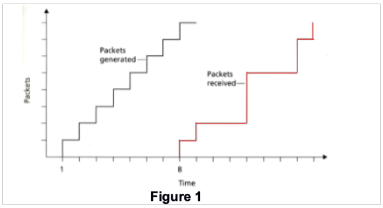
*** Delay from sender to receiver for packets 2 to 8
    | Packet # | Generation Time (g_t) | Arrival Time (a_t) | Delay = g_t - a_t |
    |----------+-----------------------+--------------------+-------------------|
    |        2 |                     2 |                  9 |                 7 |
    |        3 |                     3 |                 12 |                 9 |
    |      ... |                   ... |                ... |               ... |
*** If the audio starts as soon as Packet 1 arrives, list packets that will not arrive on time for playout
    - Easy
*** What is the delay required for the whole playout to not be interrupted
    - Easy
*** Compute the estimated delay for packets 2 through 8, using the formula for the avg network delay (take u=0.1)
**** The formula
     - Delay = (L/R) / (1 - u)
     - L/R = transmission time
     - u = link utilisation
     - We know that transmission time is 1 unit of time, so L/R = 1
     - Therefore 1 / (1-u) = 1/0.9 = 1.11 time units
     - This is the estimated avg for each packet, so all packets 2 to 8 have estimated delay of 1.11 time units
* Repeated Qs
** Always There
   - Use Dijkstra to calculate the shortest path
   - Host A sends 5 data segments to Host B. How many packets are sent altogether if packet 2 is lost, but eventually all arrive? Show behaviour, segments sent and sequence breakdown for GBN, SR, TCP - List 3 types of multimedia synchronizations.
** Nearly always there
   - Describe sending an Email in details
   - Diff between quality of experience and quality of service
   - What is FCAPS
   - Calculate distance tables after a link cost has changed
   - Router connects 3 subnets provide addresses that will provide 125, 60, 60 interfaces. Provide three network addresses that will work here.
* Exam Question Bank
** Seems that we have about 28 questions that repeat
** Networking Calculations, Delays, Etc.
   - (2x) Difference between forwarding and routing
   - (2x) How are routing decisions made in an MPLS-enabled network? Compare to others.
   - (2x) Make and role of each parts of the Protocol Data unit in the Network Layer.
   - (2x) End-to-End delay calculation between switch R1 and host R2
     - (2x) store and forward packet switching
   - (2x) Sequence of frame transmission in a IEEE 802.11 wireless lan while channel is busy
   - (3x) Describe sending an Email in details
     - (1x) Focus on Application and Transport layers
     - (1x) Focus on Application, Transport and Network layers
   - (2x) For a certain amount of hops (4) at a certain bps and propagation delay (0.001s), a message of 3200 bits:
     - (2x) Calc end-to-end data transfer delay for message switching, assuming additional 16bit header required
     - (2x) Calc end-to-end data transfer delay for datagram packet switching, assuming fixed packet size 1024bit + 16bit header
     - (2x) Two reasons why packet switching is preferred to circuit switching
   - (2x) Based on a diagram that sends packets of audio and a receiver receiving them:
     - (2x) Delay from sender to receiver
     - (2x) If the audio playback starts immediately when packet 1 arrives, which packet will not arrive on time for playout?
     - (2x) What is the minimum playout delay at the receiver? So that all 8 packets arrive in time for playout?
     - (2x) Compute the estimated delay for packets 2 to 8 using the formula for the average network delay (u=0.1)?
     - (2x) Compute the estimated deviation of delay from the estimated average for packets 2 to 8, use the formula for est. avg. deviation of delay (take β=0.1)?
   - (3x) Diff between quality of experience and quality of service in terms of
     - (2x) video codecs
     - (2x) transmission effects (delay, loss, etc.) and evaluation
     - You may reference peer reviewed conference/journal publications
   - (2x) With regards to P2P vs Client Server Architecture explain and justify the file distribution times.
   - (1x) Adaptive applications and Quality of Experience
   - (1x) Link increase vs Cache capacity for a set network needs
   - (1x) Msg consists of 3600 bits and a 144 header at a transport layer -> +152 at internet layer -> two networks +16bit. Destination network has max packet size of 1240. How many bits at destination?
   - (1x) CDN Solution
   - (2x) List 4 sources of packet delay and explain them, considering 3 links with different speed rates
** Networking Basics
   - (3x) What is FCAPS
   - (2x) IPv4 vs IPv6 challenges
   - (2x) Brief overview of HTTP. operation, connection types, messages, why is it stateless
   - (2x) What is web caching and the benefits of it?
   - (1x) HLR and VLR in GSM networks. What similarities with Mobile IP?
   - (3x) Calculate distance tables after a link cost has changed
   - (1x) Create a forwarding table for a datagram network
   - (1x) Role of port numbers in multiplexing and de-multiplexing in TCP connections.
   - (1x) Routing algorithms global/decentralized and static/dynamic
   - (2x) Which streaming solutions are good for the needs of a specific company?
   - (3x) Router connects 3 subnets provide addresses that will provide 125, 60, 60 interfaces. Provide three network addresses that will work here.
   - (2x) Two mobile nodes in a foreign network, can we use the same care-of-address in mobile IP?
   - (2x) Compare and contrast different services with the Intserv model.
   - (4x) Use Dijkstra to calculate the shortest path
   - (4x) List 3 types of multimedia synchronizations.
     - (1x) Discuss one factor that may affect synchronization specification for one of the types
   - (4x) Host A sends 5 data segments to Host B. How many packets are sent altogether if packet 2 is lost, but eventually all arrive? Show behaviour, segments sent and sequence breakdown for
     - GBN, SR, TCP
   - (2x) What is congestion control vs flow control? How are they managed
   - (2x) Explain the token bucket with regards to the regulating the traffic entering a network. Show a diagram. Explain how the bucket
     - (1x) Controls the avg peak
     - (1x) Controls the peak rate
     - (1x) Controls burst size
   - (2x) Explain RIP based on a diagram included
   - (1x) Explain NAT

* Lecturer's Tips Exams (answer 3 of 4)
  - *don't mind the wording here, some of it could be wrong*
  - LOOK AT PAST PAPERS
  - a) usually is an easy part (how does this work), probs explain a layer in detail
  - b) a little bit more complex and touches on different parts
  - part b examples: routing is definitely a question, different algos. routing vs forwarding. l over r
  - what does a network header look like?
  - if the server is busy how does the network deal with it
  - web request vs mail request (lifecycle/lifetime)
  - what happens where ipv4 and ipv6 is mixed
  - centralized vs decentralized
  - Quality of Experience of things, important (as it is for our chatgpt research)
  - different streaming approaches, what they are and how they work
  - jitter (and other network characteristics), payout delay value
  - how to design a network (Connor based stuff), usually we'll deal with classless
  - synchronization
  - different classes of services, policies for classes of services
  - client to server vs peer to peer
  - caching
  - understand and be able to explain things. e.g. company sets up a service: how would they deal with setting up a streaming service
* Working out Hosts on a Network
  - Start with the highest amount of hosts
  #+begin_verse
lab 6.2 (3)
192.168.20.0

left is 50 hosts (1 network)

top is 2 hosts (1 network)

r1 - r2 (1 network)
r2 - r3 (1 network)
r1 - r3 (1 network)

right is 2 hosts (1 network)
  #+end_verse

  Split between 128 and 64 (we need 50 hosts + 2 for broadcast and network)
  | hosts  | 256 | 128 | *64 | 32 | 16 | 8 | 4 | 2 |
  |--------+-----+-----+-----+----+----+---+---+---|
  | bits   | 128 |  64 | *32 | 16 |  8 | 4 | 2 | 1 |
  |--------+-----+-----+-----+----+----+---+---+---|
  | octets |   1 |   1 | 0   |  0 |  0 | 0 | 0 | 0 |

  Network ID: 192.168.20.0
  Octets: 128 + 64 = 192
  Subnet is = 255.255.255.192
  CIDR has 6 zeroes = 32 - 6 = 26
  Broadcast is the last one 192.168.20.63
  Range is +1 from the network to -1 from the broadcast = 192.168.20.1 - 192.168.20.62

  #+begin_verse
So then the next network available is the one after the previous broadcast, which is 192.168.20.64
  #+end_verse
* Terminology
  - bit: smallest amount of data
  - physical link: between transmitter and receiver
  - guided media: cable, copper (twister pair - TP), fiber, coax
  - unguided media: radio waves, signal propagates freely
  - WAN: wide are network (across cities, countries, has many MANs)
  - MAN: metropolitan area network (has many LANs)
  - LAN: local area network
  - PAN: personal area network
* Communication Networks and The Internet
** Internet
   - Hosts: end systems running network applications
   - Transmission rate: bandwidth bits/sec
   - Internet is a network of networks
   - Protocols: are used by systems and different layers to send information from one end to another
     - Define the *format*, *order* of *sent messages and received* among network entities and *actions taken* on messages
   - IETF: internet engineering task force
   - Infrastructure that provides services to applications
   - Network edge: is the boundary where the private network meets the public network and also is the point where hosts connect to the network.
     - How to connect to it?: Residential access nets, institutions, mobile networks, etc.
** Packet Switches
   - Packets: are the "packages" of information sent through the network
   - Packet switch: takes a packet on the input link and forwards it on the outgoing link
   - Routers: use in network core
   - Link switch: used in access networks
** Access networks
   - Home network
   - Enterprise network
   - Wireless networks (WiFi, Wide-Area 3g/4g/5g)
** Network Core
   - It is a mesh of packet switches (routers & link layer switches) and links that interconnect the end systems
   - Packet switching: hosts break application-layer messages into *packets*
     - Route packets from one router to the next across links on the path
     - Each packet transmitted at full link capacity
*** Routing Protocols
    - Determines source-destination route
*** Forwarding Tables
    - Determines which output link to send the packet through in a router (uses route mapping)
*** Circuit Switching
    - Circuit switching is a method of communication where a dedicated physical path (circuit) is established between two endpoints for the entire duration of a communication session.
      - Constant performance
      - No addressing per packet
      - Dedicated resource
      - Setup required: needs a fixed route
**** FDM - frequency of the spectrum is divided between users
     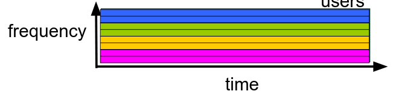
**** TDM - time is divided into frames of fixed duration
     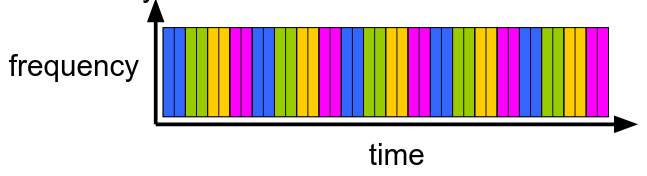
*** Packet Switching vs Circuit Switching
    - Packet switching allows more users to use the network
    - In circuit switching we have a fixed amount of users per link. So if the link is 1Mb/s and each user has 0.1Mb/s then some of it is wasted because not all users utilise the link.
    - Packet switching is better for bursty data, resource sharing and is simpler to setup. However excessive congestion is possible.
    - In packets switching how to provide a reliable bandwidth for audio and video? A: This issues is still unresolved.
** Structure of the Internet
   - The networks of networks and the roles of ISPs in all of it.
   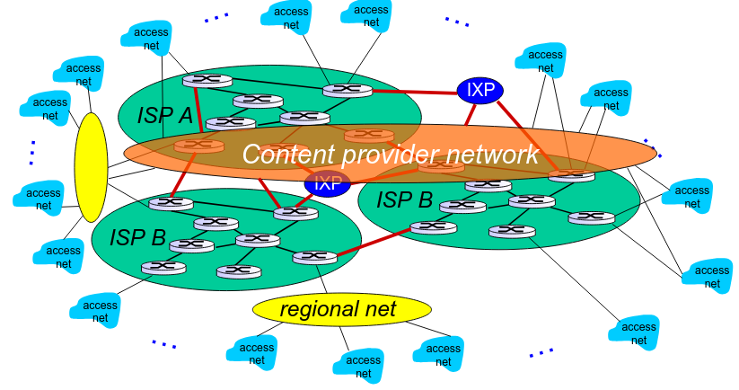
   - So we have Tier 1 ISPs
   - Then regional ISPs along with IXP
   - Then local ISPs
   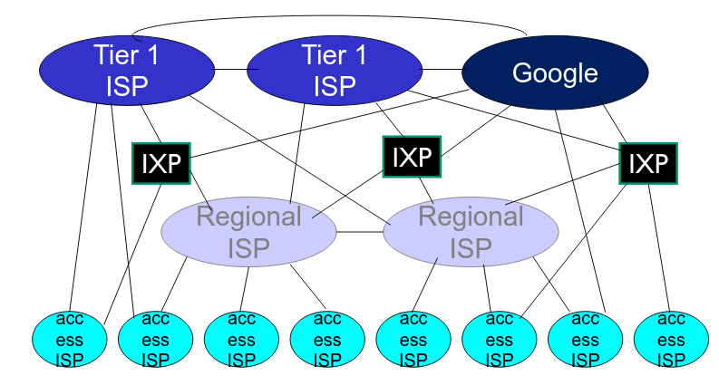
** Delay, loss and throughput
*** General Info
    - Packet starts at source, travels through routers to destination - as it travels it suffers delay
*** Sending function
    - Host breaks down the message sent into ~packets~ of length ~L~ and transmits them at the rate of ~R~
      - Transmission rate aka: link capacity or link bandwidth
      - Example: L = 7.5Mbits and R = 1.5Mbps, so the delay is 5sec
    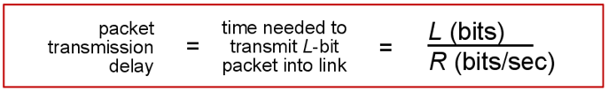
*** Sources of delay
**** Transmission: L/R
**** Propagation: Delay travelling over a distance (speed of light 250 000 km/s)
**** Nodal processing: usually less than a msec
**** Queuing: time waiting at the output link for transmission. Depends on congestion of the router.
     - ~La/R~: L - packet length, a - average packet arrival rate.
     - ~La/R ~ 0~: small avg queuing delay
     - ~La/R ~ 1~: large avg queuing delay
     - ~La/R > 1~: overload
     - Packets arriving at a full queue are lost: aka ~Packet Loss~
     - Lost packets may be re-transmitted by a previous node
**** Graphical Representation
     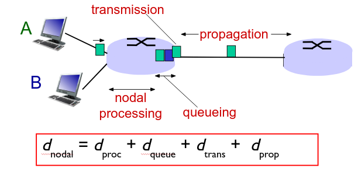
**** Throughput
     - Usually, both the sender and the receiver are a bottleneck if their bandwidths differ
** Response Time (RTT)
   - Round Trip Time (RTT): time for a small packet to travel from client to server and back
* Network Model
** Why Layering
   - Helps dealing with a complex system. Networks are complex.
   - Easier troubleshooting
   - Allows identification and relationships between complex pieces
   - One protocol per layer
** Example of Encapsulation and the Travel of a Message
   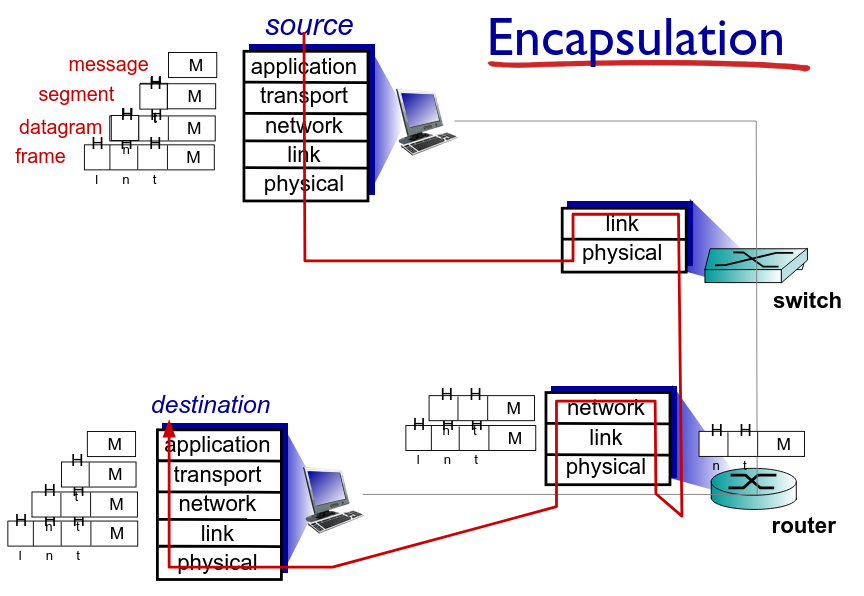
** Application Layer (7)
*** Exists in
    - Software
*** Protocols
    - FTP, SMTP, HTTP
*** Container
    - Raw Messages or Application Data Units
*** Role
    - Contains all protocols and methods that allow for process-to-process communication across an Internet Protocol (IP) network
    - Uses the underlying transport layer protocols to establish a host-to-host connection
    - Define type of messages exchanged: request, response
    - Define message syntax
    - Define message semantics
    - Define rules of how processes send & respond to messages
      - Open/Proprietary protocols
*** Process Communication
    - Process: program running within a host
      - Client process: process that initiates communication
      - Server process: process that waits to be contacted
      - P2P have both of the above
    - Sockets: is a software interface, it is the API between the networks and an application
      - Processes send/receive messages via sockets
      - Sockets are identified by a 4-tuple: (Src IP, Src Port, Dest IP, Dest Port)
      - The entire 4-tuple is one ~connection socket~ in the OS
*** HTTP (pull)
**** HTTP Request Cycle (basic)
     - Initiate TCP (create socket) to server to port 80
     - Server accepts TCP connection from client
     - HTTP messages exchanged between browser and server
     - TCP connection closed
**** Connection Type
     - Persistent: Multiple messages and objects over a single connection
       - HTTP RTT: 1 RTT for all objects
     - Non-persistent: Every message and object over a new connection (wasteful)
       - HTTP RTT: 2RTT + file transmission time (one RTT for connection setup + one RTT for request)
       - OS overhead for each TCP connection
       - Parallel connections
**** General Format
     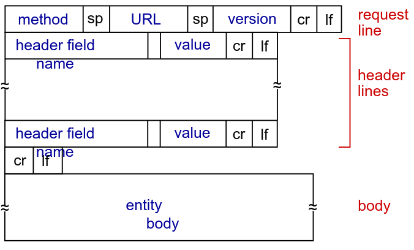
*** FTP
    - Uses port 21 and is used for file transfers
*** Email
    - Uses port 25 for client to server communication over TCP
**** Components
     - User Agent (UA)
     - Mail Server
       - Mailbox: incoming message from user
       - Message queue: messages to be sent to the user
     - Simple Mail Transfer Protocol (SMTP) push type protocol
     - POP3, IMAP, HTTP for retrieval
**** Three phase transfer
     - Handshaking
     - Transfer of messages
     - Closure
**** Interaction
     - Commands: ASCII text
     - Response: status code and phrase
**** Messages in 7bit ASCII
**** Alice sends message to Bob
     1. Alice uses UA to compose message "to" bob@school.edu
     2. Alice's UA sends message to her mail server; message placed in the message queue
     3. Client side of SMTP open opens TCP connection with Bob's mail server
     4. SMTP client sends Alice's message over the TCP connection
     5. Bob's mail server places the message in Bob's mailbox
     6. Bob invokes his user agent to read message
**** POP3
     - Can use download-and-delete or download-and-keep
     - Authorize with: ~user~ ~pass~
     - Server response with: ~+OK~ or ~-ERR~
     - Transaction phases: ~list~, ~rert~, ~dele~, ~quit~
**** IMAP
     - Keeps message at the server
     - Allows to manipulate messages at the server
*** DNS
    - Records
      - A: name to IP pair
      - NS: name to value (value is hostname of authoritative name server for this domain)
      - CNAME: alias
      - MX: mailserver
      - Message example
    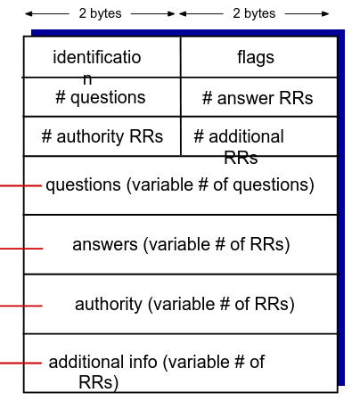
*** P2P
**** Client-to-server file distribution
     - How much time to distribute file size F to N peers?
     - Server
       - Time to send one copy F/u_s
       - Time to send N copies: N * F/u_s
     - Client
       - d_min min client download rate
       - min client download time: F / d_min
     - Solution max (NF/u_s, F/d_min) (increases linearly with N)
**** Peer-to-peer
     - Server
       - Time to send one copy F/u_s
     - Client
       - min client download time: F/d_min
     - Clients
       - max upload rate: u_s + Σ u_i  (upload server + sum of upload of peers)
     - Solution max (F/U_s, F/d_min, NF/(u_s + Σ u_i)) (increases linearly with N, but so does the upload rate)
**** Outcome
     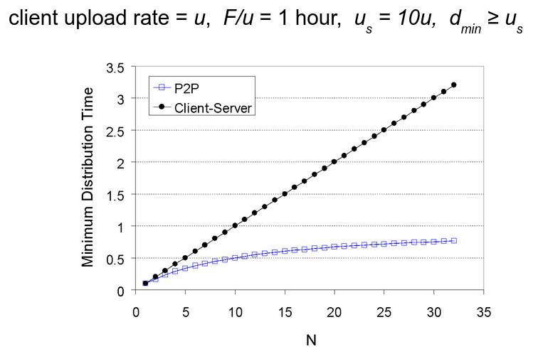
*** NETCONF
    - Network Configuration Protocol is a network management protocol from the IETF (RFC 6241)
    - It provides mechanisms to install, manipulate and delete the configuration of network devices
    - Uses simple RPC based mechanisms, fully encrypted to facilitate communication between a client and a server
    - NETCONF session is the logical connection between a network admin or a network configuration application and a network device
    - Main Roles of NETCONF:
      - Remote configuration management of network devices
      - Retrieving configuration and operational state
      - Standardized and structured management
      - Reliable, programmatic automation
    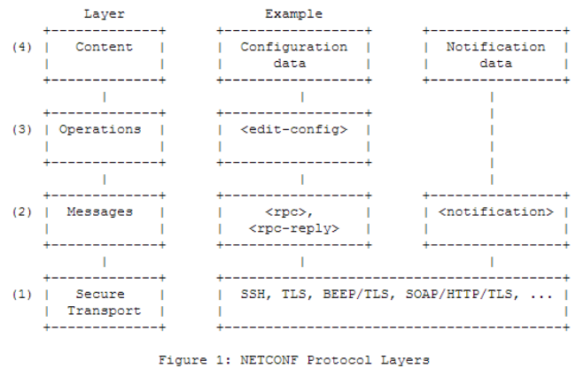

** Presentation Layer (6)
*** Exists in
    - Software
*** Protocols
    - TLS / SSL, XDR, MIME, JPEG, PNG, ASCII, etc.
*** Container
    - Raw Messages or Application Data Units
*** Role
    - Interprets the data: encryption, compression, transformation.
    - Encrypted TCP connection (e2e authentication and encryption) TLS / SSL
** Session Layer (5)
*** Exists in
    - Software
*** Protocols
    - NetBIOS, RPC, PPTP, etc
*** Container
    - Raw Messages or Application Data Units
*** Role
    - Responsible for establishing, maintaining and terminating a ~session~.
    - ~Session~ synchronization
** Transport Layer (4)
*** Exists in
    - Software
*** Protocols
    - TCP, UDP
*** Container
    - Segment (TCP), Datagram (UDP)
*** Role
    - Process-to-process data transfer
    - Provides end-to-end communications services for applications
    - Logical communication between processes
    - Transmission Control Protocol (TCP), User Datagram Protocol (UDP)
    - May provide:
      - Data integrity
      - Timing (may require low delay)
      - Throughput (some apps require a minimum throughput, like video/audio)
      - Security
*** TCP
    - Reliable transport
    - Flow control: sender won't overwhelm receiver
    - Congestion control: throttle sender when network overloaded
    - Does not provide: timing, minimum throughput guarantee, security
    - Connection oriented transmission - guarantee of logical/physical connection
*** UDP
    - Connectionless transmission - un-guaranteed - best effort policy
    - No handshaking
    - Does not provide: reliability, congestion control, flow control, timing, throughput, security or connection setup.
    - Used for streaming and DNS lookups
    - Reliability may be added at the application layer
    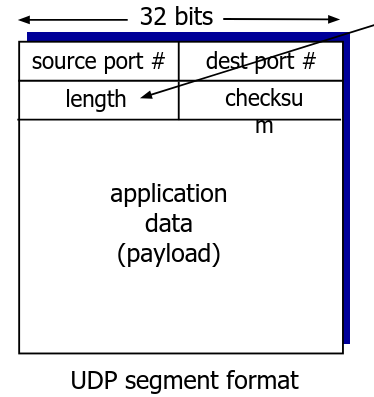
*** Multiplexing & Demultiplexing
    - Uses socket information (4-tuple) to uniquely identify segments when Multiplexing (sending)
    - Demux, retrieve that segments and direct them based on the 4-tuple to the right process
    - Webservers use different sockets for each connected client
*** Reliable Transfer Protocols
**** Pipelining
     - Sender allows multiple "in-flight" yet-to-be-acknowledged packets
     - Basically: send multiple packets and receive multiple ACKs
     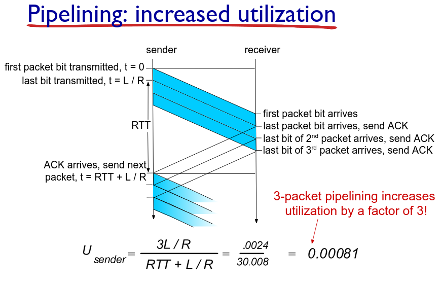
**** Go-back-N (GBN) pipelining
     - Sender can have up to N unACKed packets in pipeline
     - Receiver only sends cumulative ACK (doesn't ACK if there's a gap)
     - Sender has timer for oldest unACKed packet. When timer expires re-transmit all unACKed packets.
     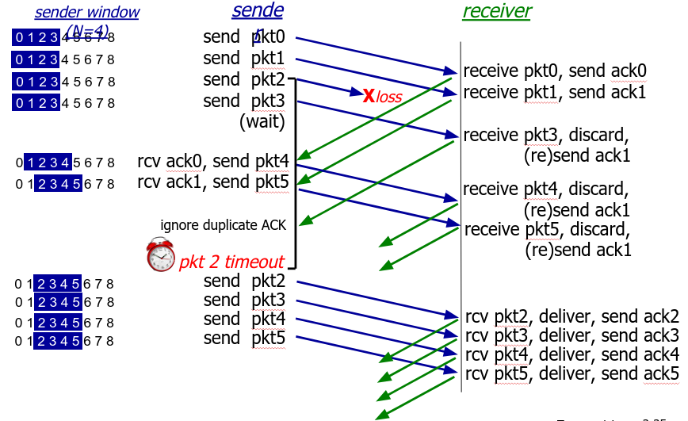

**** Selective Repeat (SR) pipelining
     - Sender can have up to N unACKed packets in pipeline
     - Receiver sends individual ACK for each packet
     - Sender maintains timer for each unACKed packet. When timer expires, re-transmit only that unACKed packet.
**** TCP
***** Info
      - Point-to-Point
      - Reliable, in-order byte stream
      - Pipelined: congestion and flow control
      - Full duplex: bi-directional flow in same connection. MSS: max segment size
      - Connection oriented: handshaking
      - Flow controlled: sender will not overwhelm receiver
***** Segment Structure
      - Sequence numbers: byte stream "number" of first byte in segment's data
      - ACKs: sequence number of next byte expected from other side
      - Cumulative ACK
      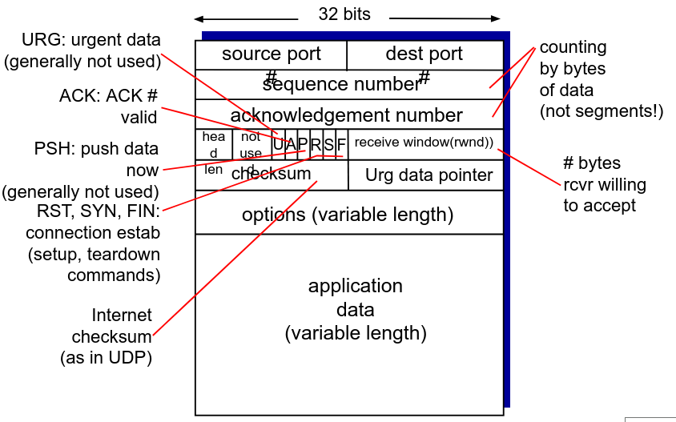
      - Seq numbers and ACKs
      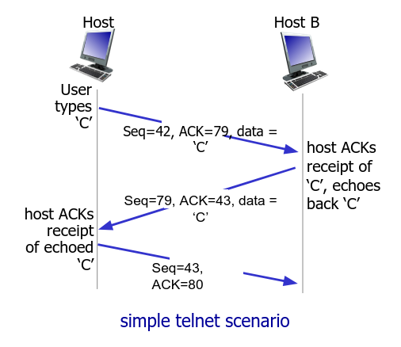
***** TCP and RTT
      - Timeout value, needs to be longer than RTT! Too short = premature re-transmission, too long = slwo reaction to segment loss
      - TCP sends a sample and continues to sample the RTT and adjusts it automatically
      - It is an exponential weighted moving average
      - Influence of past samples decreases expontentially fast
      - Typical value of α = 0.125s
      - EstimatedRTT = (1 - α) * EstimatedRTT + α * SampleRTT
      - Timeout interval = EstimatedRTT + "safety margin"
      - DeviationRTT = (1 - β) * DevRTT + β (SampleRTT - EstimatedRTT) (typically β = 0.25)
      - Timeout interval = EstimatedRTT + 4*DevRTT (safety margin)
***** TCP Re-transmission Scenarios
      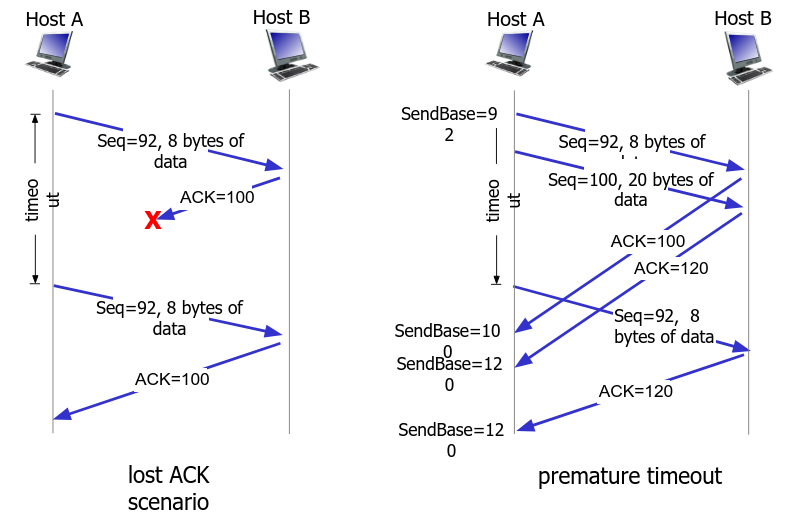
***** Cumulative ACK
      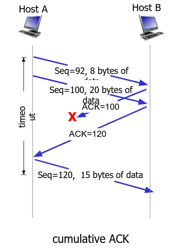
***** TCP Fast Re-transmit
      - If sender receives 3 ACKs for same data (triple duplicate ACK), resend unACKed segment with smallest seq number
      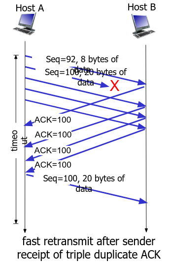
***** TCP Flow Control
      - Receiver controls sender
      - Won't overflow receiver by sending too much
      - Receiver advertises free buffer space
***** Connection management
      - Agree to establish connection: handshake
      - 3-way handshake
      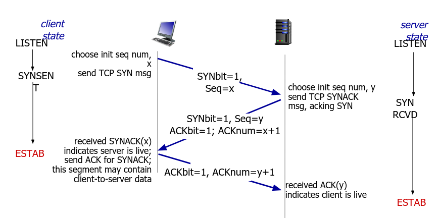
      - Closing a connection
      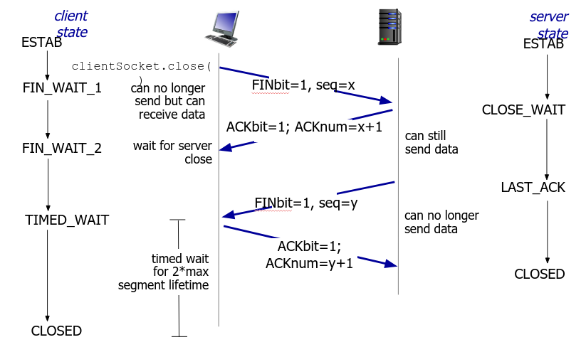
**** Congestion Control
     - Too many sources sending too much data too fast for the network to handle
     - Causes lost packets and long delays
     - AIMD: Additive Increase, Multiplicative Decrease
** Network Layer (3)
*** Exists in
    - Router, 3rd layer switches, firewall
*** Protocols
    - IP and Routing Protocols
*** Container
    - IP Packet (aka IP Datagram)
*** Role
    - Routing of datagrams from source to destination
    - Logical communication between hosts
    - IP is based on a set of protocols that are used to transport datagrams from a source host to a destination endpoint. Achieved by IP Addresses.
    - Three basic functions:
      - For outgoing packets - select the next-hop host (gateway) and transmit packets to this host by passing it to an appropriate link layer implementation
      - For incoming packets - capture packets and pass the packet payload up to the appropriate transport-layer protocol, if appropriate
      - Error checking
** Data Link Layer (2)
*** Exists in
    - Switches, bridges, NICs, wireless APs
*** Protocols
    - Ethernet, 802.11 (WiFi), PPP
*** Container
    - Frame
*** Role
    - Data transfer between neighboring network elements (sometimes link and physical are put together)
    - Delivers the datagram to the next node along a route
** Physical Layer (1)
*** Exists in
    - Cables, connectors, hubs
*** Protocols
    - Physical "bits on the wire"
*** Role
* LAN, WAN, RAN, Wireless (5G)
* Multimedia Networking
* QoS, QoS Support, QoE
* Network Congestion
* Network Management, Traffic Engineering, Network-Application Performance
* Remove at the End
  #+BEGIN_EXPORT html
  
  
  #+END_EXPORT
