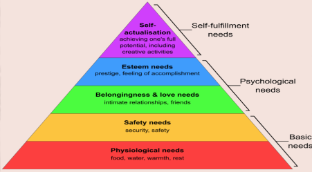
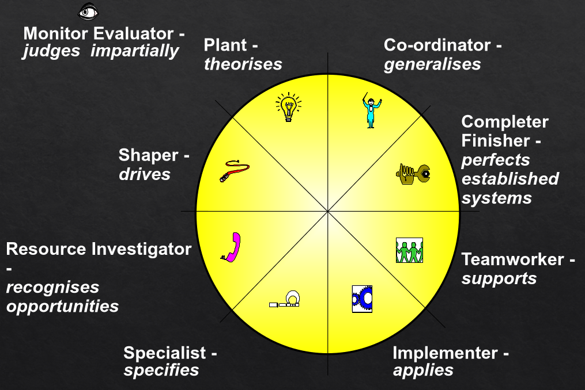

#+TITLE: Self Management and Teamwork
#+DATE: [2026-04-11 Sat 15:13]
#+AUTHOR: Damian Chrzanowski
#+EMAIL: pjdamian.chrzanowski@gmail.com
#+OPTIONS: TOC:2 num:2
#+HTML_HEAD: <link href="https://fonts.googleapis.com/css?family=Source+Sans+Pro" rel="stylesheet">
#+HTML_HEAD: <link rel="stylesheet" type="text/css" href="../assets/org.css"/>
#+HTML_HEAD: <link rel="icon" href="../assets/favicon.ico">
#+latex_header: \hypersetup{colorlinks=true,linkcolor=black}
#+latex_header: \usepackage[margin=0.5in]{geometry}
#+latex_header: \usepackage[scaled]{helvet} \renewcommand\familydefault{\sfdefault}
[[file:index.org][Home Page]]
* Usual Exam Questions
** ~ChatGPT~ and how it helped with the team
   - Problem solving
   - Learning and knowledge sharing
   - Team communication
   - Agile Scrum practices
   - Negatives
     - Reduces team interaction when AI relied too much on
     - Too dependent on AI
   - Works best as a support tool, not a replacement for thinking
** ~EI~, emotional intelligence
   - Ability to perceive, control and evaluate emotions.
** ~Maslow's~ needs hierarchy
   

** Four behaviour types ~DISC~. Quadrants of Marston's model.
   - ~Dominance~: task focused, results driven, likes control
   - ~Influence~: people focused, outgoing, good at communication
   - ~Steadiness~: calm, supportive, cooperative
   - ~Conscientiousness~: detail-oriented, careful, analytical
   - ~DISC~ quadrants are based on:
     - Task vs People focus
     - Active vs Passive behaviour
   - ~DISC~ and usage of ~ChatGPT~
     - Most of our team had S and C traits: supportive, organised and focused on quality
     - ~D~: Used AI to make quick decisions and move forward, improved efficiency
     - ~I~: Used AI for idea generation and communication, helps brainstorm and explain
     - ~S~: Used AI to support teamwork and reduce pressure
     - ~C~: Used AI to construct accurate answers and structured solutions
** ~Belbin~ profiles
   - Coherent Profile: Self (SPI) and observers agree. Show strong self-awareness and consistency.
   - Compatible profile: some similarities
   - Confused profile: all over the place
   - Discordant profile: observers agree, but personal does not. Poor self awareness.
** ~Marston~ Model
   - In the Marston model lets place DISC clockwise like so:
   #+begin_src
Di
CS
   #+end_src
   - Then: on the left perceives an unfavourable environment and on the right its a favourable one
   - Then: on top perceives self as more powerful than environment, bottom less powerful than the environment
** Problem Based Learning (~PBL~)
   - When a problem needs solving it is seen as an opportunity for learning. So the problem is seen as a starting point, so instead of just solving the problem, the goal is to develop understanding, teamwork and critical thinking.
   - Collaboration centered, brainstorming (discussions), real world problems, etc.
   - The ~tutor~ is a guide, basically, but never gives direct solutions.
** Self Analysis
*** Belbin
    - Plant: AI is helpful and is frustrating because plant is creative. But it help the plant with new ideas.
    - Resource Investigator: explorer works well with AI, but has a tendency to get sucked into it too much.
    - Implementer: helps in generating output faster. May become too reliant.
    - Teamworker: clear steps and a structure to follow. But AI reduces communication with the team.
*** DISC
    - Mostly I and C: I = communication, brainstorm, explain, C = Construct accurate answers and structured solutions
*** Ocean 5
** ~Belbin~
   - Personal: Monitor Evaluator, Coordinator, Specialist
   - Group: Completer Finisher, Implementer, Shaper
** ~Belbin~ 9 roles and what is ~team role~. Opposites of each role.
   - A ~team role~ according to Dr Meredith Belbin is: The way a person behaves, contributes and interacts within a team. It is based on a person's strengths and behaviour, not just their job role. Helps the team to understand each other better and how people fit.
   - Roles
     - ~Plant~ -> Ideas
     - ~Completer Finisher~ -> Follow Through
     - ~Resource Investigator~ -> Explorer, contacts
     - ~Implementer~ -> Organisation
     - ~Monitor Evaluator~ -> Plans
     - ~Shaper~ -> Action/Drive
     - ~Coordinator~ -> Coordination
     - ~Teamworker~ -> Support
     - ~Specialist~ -> Knowledge
   - Opposites, this is opposite behaviour, not opposite to argue with each other:
     - 
     - ~Plant~ theorises -> ~Implementer~ applies
     - ~Coordinator~ generalises -> ~Specialist~ specifies
     - ~Resource Investigator~ recognizes opportunity -> ~Completer Finisher~ perfects established system
     - ~Shaper~ drives -> ~Teamworker~ supports
     - ~Monitor Evaluator~ judges impartially
** ~Lyssa Adkins~ five levels of conflict model
   - Level 1: Problem to Solve. Healthy, respectful.
   - Level 2: Disagreement. Tensions appear, but still controlled.
   - Level 3: Contest. People try to win arguments. Less focus on solution.
   - Level 4: Fight. Emotions escalate. Communication breaks down.
   - Level 5: Intractable: Conflict is destructive, no cooperation exists.
** ~Fredrick Taylor~ four basic theories of scientific management.
   - Find the one best way to do a task
   - Select and train workers properly
   - Supervise closely and use rewards
   - Managers plan, workers execute
** ~Kurt Lewin~ change management
   - Unfreeze: prepare people for change
   - Change: Introduce change
   - Refreeze: Make the change permanent
** ~Tuckman's Form/Storm/Norm/Perform~ used by a Scrum Master to empower the team.
   - Forming (awareness): SM provides guidance and structure
   - Storming (conflict): SM manage conflict and encourage open communication
   - Norming (cooperation): SM supports collaboration and participation
   - Performing (productivity): SM empowers the team and reduces control
** ~Lyssa Adkins~ High-Performance Tree
   - ~Roots~ (Foundation):
     - Trust, respect, relationships
     - Strong foundation needed
   - ~Trunk~ (Core practices):
     - Communication, collaboration, Scrum values
     - Supports how the team works together
   - ~Branches/Leaves~ (Outcome):
     - High performance, productivity, success
   - Scrum values:
     - Commitment
     - Focus
     - Openness
     - Respect
     - Courage
* Notes
* Remove at the End
  #+BEGIN_EXPORT html
  
  
  #+END_EXPORT
